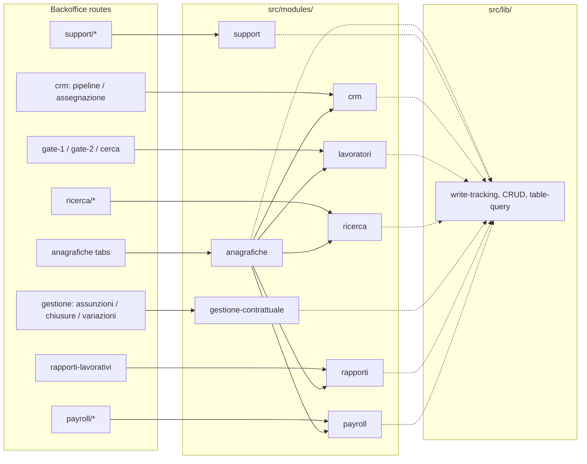

# Domain Modules Structure — Requirements

## Summary

Introduce eight Italian-named domain modules under `src/modules/<dominio>/` (per `docs/piano-stabilizzazione.md` §6 and `AGENTS.md`) that dissolve the monolithic `src/lib/anagrafiche-api.ts` (1,739 lines), make domain boundaries explicit, and enforce them via lint. Module slugs use the piano domain names; route ownership follows `src/routes/app-routes.ts`. Cross-cutting Supabase infrastructure stays in `src/lib/`.

---

## Problem Frame

BazeOffice is a production SPA with ~85k LOC where all Supabase access funnels through a single 1,739-line data layer consumed from 51 files. Components, hooks, and API calls are organized by technical layer (`components/`, `hooks/`, `lib/`) rather than by the backoffice areas operators navigate. A new contributor — human or AI — cannot tell where domain logic belongs, and changing a database field requires hunting across the monolith.

The stabilization plan (`docs/piano-stabilizzazione.md` §6) already targets module anatomy; this brief pins the **domain cut** to piano domain names plus backoffice route ownership, and the **module skeleton** before implementation planning begins.

---

## Key Decisions

- **Eight Italian domain modules (piano §6).** Module folder slugs are the domain names from `docs/piano-stabilizzazione.md` §6 and `AGENTS.md`: `anagrafiche`, `support`, `crm`, `lavoratori`, `ricerca`, `gestione-contrattuale`, `rapporti`, `payroll`. Route ownership within each module follows `src/routes/app-routes.ts`. See Requirements R1–R8 and **Relationship to piano-stabilizzazione §6** below.
- **Anagrafiche = generic table CRUD UI.** The `anagrafiche` module owns AgGrid tab navigation and views for all anagrafiche tabs — not famiglie-only. Workflow UIs for the same entities live in their home domain modules.
- **Entity overlap is intentional.** Famiglie, lavoratori, and rapporti_lavorativi appear in both `anagrafiche` (CRUD UI) and workflow modules (`crm`, `lavoratori`, `rapporti`). The split is view type, not exclusive entity ownership.
- **CRUD data lives in the entity's home module.** Table CRUD operations belong in the domain module that owns the entity. The `anagrafiche` module renders AgGrid tabs and **imports queries/mutations from the home module's public `index.ts`**. Cross-module `.api.ts` / `.adapters.ts` imports remain forbidden (R11).
- **Domain types live in modules; `src/types/` is global-only.** Entity types move from `src/types/entities/` into the owning module's `types/` during migration. Cross-module type imports are allowed via public `index.ts` barrels.
- **Italian folder slugs (piano §6).** Module paths use Italian kebab-case slugs from the piano domain list — not English aliases (`families`, `workers`, etc.).
- **Hybrid query/mutation layout.** Each module uses `queries/` and `mutations/` directories with one function per file. Data layer files are `<dominio>.api.ts` and `<dominio>.adapters.ts` — no `server` prefix (browser-only SPA).
- **Rich internal structure supersedes piano flat files.** Each module includes `schemas/`, `types/`, and `lib/` in addition to `components/` and `hooks`. **This folder layout supersedes** the flat-file skeleton in piano §6 and current `AGENTS.md`. R17 updates `AGENTS.md` to match R9.
- **Lint boundary: api + adapters.** Public surface is `index.ts` exporting queries, mutations, types, schemas, hooks, and components consumed outside the module.
- **Cross-cutting infra in `src/lib/`.** Write-tracking, generic CRUD, `table-query` chokepoint, lookup helpers, and Supabase client wiring stay in `src/lib/`, extracted from the monolith before or as part of the first domain migration PR (R19).
- **Full co-location per migration.** Each domain migration PR moves data layer, hooks, and components together.
- **One domain per PR.** No bulk migration; tests must stay green between PRs.
- **Pages and routes stay global.** `src/pages/` and `src/routes/` remain thin wiring layers in v1. Page components import only from `@/modules/<dominio>` public barrels; they do not co-locate inside modules during domain migration.

---

## Relationship to piano-stabilizzazione §6

Piano §6 lists eight candidate domains. This doc adopts those names as module slugs and maps backoffice routes to them. Riattivazioni and prove e colloqui route under `support` (customer-support URLs), not `gestione-contrattuale`.

| Piano §6 domain (module slug) | Backoffice routes / `MainSection` | Notes |
|---|---|---|
| `anagrafiche` | `mainSection === "anagrafiche"` (all tabs) | CRUD UI shell; entity CRUD imported from home modules |
| `support` | `prove_colloqui`, `customer_support_*`, `customer_support_riattivazioni` | Tickets, prove e colloqui, riattivazioni |
| `crm` | `crm_pipeline_famiglie`, `crm_assegnazione` | Pipeline famiglie, assegnazione, richieste attivazione |
| `lavoratori` | `gate_1`, `gate_2`, `lavoratori_cerca` | Gate 1, Gate 2, cerca lavoratori |
| `ricerca` | `ricerca_pipeline` | Ricerca board/detail, processi matching, selezioni |
| `gestione-contrattuale` | `gestione_contrattuale_assunzioni`, `_chiusure`, `_variazioni` | Assunzioni, chiusure, variazioni boards |
| `rapporti` | `gestione_contrattuale_rapporti` | Rapporti lavorativi list/detail/board |
| `payroll` | `payroll_cedolini`, `payroll_contributi_inps` | Cedolini, contributi INPS |

---

## Requirements

**Module inventory and route mapping**

- R1. **`anagrafiche` module** — generic database CRUD **UI section** (all `anagraficheTab` values). AgGrid views and tab navigation. Entity CRUD imported from home modules via `@/modules/<home>`. `table-query` helper stays in `src/lib/`.
- R2. **`support` module** — customer-support routes: tickets, prove e colloqui, riattivazioni.
- R3. **`crm` module** — `crm_pipeline_famiglie`, `crm_assegnazione`; includes `features/richieste-attivazione/`.
- R4. **`lavoratori` module** — `gate_1`, `gate_2`, `lavoratori_cerca`.
- R5. **`ricerca` module** — `ricerca_pipeline` (board and detail).
- R6. **`gestione-contrattuale` module** — assunzioni, chiusure, variazioni boards. Excludes rapporti (R7) and riattivazioni (R2).
- R7. **`rapporti` module** — `gestione_contrattuale_rapporti`; rapporti lavorativi list/detail. Includes `features/rapporti/`.
- R8. **`payroll` module** — cedolini and contributi INPS.

**Module skeleton**

- R9. Every module under `src/modules/<dominio>/` follows this layout:

  ```
  src/modules/<dominio>/
  ├── index.ts                  # sole public export surface
  ├── <dominio>.api.ts          # only file calling Supabase for this domain (internal)
  ├── <dominio>.adapters.ts     # Supabase row → domain types (internal)
  ├── queries/                  # one TanStack useQuery wrapper per file
  ├── mutations/                # one TanStack useMutation wrapper per file
  ├── schemas/                  # Zod schemas
  ├── types/                    # TypeScript types and schema inferences
  ├── lib/                      # pure domain helpers, one concern per file
  ├── components/
  ├── hooks/
  └── __tests__/
  ```

- R10. Consumers import only from `@/modules/<dominio>` (the `index.ts` barrel). Cross-module imports of exported types, queries, mutations, hooks, and components are allowed. Deep imports into `.api.ts`, `.adapters.ts`, or other internals are drift.
- R11. Adapters are the only place Supabase column/field names appear for that domain. Normalized domain types live in the module's `types/` directory.

**Lint and enforcement**

- R12. ESLint blocks importing `<dominio>.api.ts` or `<dominio>.adapters.ts` from outside the owning module.
- R13. ESLint rules referencing `src/lib/anagrafiche-api.ts` are updated as domains migrate — targets move to `src/lib/` infra or the owning module's `.api.ts`.

**Migration from legacy layout**

- R14. `src/lib/anagrafiche-api.ts` is dissolved domain-by-domain into module `.api.ts` + `.adapters.ts` files.
- R15. Legacy paths migrate with `git mv`: `components/`, `hooks/`, `features/`, and `src/types/entities/` → module directories per mapping tables below.
- R16. After a domain migrates, no new code is added to legacy paths for that domain.
- R17. `src/features/` and `src/types/entities/` are retired as domains migrate; `src/types/` retains global unscoped types only.

**Documentation**

- R18. `AGENTS.md` updated: eight Italian modules, R9 folder skeleton (superseding piano §6 flat files), lint rules, CRUD-in-home-module pattern, anagrafiche-as-CRUD-UI distinction.

**Testing gate**

- R19. Each domain migration lands with green `npm run test` + `tsc` + `lint`. Mocks at `@/modules/<dominio>` boundary.

**Infra prerequisite**

- R20. Before or as part of the first domain migration PR, extract write-tracking, generic CRUD, and `table-query` from `anagrafiche-api.ts` into `src/lib/` files. Retarget `use-board-mutations` and ESLint chokepoints.

---

## Domain Module Map



| Module slug | Route slugs / `MainSection` | Legacy sources |
|---|---|---|
| `anagrafiche` | anagrafiche tabs (famiglie, processi, lavoratori, …) | `components/anagrafiche/`, `use-anagrafiche-data` |
| `support` | `/customer-support/*`, `/prove-e-colloqui` | `components/support/`, `components/prove-colloqui/`, `gestione-contrattuale/riattivazioni-*` |
| `crm` | `/pipeline`, `/assegnazione` | `components/crm/`, `features/richieste-attivazione/` |
| `lavoratori` | `/gate-1`, `/gate-2`, `/cerca-lavoratori/*` | `components/lavoratori/`, `features/lavoratori/` |
| `ricerca` | `/ricerca`, `/ricerca/:id` | `components/ricerca/`, `features/ricerca/` |
| `gestione-contrattuale` | `.../assunzioni`, `.../chiusure`, `.../variazioni` | assunzioni/chiusure/variazioni board views |
| `rapporti` | `.../rapporti-lavorativi` | rapporti panels, `features/rapporti/` |
| `payroll` | `/payroll/cedolini`, `/payroll/contributi-inps` | `components/payroll/` |

---

## Key Flows

- F1. **Per-domain migration** — prerequisite R20 on first PR; then skeleton, extract api/adapters, move types, split queries/mutations, git mv UI/hooks into module, update imports (including `src/pages/` → `@/modules/<dominio>`), extend lint, verify green gate. Pages and routes are not moved into modules.
- F2. **Shared entity, two surfaces** — home module owns CRUD + adapters; `anagrafiche` imports CRUD hooks from `@/modules/<home>` public barrel.

**Anagrafiche tab → home module (CRUD owner)**

| `anagraficheTab` | Home module |
|---|---|
| `famiglie` | `crm` |
| `lavoratori` | `lavoratori` |
| `rapporti_lavorativi` | `rapporti` |
| `processi` | `ricerca` |
| `selezioni_lavoratori` | `ricerca` |
| `mesi_lavorati` | `payroll` |
| `pagamenti` | `payroll` |

**Entity type → home module**

| Legacy type file | Home module |
|---|---|
| `famiglie.ts`, `richiesta-attivazione.ts` | `crm` |
| `lavoratore.ts`, `documento-lavoratore.ts`, `esperienza-lavoratore.ts`, `referenza-lavoratore.ts` | `lavoratori` |
| `processi-matching.ts` | `ricerca` |
| `rapporto-lavorativo.ts` | `rapporti` |
| `chiusura-contratto.ts`, `variazione-contrattuale.ts` | `gestione-contrattuale` |
| `ticket.ts` | `support` |
| `pagamento.ts`, `mese-lavorato.ts`, `mese-calendario.ts`, `presenza-mensile.ts`, `contributo-inps.ts`, `transazione-finanziaria.ts` | `payroll` |
| `lookup-values.ts` | `src/types/` (global) |

---

## Acceptance Examples

- AE1. **Covers R12.** Import from `@/modules/lavoratori/lavoratori.api.ts` outside the module → ESLint error. Import `useLavoratoriQuery` from `@/modules/lavoratori` → allowed.
- AE2. **Covers R1, R4, F2.** `/lavoratori` anagrafiche tab UI in `@/modules/anagrafiche` imports `useLavoratoriTableQuery` from `@/modules/lavoratori`. `/gate-1` workflow also in `@/modules/lavoratori`.
- AE3. **Covers R2, R6.** `fetchRiattivazioniBoard` exported from `@/modules/support`, not `@/modules/gestione-contrattuale`.
- AE4. **Covers R14.** After `support` migrates, `anagrafiche-api.ts` has no support fetch functions.
- AE5. **Covers R10, R17.** `@/modules/rapporti` imports type `Lavoratore` from `@/modules/lavoratori` → allowed. Import from `lavoratori.adapters.ts` → ESLint error.

---

## Success Criteria

- At least one domain module fully migrated as reference template with green CI.
- `anagrafiche-api.ts` measurably reduced after each migration PR.
- ESLint catches deliberate deep import of `.api.ts`.
- `AGENTS.md` reflects eight Italian modules and R9 skeleton.
- Planner can sequence migrations without re-deciding domain boundaries.

---

## Scope Boundaries

**Deferred for later**

- Splitting giant view files — Phase 3 refactoring.
- Deep-import lint on `components/` and `hooks/` — only `.api.ts` + `.adapters.ts` in v1.
- Bulk migration of all eight modules in one PR.
- Renaming URL slugs or `MainSection` values — routes stay as-is.
- Creating `src/shared/` — cross-cutting stays in `src/lib/`.

**Outside this product's identity**

- Server layer or `'use server'` actions.
- Backend Supabase schema changes as part of this work.

---

## Dependencies / Assumptions

- Fase 1 test safety net per `docs/testing-strategy.md`.
- Piano sequencing: test net → structure → giant-file splits.
- ESLint flat-config extends to per-module import restrictions.
- TanStack Query remains the client data cache.

---

## Outstanding Questions

**Deferred to Planning**

- Migration order across the eight modules.
- Assignment of `use-board-mutations` and other cross-domain hooks in `src/hooks/`.

---

## Sources / Research

- `docs/piano-stabilizzazione.md` §6 — eight Italian domain names and anti-patterns.
- `docs/testing-strategy.md` — mock at module boundary.
- `src/routes/app-routes.ts` — route → `MainSection` mapping.
- `src/lib/anagrafiche-api.ts` — monolith to dissolve.
- `eslint.config.js` — chokepoint rules.
- `AGENTS.md` — domain candidates list (Italian names).
