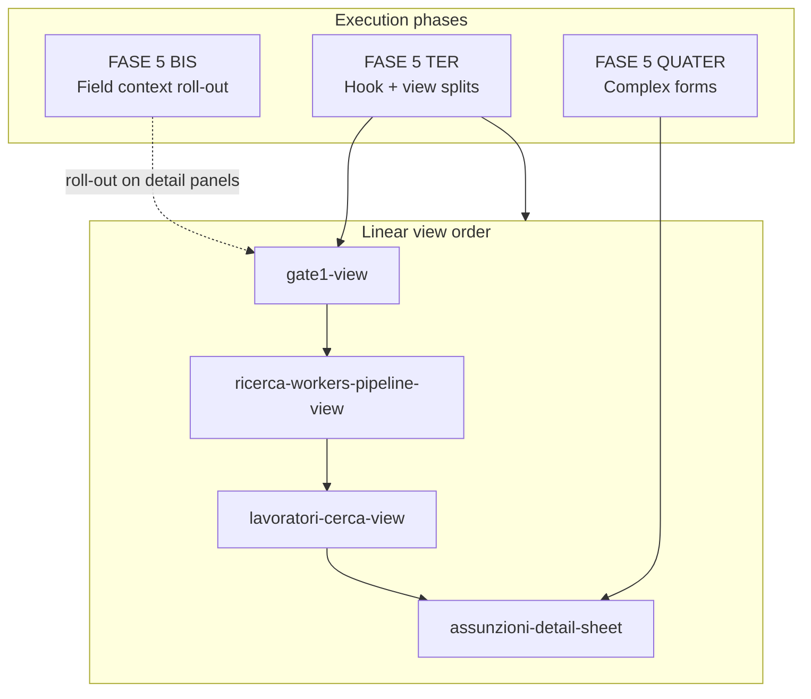

# Large File Split + FASE 5 — Requirements

## Summary

Stabilize BazeOffice by splitting giant views and hooks under a green test net, following the Linear checklist order and the full FASE 5 program from `docs/realtime-bug-class-plan.md` (BIS, TER, QUATER). Each target file follows Target B from `docs/testing-strategy.md`: characterize observable behavior, split into cohesive units, keep the suite green. gate1-view is the reference cycle: full render characterization, smart hook plus thin shell, hook tests plus view smoke renders.

---

## Problem Frame

The codebase is in production with ~85k LOC and a thin safety net on its largest files. Four views exceed 2,400 lines; three hooks exceed 900 lines. `gate1-view` still owns ~1,300 lines of orchestration logic and ~1,750 lines of JSX despite partial card extraction into `gate1/`. Hand-rolled save handlers and god-hooks compound realtime and autosave risk.

`docs/piano-stabilizzazione.md` mandates net-first, one-file-at-a-time refactoring. Mattia joins to help execute. This brief unifies the Linear giant-file checklist with FASE 5 so views, hooks, form-field migration, and memoization are one coordinated program — not a views-only initiative with hooks deferred.

---

## Key Decisions

- **Net-first, one file per PR.** Characterize before split; suite stays green throughout. No bulk migrations. Aligns with `docs/piano-stabilizzazione.md` §1 and `docs/testing-strategy.md` Target B.
- **Full FASE 5 in scope.** BIS (form field context and roll-out), TER (god-hook and god-component splits, memoization, soft size lint), and QUATER (residual complex forms). FASE 6+ (realtime hardening, OCC) stays out of this program.
- **Linear checklist order for giant views.** Start with `gate1-view`, then `ricerca-workers-pipeline-view`, `lavoratori-cerca-view`, `assunzioni-detail-sheet`. Hook splits are in scope and run as dedicated cycles — not excluded because views come first.
- **gate1 split pattern: smart hook + thin shell (Option A).** Extract `use-gate1-view` for state, effects, and handlers; `gate1-view.tsx` becomes a thin composer. Existing `gate1/*Card` files and `Gate1WorkerProvider` stay; no section-file-first or panel-first split for gate1.
- **gate1 characterization: full render + hook smoke.** Integration tests use `renderWithProviders` with module-boundary mocks. After split: primary net on `use-gate1-view` via `renderHook`, plus one to two `Gate1View` smoke renders.
- **FASE 5 BIS.0 partially shipped.** `useAutoSaveFormFields`, `useAutoSaveForm`, Field components, and integration tests exist. Remaining BIS work is pilot, roll-out, and lint — not greenfield infrastructure.
- **No DOM snapshots; no coverage % gate.** Coverage is a map only (`docs/piano-stabilizzazione.md` anti-patterns).

---

## Requirements

**Program rules**

- R1. Every split target follows characterize → split → green. If a test must change to compile, treat that as a deliberate public-seam change — not a silent edit.
- R2. Mock the data layer at the module boundary (`@/modules/<dominio>` or `@/lib/*`). Never mock deep Supabase query-builder chains.
- R3. One concern per PR; aim under ~400 changed lines. Conventional commits; no AI co-author lines.
- R4. After each completed cycle, document the pattern in `docs/solutions/` via `/ce-compound`.

**Linear giant views**

- R5. **`gate1-view`** (~3,287 LOC) — characterize with full render tests; split to `use-gate1-view` + thin `gate1-view.tsx`; reuse existing `gate1/*` cards. Reference implementation for later views.
- R6. **`ricerca-workers-pipeline-view`** (~2,763 LOC) — characterize then split. Natural seams: inline helpers to `lib/`, `PipelineWorkerCard`, `WorkerPipelineColumn`, main orchestrator.
- R7. **`lavoratori-cerca-view`** (~2,515 LOC) — characterize then split. Natural seams: inline field components (`NonQualificatoTipoLavoroField`, etc.) and main view.
- R8. **`assunzioni-detail-sheet`** (~2,410 LOC) — characterize then split. Natural seams: `DatoreDetail`, `LavoratoreDetail`, `RapportoDetailSections`, sheet shell.

**Linear giant hooks**

- R9. **`use-crm-pipeline-preview`** (~1,888 LOC) — characterize hook body (pure helpers already partially tested); split mapper and hook responsibilities.
- R10. **`use-ricerca-workers-pipeline`** (~993 LOC) — characterize (no test net today) then split.
- R11. **`use-selected-worker-editor`** (~1,131 LOC) — FASE 5 TER.2: split into 8 section hooks after gate1 cycle completes. Sections: header, availability, address, job search, skills, experiences, references, documents. Each hook uses `useAutoSaveFormFields` (FASE 5 BIS). Extend existing `use-selected-worker-editor.integration.test.tsx` as the safety net.
- R12. **`use-lavoratori-data`** — FASE 5 TER.1: split into 7 responsibility hooks (pagination, filters, list query, selection, detail loader with realtime Pattern B, gate1 filters, gate2 filters). Dedicated cycle; sequencing relative to gate1 is a planning decision (see Outstanding Questions).

**Board hook quick win**

- R13. Extract duplicated `deleteMutation` pattern from `use-assunzioni-board` and `use-chiusure-board` into a shared helper atop `useCreateMutation` in `src/hooks/use-board-mutations.ts`.

**FASE 5 BIS — Form field context**

- R14. Complete roll-out of context-aware Field components (`FieldInput`, `FieldSelect`, `FieldMultiSelect`, etc.) so detail panels cannot omit saves via hand-rolled handlers.
- R15. **5 BIS.2** — Pilot `disponibilita_nel_giorno` on gate1; validate bug class A.1 is structurally impossible.
- R16. **5 BIS.3** — Roll out Field components across gate1 detail handlers (coordinate with gate1 TER split — see Outstanding Questions).
- R17. **5 BIS.4** — ESLint rule blocking hand-rolled `on*Change` save patterns in detail panels.
- R18. **5 BIS.5** — CRM onboarding cards: zod schema + `useAutoSaveFormFields` on `useCrmPipelinePreview.updateProcessCard`.
- R19. **5 BIS.6** — Roll out to rapporto, assunzioni, and variazioni detail panels; lint shows zero legacy handler warnings.

**FASE 5 TER — God-hook and god-component splits**

- R20. **5 TER.3** — Apply `React.memo` and `useCallback` on sub-components in split views (gate1 cards already extracted; stabilize callback identity).
- R21. **5 TER.4** — Soft ESLint warnings: `use-*.ts` > 500 LOC, `*.tsx` > 800 LOC (warning, not error).

**FASE 5 QUATER — Residual complex forms**

- R22. Migrate remaining complex forms to react-hook-form + Field pattern: worker profile header (if not covered by BIS), multi-field submit modals (new worker, operatrice assignment), cross-field validation (e.g. fee min/max).
- R23. Done when no `useState(buildDraft(prop))` remains outside react-hook-form or Field components.

---

## Key Flows

- F1. **Per-file split cycle (Target B)**
  - **Trigger:** A giant file from the checklist is next in queue.
  - **Steps:** (1) Identify public seam. (2) Write characterization tests for current behavior. (3) Split file under green. (4) `/ce-compound` learning doc. (5) PR.
  - **Outcome:** File below soft size threshold; behavior coverage did not drop.

- F2. **gate1 reference cycle**
  - **Trigger:** First item in Linear view checklist.
  - **Steps:** (1) Full render characterization with module-boundary mocks. (2) Extract `use-gate1-view`. (3) Thin `gate1-view.tsx` composer. (4) Hook tests + view smoke. (5) Compound doc as template.
  - **Outcome:** gate1 orchestrator under ~800 LOC; pattern documented for Mattia and later views.

- F3. **FASE 5 BIS roll-out on a detail panel**
  - **Trigger:** A detail panel still uses hand-rolled `on*Change` + draft state.
  - **Steps:** (1) zod schema for panel fields. (2) `useAutoSaveForm` + Field components. (3) Component smoke asserting patch called. (4) Lint clean.
  - **Outcome:** Save-omission bug class structurally impossible for that panel.

---

## Success Criteria

- Every checklist file (R5–R13) has characterization tests before its split PR merges.
- `npm run test`, `tsc`, and `lint` stay green after each PR.
- gate1 cycle produces a reusable playbook in `docs/solutions/` for characterize + smart-hook split.
- FASE 5 BIS lint (R17) reports zero legacy handler warnings on migrated panels.
- FASE 5 TER.4 soft warnings trend toward zero on touched files (no hard gate on global LOC).
- No DOM snapshot tests added for giant components.

---

## Scope Boundaries

**In scope**

- All Linear checklist items (four views, three hooks, `deleteMutation` helper).
- Full FASE 5: BIS, TER (including TER.1–TER.4), QUATER.
- Storybook stories as a manual catalogue when writing component characterization (per `docs/testing-strategy.md` B2).

**Deferred for later**

- FASE 6 BIS and beyond (realtime reconnect, OCC, anti-freeze structural refactor).
- Bulk module-structure migration (domains already under `src/modules/`).
- Splitting `anagrafiche-api.ts` monolith (separate stabilization track; adapters pattern already established).

**Outside this program's identity**

- Chasing a global coverage percentage target.
- ESLint max-lines as a blocking error (soft warning only per TER.4).

---

## Dependencies / Assumptions

- FASE 1 test infrastructure (Vitest, `renderWithProviders`, `renderHookWithQueryClient`) is operational and gated in CI.
- FASE 5 BIS.0 infrastructure (`useAutoSaveFormFields`, Field components) is stable enough to build roll-out on.
- `use-selected-worker-editor` integration tests remain the primary net for TER.2; they must stay green through the 8-way split.
- Mattia can execute subsequent checklist items using the gate1 playbook.
- Production hotfixes from `main` pause this work per `docs/piano-stabilizzazione.md` §1.

---

## Outstanding Questions

**Deferred to Planning (`ce-plan`)**

- OQ1. **gate1: BIS roll-out vs TER split sequencing.** 5 BIS.3 (Field migration) and gate1 smart-hook split can touch the same handlers — plan PR order to avoid merge conflicts.
- OQ2. **`use-lavoratori-data` timing.** Split before gate1 `use-gate1-view` extraction, after gate1 characterization only, or as a parallel track — gate1 depends heavily on `useLavoratoriData`.
- OQ3. **`deleteMutation` PR slot.** Parallel small PR anytime, or strictly after gate1 characterization lands.

---

## Sources / Research

| Artifact | Relevance |
|---|---|
| `docs/piano-stabilizzazione.md` §1, §6–7 | Net-first principle, module anatomy, Phase 3 refactoring |
| `docs/testing-strategy.md` Target B | Characterize → split playbook; hooks-before-views guidance |
| `docs/realtime-bug-class-plan.md` FASE 5 BIS/TER/QUATER | Full FASE 5 scope and sub-phase checklists |
| `docs/solutions/characterization-testing-*.md` | Prior characterization patterns for hooks and boards |
| Linear issue (giant file checklist) | File targets and expected outcome |

---

## Target Inventory

| File | LOC (approx.) | Split status | Test net |
|---|---|---|---|
| `src/modules/lavoratori/components/gate1-view.tsx` | 3,287 | 9 cards in `gate1/`; orchestrator monolith | Pattern harness (draft-resync) |
| `src/modules/ricerca/components/ricerca-workers-pipeline-view.tsx` | 2,763 | Partial inline components | Structural fixture only |
| `src/modules/lavoratori/components/lavoratori-cerca-view.tsx` | 2,515 | Inline field components | None |
| `src/modules/gestione-contrattuale/components/assunzioni-detail-sheet.tsx` | 2,410 | `DatoreDetail` / `LavoratoreDetail` trees | Pattern fixture only |
| `src/modules/crm/hooks/use-crm-pipeline-preview.ts` | 1,888 | Pure helpers exported | Pure-function tests only |
| `src/modules/lavoratori/hooks/use-selected-worker-editor.ts` | 1,131 | Monolithic | Strong integration suite |
| `src/modules/ricerca/hooks/use-ricerca-workers-pipeline.ts` | 993 | Monolithic | None |
| `src/modules/lavoratori/hooks/use-lavoratori-data.ts` | ~2,200 | Monolithic (TER.1) | Partial |

