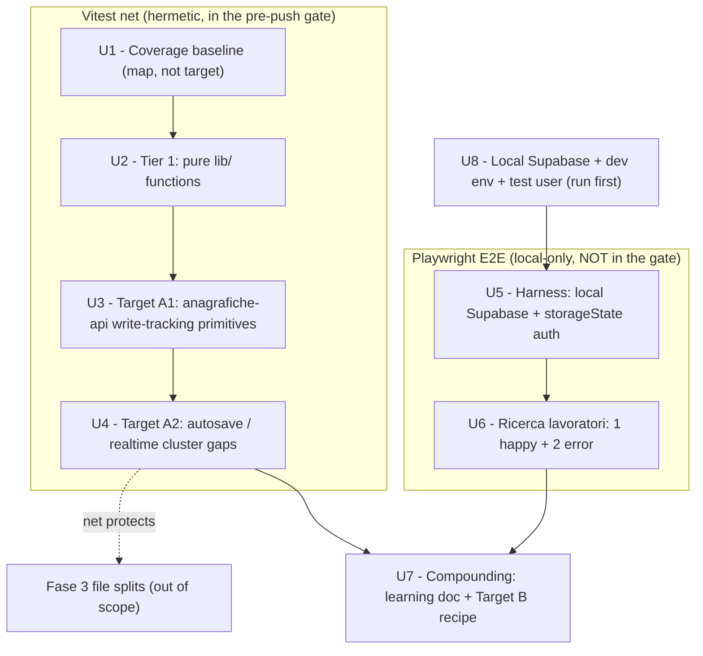
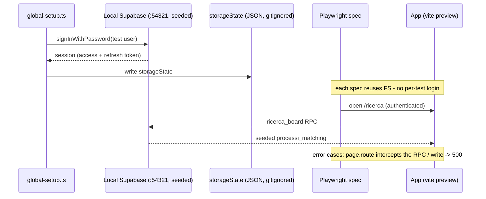

# test: Fase 1 safety net — Vitest characterization + Playwright E2E

## Summary

Build the **behavioral safety net** of Fase 1 from `docs/piano-stabilizzazione.md`
so the giant files and the data layer can be refactored later without
regressions. Two tracks: (1) extend the Vitest net over the pure `lib/`
functions, the `anagrafiche-api.ts` write-tracking primitives, and the
autosave/realtime cluster gaps; (2) stand up a **local-only Playwright E2E
harness** against a local Supabase stack, with the Ricerca lavoratori feature
covered by 1 happy path + 2 error cases. The task closes by leaving a learning
doc so Fase 3 starts advantaged.

This plan also wires the **local dev environment** against local Supabase — the
foundation both `npm run dev` and the E2E harness share, set up first. It does
**not** split any giant file or migrate any module (those are Fase 2/Fase 3).

---

## Problem Frame

The codebase is in production but unsafe to modify: ~85k LOC, giant view/hook
files, and a 1,736-line monolithic data layer (`anagrafiche-api.ts`). The Fase 1
rule is **net-first**: pin observable behavior at stable seams before touching
internals. Today there are 73 green tests covering a slice of the highest-risk
hooks, but the pure utilities and parts of the autosave/realtime cluster are
naked, and there is no end-to-end coverage at all.

Christian (CTO) added a second requirement on top of Fase 1: **E2E with
Playwright**, 1 happy path + ≥2 error cases per feature, set up to run **locally**
(CI deferred — "in CI è uno sbattimento per ora, lascia stare"). The components
themselves don't need unit coverage yet; the critical parts do.

The work is also a **learning exercise** — every decision here is recorded with
its rationale so the operator understands the net, not just runs it.

---

## Requirements

**Coverage baseline (Tier 0)**

- R1. `npm run coverage` produces a report and the current coverage of the
  refactor-target files is recorded as a before/after map — not a target to hit.

**Unit / characterization net (Vitest)**

- R2. Every exported pure function in `lib/` (excluding the Supabase-calling
  code) has happy-path + edge-case tests.
- R3. The write-tracking / echo-suppression primitives in `anagrafiche-api.ts`
  have unit tests pinning their exact current semantics.
- R4. Each delicate autosave/realtime behavior (resync-without-clobber,
  echo-suppression window, identity-switch flush, realtime subscribe/unsubscribe)
  has a test that fails if the guard is removed.
- R5. Tests mock at the module boundary (`@/lib/*`), never the deep Supabase
  query-builder chain; no DOM snapshots; assertions are on observable behavior.

**E2E (Playwright, local-only)**

- R6. Playwright runs locally against a local Supabase stack, with an
  authenticated session established once and reused via `storageState`.
- R7. The Ricerca lavoratori feature has 1 happy-path E2E plus ≥2 error-case E2E.
- R8. The E2E suite is local-only: it has its own scripts and does **not** run in
  `npm test`, the lefthook pre-push gate, or CI.

**Compounding & safety**

- R9. The task leaves a learning doc capturing the testing patterns and the
  just-in-time characterization recipe Fase 3 will reuse.
- R10. The existing 73 green tests stay green and the pre-push gate
  (test + tsc + lint) remains fast and hermetic.

**Local environment (prerequisite)**

- R11. `npm run dev` runs against the local Supabase stack and authenticates with
  the local test user, giving dev and E2E the same resettable backend.

---

## Key Technical Decisions

- Local Supabase as the E2E backend: isolated and resettable via
  `supabase db reset` (loads `backend-supabase/supabase/seed.sql`), so E2E never
  touches staging/prod data. Cost: requires Docker + a running stack. The local
  test user `test@usuario.com` / `password123` is provisioned by the seed on
  `db reset` (U8).
- One-time auth via `storageState`: `global-setup` logs in once
  (`supabase.auth.signInWithPassword`) and persists the session; every spec
  reuses it. The client already sets `persistSession: true`
  (`src/lib/supabase-client.ts`), so a saved storage state authenticates the app
  without a per-test login. Avoids login latency and flakiness.
- Error cases via network interception (`page.route`), not backend manipulation:
  a real local backend won't return 500 on demand, so the ≥2 error paths are
  driven by intercepting the board RPC / write edge-function and returning a
  failure deterministically.
- Playwright stays out of the gate: new `e2e` / `e2e:ui` scripts are separate
  from `test`; `lefthook.yml` and CI are untouched. The vitest net stays the
  hermetic merge gate (it mocks every network seam); Playwright is opt-in local.
- Mock at the module boundary, never the query-builder chain: matches the
  established convention (`vi.mock("@/lib/anagrafiche-api")`,
  `vi.mock("sonner")`). Keeps unit tests fast and refactor-proof.
- Characterization-first, behavior-only assertions, no DOM snapshots: tests pin
  what the user/consumer observes so the giant files can be split later without
  rewriting the tests. Coverage is a map, never a percentage target.
- Write-tracking tested via module reset: `anagrafiche-api.ts` holds module-level
  mutable state (`pendingWriteCount`, `lastLocalWriteAt`). Tests isolate cases
  with `vi.resetModules()` + dynamic `import()` and pin timing with
  `vi.setSystemTime`.
- Target B scoped to a recipe, not splits: Fase 1 documents the just-in-time
  characterization recipe; actually breaking up giant files happens in Fase 3.

---

## High-Level Technical Design

### Testing layers this plan establishes



### E2E harness architecture



---

## Output Structure

New `e2e/` hierarchy created by U5–U6 (Playwright uses its own runner and dir,
kept out of the vitest `include` globs):

```
bazeoffice/
├── playwright.config.ts        # webServer + storageState + testDir: e2e/
├── e2e/
│   ├── global-setup.ts         # one-time auth -> storageState
│   ├── ricerca.spec.ts         # U6: 1 happy + 2 error
│   ├── support/                # selectors / helpers / route-error utils
│   ├── .auth/                  # storageState output (gitignored)
│   └── README.md               # local runbook (start backend, seed, run)
└── docs/solutions/
    └── 2026-06-19-testing-safety-net.md   # U7 learning doc
```

The per-unit `Files:` lists below remain authoritative; the implementer may
adjust the layout if a cleaner shape emerges.

---

## Implementation Units

### Phase 0 — Local environment (run first)

### U8. Local Supabase + dev environment + test user

- **Goal:** Get `npm run dev` running against a local Supabase stack with a known
  test user, so day-to-day dev and the E2E harness share one clean, resettable
  local backend. Run first — U5 and U6 depend on it.
- **Requirements:** R11, R6, R10
- **Dependencies:** none (foundation)
- **Files:**
  - `.env.local` (bazeoffice, gitignored) —
    `VITE_SUPABASE_URL=http://localhost:54321`,
    `VITE_SUPABASE_ANON_KEY=<from supabase status>`,
    `VITE_SUPABASE_FUNCTIONS_URL=http://localhost:54321/functions/v1`.
  - `backend-supabase/supabase/` (sibling repo) — add the local test user so
    `supabase db reset` provisions it: a seed snippet inserting into `auth.users`
    (pgcrypto-hashed password) **and** `auth.identities`, or an extra `[db.seed]`
    file in `config.toml`. Local seed only — never a migration, so it never
    reaches staging/prod.
  - `docs/testing-strategy.md` / `e2e/README.md` — note the local bootstrap.
- **Approach:**
  1. `cd ../backend-supabase && supabase start` (Docker).
  2. Add the test-user seed snippet, then `supabase db reset` to apply it.
  3. `supabase status` → copy the local anon key → write `.env.local` in bazeoffice.
  4. `npm run dev`, log in with `test@usuario.com` / `password123`, confirm a board
     loads against local data.
- **Security note:** `test@usuario.com` / `password123` are throwaway
  **local-only** seed credentials — safe to commit in the backend seed. The
  session token (`storageState`) stays gitignored.
- **Test expectation:** none — environment/setup unit.
- **Verification:** `npm run dev` authenticates the test user against local
  Supabase and renders a populated board; `supabase db reset` re-creates the user
  idempotently.

### Phase A — Vitest net

### U1. Close out the coverage baseline (Tier 0)

- **Goal:** Confirm coverage runs and record the current coverage of the
  refactor-target files as a before/after map.
- **Requirements:** R1
- **Dependencies:** none
- **Files:** `docs/testing-strategy.md` (record baseline numbers). `package.json`
  and `vitest.config.ts` already have the script + provider — no change expected.
- **Approach:** Run `npm run coverage`; capture per-file coverage for the
  refactor targets (`anagrafiche-api.ts`, the giant `*-pipeline` / `*-board`
  hooks, the giant views) and paste a short baseline table into
  `testing-strategy.md`. The number is a map of what's naked, not a goal.
- **Patterns to follow:** the "Current baseline" table already in
  `docs/testing-strategy.md`.
- **Test expectation:** none — verification/documentation unit; coverage provider
  is already installed and no behavior changes.
- **Verification:** `npm run coverage` emits a report; baseline numbers recorded
  in `testing-strategy.md`.

### U2. Tier 1 — pure functions in `lib/`

- **Goal:** Pin happy-path + edge behavior of the pure utilities most likely to
  break under a refactor.
- **Requirements:** R2, R5
- **Dependencies:** none (U1's map is helpful but not blocking)
- **Files (new):**
  - `src/lib/geo-utils.test.ts`
  - `src/lib/datetime.test.ts`
  - `src/lib/search-utils.test.ts`
  - `src/lib/lookup-color-styles.test.ts`
  - `src/lib/private-area-url.test.ts`
  - `src/lib/availability-functions.test.ts` (only the pure
    `isHardBlockingSelection`; the `invoke*` functions are network calls — skip)
- **Approach:** Plain `*.test.ts`, table-driven input→output, no DOM, no mocks.
- **Execution note:** Characterization — pin the CURRENT output exactly; a
  surprising-but-intentional output is the contract, don't "fix" it here.
- **Patterns to follow:** `src/lib/ricerca/center-coords.test.ts`,
  `src/lib/lavoratori/is-disponibile-ricerca.test.ts`.
- **Test scenarios:**

  | Function | Pin |
  | --- | --- |
  | `geo-utils.parseCoordinates` | valid `"lat,lng"` → coords; `{lat,lng}` object → coords; `null`/`undefined`/garbage → `null` |
  | `geo-utils.distanceKmBetweenCoordinates` | two known points → expected km (tolerance); identical points → 0; null arg → current behavior |
  | `datetime.romaWallclockToUtcIso` | a **winter** date and a **summer** date (CET vs CEST) → correct UTC ISO; `null`/`undefined` → `null` |
  | `datetime.utcIsoToRomaInput` / `utcIsoToRomaParts` | UTC ISO → Rome-local parts, winter + summer; `null` → `""` / empty parts |
  | `search-utils.normalizeSearchText` | accent/case/whitespace folding; non-string → current behavior |
  | `search-utils.getSearchTokens` | multi-space query → token list; empty → `[]` |
  | `search-utils.matchesSearchQuery` | match across fields; partial match; empty query → current behavior |
  | `search-utils.hideEmptyKanbanGroups` | groups with items kept, empty groups dropped |
  | `lookup-color-styles.*` (5 fns) | known color → expected className; `null`/unknown → fallback className |
  | `private-area-url.buildFamilyPrivateAreaUrl` / `buildFamilyPresenzeUrl` | valid email+id → expected URL; missing email or id → current behavior |
  | `availability-functions.isHardBlockingSelection` | hard-blocking stato → `true`; non-blocking → `false`; `null` → `false` |

  Skip with `Test expectation: none`: `province-italiane.ts` (static const data),
  `utils.cn` (thin `twMerge(clsx())` wrapper — one sanity assertion at most).
- **Verification:** new tests green under `test:unit`; coverage of these files rises.

### U3. Target A1 — `anagrafiche-api.ts` write-tracking net

- **Goal:** Pin the write-tracking / echo-suppression primitives — the
  foundation the realtime cluster's echo suppression depends on — before the data
  layer is reorganized.
- **Requirements:** R3, R5
- **Dependencies:** none
- **Files (new):** `src/lib/anagrafiche-api.write-tracking.test.ts`
- **Approach:** Unit-test the module-level state machine
  (`anagrafiche-api.ts:427-515`). Because the state is module-level and mutable,
  isolate cases with `vi.resetModules()` + dynamic `import()`, and pin timing with
  `vi.useFakeTimers()` / `vi.setSystemTime()`.
- **Execution note:** Characterization — pin the CURRENT semantics
  (floor-at-zero, `+Infinity` before the first write).
- **Patterns to follow:** `src/hooks/use-debounced-save.integration.test.tsx`
  (mocks these primitives) — here we test the real implementations.
- **Test scenarios:**
  - `beginPendingWrite()` increments `getPendingWriteCount()` by 1; a paired
    `endPendingWrite()` returns it to the prior value.
  - `endPendingWrite()` floors at 0 — calling it when the count is already 0
    stays 0, never negative.
  - `getMillisSinceLastLocalWrite()` returns `+Infinity` before any write; after
    `endPendingWrite()` or a resolved `runTracked` it returns a finite elapsed
    (assert exact with fake system time).
  - `runTracked(resolvingPromise)`: count is 1 in flight, 0 after; resolves with
    the value; `lastLocalWriteAt` advanced on success.
  - `runTracked(rejectingPromise)`: count is decremented in the `finally` (back
    to 0); rejection propagates; `lastLocalWriteAt` not advanced on failure
    (verify current behavior).
  - Nesting: `runTracked` wrapping another tracked call → count 2 → 0, no
    underflow.
  - (optional) `normalizeTableResponse` shapes a raw `table-query` response into
    `{ rows, total, columns, groups }`; empty input → the `EMPTY_ROWS` shape.
- **Verification:** tests green; the `lastLocalWriteAt` echo-window contract is
  pinned independent of any consuming hook.

### U4. Target A2 — autosave / realtime cluster coverage gaps

- **Goal:** Close the gaps in the highest-risk cluster — the resync-without-clobber
  hook and the realtime-rows subscription that currently have no tests.
- **Requirements:** R4, R5
- **Dependencies:** none (U3 helpful for shared understanding)
- **Files (new):**
  - `src/hooks/use-auto-save-form.integration.test.tsx`
  - `src/hooks/use-realtime-rows.integration.test.tsx`
  - extend an existing cluster test only if a named behavior below is unasserted.
- **Approach:** `renderHookWithQueryClient`, fake timers, mock
  `@/lib/anagrafiche-api` and `sonner` at the module boundary (mirroring the
  existing cluster tests).
- **Execution note:** Characterization-first — for each behavior, write the
  assertion that fails if the guard were removed.
- **Patterns to follow:** `src/test/draft-resync-tier2.integration.test.tsx`,
  `src/test/key-unmount-pattern.integration.test.tsx`,
  `src/hooks/use-realtime-board-sync.integration.test.tsx`,
  `src/hooks/use-debounced-save.integration.test.tsx`.
- **Test scenarios:**
  - `use-auto-save-form` (the delicate resync-without-clobber per its own docstring):
    - clean field + server `defaults` change to a new signature → field updates
      to the new server value (reset applied).
    - **dirty field (user typing) + server `defaults` change → field keeps the
      user's edit** (`keepDirtyValues`, not clobbered) — the core regression guard.
    - `defaults` object identity changes but the JSON signature is equal → no
      reset (no churn every render).
    - a field becoming dirty triggers the debounced `onSave`; with `isPaused()`
      returning true → save suppressed.
  - `use-realtime-rows`:
    - subscribes to the given table(s); a CDC event invokes the reload/callback.
    - unsubscribes on unmount (no leaked channel).
  - Verify-or-add (do not duplicate existing coverage): echo-suppression within
    the 2500ms window in `use-realtime-board-sync` — a remote echo within the
    window is suppressed; after it, a reload fires.
- **Verification:** each delicate behavior has a failing-without-the-fix test;
  full vitest suite stays green.

### Phase B — Playwright E2E (local-only)

### U5. Playwright harness — local Supabase + `storageState` auth

- **Goal:** Stand up a local-only E2E harness wired to a local Supabase stack
  with a reusable authenticated session.
- **Requirements:** R6, R8, R10
- **Dependencies:** U8 (running local stack + test user); independent of Phase A
- **Files:**
  - `package.json` — add `@playwright/test` devDep + `e2e` / `e2e:ui` scripts.
    Do **not** modify `test` or `lefthook.yml`.
  - `playwright.config.ts` (new) — `testDir: "e2e"`, `webServer` running the app
    pointed at local Supabase, `use.storageState` pointing at the saved auth.
  - `e2e/global-setup.ts` (new) — programmatic `signInWithPassword` against local
    Supabase, write `storageState` to `e2e/.auth/`.
  - `e2e/README.md` (new) — local runbook: start backend, seed, run E2E.
  - `e2e/.auth/` — storage state output (gitignored).
  - `.gitignore` — add `e2e/.auth`, `playwright-report`, `test-results`.
  - `vitest.config.ts` — confirm `include` globs never match `e2e/**` (they
    target `src/**`, so this is a check, not a change).
- **Approach:**
  - Backend, env wiring, and the test user come from U8; this unit consumes the
    running local stack and authenticates `global-setup` as `test@usuario.com`.
  - Auth: one programmatic login in `global-setup` → `storageState` reused by all
    specs.
  - Run the app under `vite preview` of a build for determinism (no StrictMode
    double-render); `dev:nostrict` is an acceptable faster alternative.
  - Keep Playwright entirely out of `npm test`, `lefthook.yml`, and CI.
- **Test scenarios:** none directly (harness). A trivial smoke spec
  (authenticated app shell + sidebar render) validates the wiring.
- **Verification:** `npm run e2e` boots the app against local Supabase and the
  smoke spec passes; no Playwright dep leaks into the vitest run.

### U6. Ricerca lavoratori E2E — 1 happy + 2 error

- **Goal:** Cover the Ricerca lavoratori feature end-to-end per Christian's spec.
- **Requirements:** R7
- **Dependencies:** U5, U8
- **Files (new):** `e2e/ricerca.spec.ts`; selectors/route-error helpers in
  `e2e/support/`.
- **Approach:** Navigate to `/ricerca` (`ricerca_pipeline`), assert the board
  loads from the `ricerca_board` RPC, open a seeded search
  (`processi_matching` id → `ricercaProcessId`), assert the workers pipeline +
  summary cards render, and perform one visible interaction. Drive error cases
  with `page.route` interception of the relevant RPC / write edge-function.
- **Test scenarios:**
  - **Happy path** (Covers R7): authenticated user opens Ricerca → board renders
    seeded columns/cards → opens a search → workers pipeline + summary cards
    visible → (optional) a field edit shows an autosave/success indication.
  - **Error case 1 — board load failure:** intercept the `ricerca_board` RPC →
    500; the board shows an error/empty state and the app does not white-screen.
  - **Error case 2 — save failure on detail:** while editing a selection field,
    intercept the write (`update-record`) → 500; a `toast.error` appears and the
    edit is not silently shown as saved (mirrors the `useDebouncedSave`
    "salvataggio silenzioso" guard).
  - (optional third) open a non-existent search id in the URL → graceful
    not-found/empty detail, no crash.
- **Verification:** `npm run e2e` runs the Ricerca specs green locally; the
  Playwright report lists 1 happy + ≥2 error specs.

### Phase C — Compounding

### U7. Learning doc + Target B characterization recipe

- **Goal:** Leave the knowledge behind so the next task — and the AI — start
  advantaged, and document the just-in-time characterization recipe Fase 3 will
  reuse, without splitting any giant file now.
- **Requirements:** R9
- **Dependencies:** U2–U6 (documents what they established)
- **Files:**
  - `docs/solutions/2026-06-19-testing-safety-net.md` (new) — patterns
    established (module-boundary mocking, fake-timer debounce,
    characterization-first, no-DOM-snapshots, module-reset for module-level state,
    E2E `storageState` + `page.route` error injection) + the per-giant-file recipe
    (characterize public seam → split → keep green).
  - `docs/testing-strategy.md` — add the E2E section and link the new doc.
- **Approach:** Prose + short pattern snippets distilled from U2–U6. Frame the
  Target B recipe explicitly as the Fase 3 template, not work to do now.
- **Test expectation:** none — documentation unit.
- **Verification:** doc exists, cross-links `testing-strategy.md`,
  `realtime-board-pattern.md`, and `realtime-bug-class-plan.md`; a teammate or
  agent can follow the recipe cold.

---

## System-Wide Impact

- Adds a second test runner (Playwright) beside Vitest. Contributors need Docker
  + a local Supabase stack to run E2E — documented and **optional**, never in the
  gate.
- `vitest.config.ts` `include` must keep matching only `src/**` so Playwright
  specs under `e2e/**` never get picked up by the vitest run (verified in U5).
- `.gitignore` grows by Playwright artifacts (`playwright-report`,
  `test-results`) and the auth `storageState` (`e2e/.auth`), which contains a
  real session token and must never be committed.

---

## Risks & Dependencies

- Provisioning the test user touches the sibling `backend-supabase/` seed: the
  insert must add both an `auth.users` row (pgcrypto-hashed password) **and** a
  matching `auth.identities` row, or login silently fails. Local seed only —
  never a migration. Requires Docker for the local stack.
- Ricerca seed data may be thin or unstable for a deterministic happy path → a
  small E2E-specific seed fixture may be needed.
- React StrictMode double-renders effects in dev and could perturb E2E timing →
  run E2E against `vite preview` of a build (or `dev:nostrict`).
- `anagrafiche-api.ts` module-level mutable state makes test isolation tricky →
  mitigated by `vi.resetModules()` + dynamic import (KTD: write-tracking via
  module reset).
- The storage-state token expires → `global-setup` re-runs each invocation, so
  it refreshes naturally; flag if a stale state ever leaks between runs.

---

## Open Questions

- Is the seeded `processi_matching` / ricerca data rich and stable enough for a
  deterministic happy-path, or do we add a minimal E2E-specific seed? (U6)
- Run the E2E app under `vite preview` of a production build (determinism) vs
  `dev:nostrict` (speed)? Lean preview; decide during U5.

The test-user question is resolved: U8 provisions `test@usuario.com` via the seed.

---

## Operational Notes — local E2E runbook

The end-state local workflow (also captured in `e2e/README.md` by U5):

```bash
# 1. start + seed the local backend (sibling repo)
cd ../backend-supabase
supabase start
supabase db reset          # loads seed.sql + the test user (U8)
supabase status            # copy the local anon key

# 2. point bazeoffice at local Supabase (U8) — .env.local
#    VITE_SUPABASE_URL=http://localhost:54321
#    VITE_SUPABASE_ANON_KEY=<anon key from supabase status>
#    VITE_SUPABASE_FUNCTIONS_URL=http://localhost:54321/functions/v1

# 3. dev against local, log in as test@usuario.com / password123
cd ../bazeoffice
npm run dev

# 4. run E2E, app auto-started by Playwright webServer
npm run e2e                 # headless
npm run e2e:ui              # interactive / debugging
```

The vitest gate is unchanged and stays hermetic:

```bash
npm test                    # vitest only — no Docker, no backend
```

---

## Sources & Research

Codebase locations that orient the implementation:

- Auth flow: `src/hooks/use-auth-session.ts` (`signInWithPassword`),
  `src/components/auth/login-view.tsx` (`#login-email`, `#login-password`),
  `src/main-app.tsx` (session gate), `src/lib/supabase-client.ts`
  (`persistSession: true`).
- Write-tracking primitives: `src/lib/anagrafiche-api.ts:427-515`.
- Autosave/realtime cluster: `src/hooks/use-auto-save-form.ts` (untested),
  `src/hooks/use-realtime-rows.ts` (untested),
  `src/hooks/use-auto-save-form-fields.ts`, `src/hooks/use-debounced-save.ts`,
  `src/hooks/use-realtime-board-sync.ts`.
- Ricerca surface: `src/routes/app-routes.ts` (`ricerca_pipeline`,
  `ricercaProcessId`), `src/hooks/use-ricerca-board.ts`,
  `src/components/ricerca/` (board + detail + workers-pipeline views).
- Gate / convention: `lefthook.yml` (pre-push test + tsc + lint),
  `vitest.config.ts` (happy-dom, dummy env, coverage include).
- Backend seed (sibling repo): `backend-supabase/supabase/seed.sql`,
  `backend-supabase/supabase/config.toml`.
- Origin docs: `docs/piano-stabilizzazione.md` (§4 Fase 0, §5 Fase 1),
  `docs/testing-strategy.md` (Tier 0 / Tier 1 / Target A / Target B).

External research was not run: Playwright + Vite + local Supabase is a
well-established setup and the codebase has strong local Vitest patterns. The
implementer should confirm version-specific Playwright config against the current
official docs during U5.
