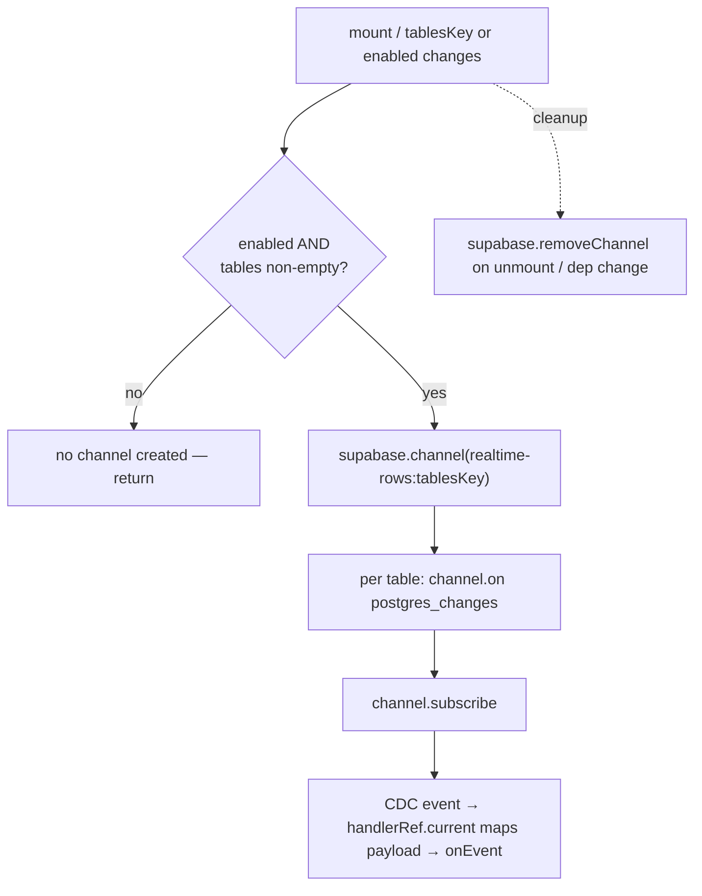

# test: U4 — autosave / realtime cluster characterization net

## Summary

Implement **U4 (Target A2)** of the Fase 1 safety-net plan: characterization
tests for the two untested members of the highest-bug-risk cluster — the
resync-without-clobber form hook `useAutoSaveForm` and the realtime subscription
primitive `useRealtimeRows` — each pinned so the test goes **red if its guard is
removed**. Plus a verify-only pass on the 2500ms echo-suppression window (already
covered). Test-only; no production change.

This advances R4 (each delicate autosave/realtime behavior has a fails-without-the-fix
test) and R5 (mock at the module boundary, behavior-only assertions) from the
origin plan (see origin: `docs/plans/2026-06-19-001-test-fase1-safety-net-plan.md`).

---

## Problem Frame

`useAutoSaveForm` and `useRealtimeRows` are the two cluster members with **zero
real coverage**. `useRealtimeRows` is mocked away in every board-hook test (e.g.
`src/hooks/use-realtime-board-sync.integration.test.tsx:15` replaces it wholesale),
so its real subscribe/unsubscribe/mapping logic has never been asserted.
`useAutoSaveForm` is the FASE 5 BIS replacement for the old manual
`useState`+resync pattern; the manual pattern is covered by
`src/test/draft-resync-tier2.integration.test.tsx`, but the new form-context hook
that supersedes it is not.

These are the seams a Fase 3 data-layer refactor is most likely to break, and a
regression here reintroduces the realtime stale-field / clobbered-edit bug class.
The net must fail loudly when a guard is dropped — a green-but-vacuous test in
this cluster is the failure mode (see sibling learning
`docs/solutions/best-practices/characterization-testing-module-level-state.md`).

---

## Requirements

- **R4** (origin) — Each delicate autosave/realtime behavior
  (resync-without-clobber, echo-suppression window, save-trigger, pause-defer,
  realtime subscribe/unsubscribe) has a test that fails if the guard is removed.
- **R5** (origin) — Tests mock at the module boundary (`@/lib/*`, `sonner`),
  never the deep Supabase query-builder chain; no DOM snapshots; assertions on
  observable behavior.
- **R10** (origin, carried) — The existing green suite stays green and the
  pre-push gate (test + tsc + lint) remains fast and hermetic. These tests add no
  Docker/backend dependency.

---

## Key Technical Decisions

- **Test `useAutoSaveForm` with a rendered component + `userEvent`, not bare
  `renderHook` + `setValue`.** The save engine (`useAutoSaveFormFields`) only acts
  on `form.watch` events where `type === "change"`. A programmatic `setValue` (or
  `reset`) hits the **non-change branch**, which resyncs the committed snapshot and
  deliberately does **not** save. A `renderHook`+`setValue` test would therefore
  exercise the wrong branch and never trigger a save — a false green. Save-path
  scenarios render a tiny inline component with registered inputs and drive them
  with `userEvent.type` (mirroring `draft-resync-tier2.integration.test.tsx`).

- **The JSON-signature reset-gating is asserted by spying on `form.reset`.** The
  hook resets on `[JSON.stringify(defaults)]`, not `[defaults]`, so a content-equal
  new object must not re-reset. `renderHook` + `vi.spyOn(result.current, "reset")`
  across an equal-content rerender vs a changed-content rerender pins this directly
  (the effect calls `form.reset(...)` as a method lookup, so the spy intercepts).

- **`useAutoSaveForm` needs only `sonner` mocked.** It imports no
  `anagrafiche-api` and no React Query; `onSave` and `isPaused` are injected props
  → `vi.fn()` test doubles. (This corrects the origin plan's generic "mock
  `@/lib/anagrafiche-api` and sonner" — accurate for the board-sync/debounced-save
  tests, but unnecessary here.)

- **`useRealtimeRows` is tested against a mocked `@/lib/supabase-client`.** The
  fake `supabase.channel()` returns a chainable channel that records its name,
  captures each `.on("postgres_changes", filter, cb)` registration, and exposes
  `.subscribe()`; `supabase.removeChannel` is a spy. Tests capture the registered
  callback and invoke it to simulate a CDC event. `.on()` **must** return the
  channel — the source chains `.on()` per table on one channel.

- **The 2500ms echo window is verify-only.** `use-realtime-board-sync`'s tests
  already assert both arms (suppress in-window, fire out-of-window). No duplicate.

- **Neither hook needs a QueryClient.** Use plain `renderHook` /
  `renderWithProviders`; not `renderHookWithQueryClient`.

| Behavior to pin | Lives in | Tested via |
| --- | --- | --- |
| resync clean / keep dirty | `use-auto-save-form.ts` | component + `userEvent`, rerender new defaults |
| signature reset-gating | `use-auto-save-form.ts` | `renderHook` + `reset` spy |
| dirty-track, pause-defer, save, error toast, reset-no-save | `use-auto-save-form-fields.ts` | through public `useAutoSaveForm` |
| subscribe / map / unsubscribe / ref-stability / enabled-guard | `use-realtime-rows.ts` | mocked `supabase-client` |
| echo-window suppress / fire | `use-realtime-board-sync.ts` | already covered (verify) |

---

## High-Level Technical Design

### Autosave save-decision flow (what U1 characterizes)

```mermaid
flowchart TD
  W[form.watch fires] --> T{type === change<br/>and name set?}
  T -->|no: reset / realtime echo| R[resync committed snapshot<br/>clear pending — NO save]
  T -->|yes: user edit| D{value equals<br/>committed?}
  D -->|yes| Skip[drop from pending — no save]
  D -->|no| P[pending[name] = value<br/>schedule flush after debounceMs]
  P --> F[flush]
  F --> Pause{isPaused?}
  Pause -->|yes| Re[reschedule — defer] --> F
  Pause -->|no| E{pending empty?}
  E -->|yes| Stop[return — nothing to save]
  E -->|no| Save[onSave patch]
  Save -->|resolved| C[mark keys committed]
  Save -->|rejected| Toast[toast.error]
```

Each diamond is a guard with its own scenario: the `type===change` branch
(reset-no-save), the dirty-track equality check, the `isPaused` defer-loop, and
the resolved/rejected fork (commit vs toast).

### Realtime-rows subscription lifecycle (what U2 characterizes)



The handler is held in a ref updated by a separate effect, so an `onEvent`
closure change must NOT re-run the subscription effect (keyed on
`tablesKey, enabled` only).

---

## Implementation Units

### U1. `useAutoSaveForm` — resync-without-clobber + autosave behaviors

- **Goal:** Pin the FASE 5 BIS autosave form hook so a refactor can't reintroduce
  the clobber-on-realtime-echo bug or silently drop a save.
- **Requirements:** R4, R5
- **Dependencies:** none
- **Files (new):** `src/hooks/use-auto-save-form.integration.test.tsx`
- **Approach:** Two render strategies in one file. Save-path and dirty-keep
  scenarios render a minimal inline component with registered inputs
  (`<input {...form.register("a")} />`, plus `b`) via `renderWithProviders` and
  drive them with `userEvent.type` — the only way to produce genuine `type:"change"`
  watch events. The signature reset-gating uses `renderHook` + a spy on
  `result.current.reset`. Mock `sonner`; pass `onSave`/`isPaused` as `vi.fn()`.
  Fake timers for the debounce; `await vi.advanceTimersByTimeAsync(...)`.
- **Execution note:** Characterization-first — for each behavior write the
  assertion that fails if the guard were removed.
- **Patterns to follow:** `src/test/draft-resync-tier2.integration.test.tsx`
  (inline component + `userEvent` + `renderWithProviders`),
  `src/hooks/use-debounced-save.integration.test.tsx` (sonner mock, fake-timer
  save/toast).
- **Test scenarios:**
  - Happy — **clean field resyncs:** render with `{a:"1", b:"2"}`, rerender with
    new defaults `{a:"9", b:"2"}` (new signature) → untouched field `a` shows `"9"`.
  - **Core guard — dirty field survives resync:** type `"draft"` into `a` (now
    dirty), rerender with new server defaults changing `b` → `a` still shows
    `"draft"` (keepDirtyValues), `b` updates. Red if `keepDirtyValues` removed.
  - **Signature-equal → no reset:** `renderHook`, spy `result.current.reset`,
    rerender with a content-equal new defaults object → `reset` not called; rerender
    with changed content → `reset` called once. Red if dep is `[defaults]` not
    `[signature]`.
  - **Save trigger:** type into `a`; after the debounce, `onSave` called once with
    `{ a: "<typed>" }` (only the changed field).
  - **Pause defers save:** `isPaused` returns true; type into `a`; advance timers →
    `onSave` not called; flip `isPaused` to false; advance → `onSave` fires. Red if
    the `isPaused` defer-loop removed.
  - **Error path:** `onSave` rejects → `toast.error` called with the resolved
    message; the field is not marked committed (a follow-up change still attempts a
    save). Red if `.catch(...toast.error)` removed.
  - **Reset/echo does not save:** after a save baseline, a programmatic resync
    (rerender new defaults) fires no `onSave` from the reset itself (non-change
    branch). Red if the `type !== "change"` guard removed.
  - (optional) **Dirty-track no-op:** type a char into an empty `a` then erase back
    to the committed value before the debounce → no `onSave` (pending cleared).
- **Verification:** all scenarios green; removing any single guard
  (`keepDirtyValues`, the `[signature]` dep, the `isPaused` defer, the
  `type!=="change"` branch, the error `.catch`) reds exactly its scenario. Full
  vitest suite stays green.

### U2. `useRealtimeRows` — subscription lifecycle + event mapping

- **Goal:** Pin the realtime subscription primitive every board hook stands on,
  currently mocked away in all tests.
- **Requirements:** R4, R5
- **Dependencies:** none (U1 independent)
- **Files (new):** `src/hooks/use-realtime-rows.integration.test.tsx`
- **Approach:** Mock `@/lib/supabase-client` with a fake `supabase.channel(name)`
  returning a chainable channel that records `name`, captures each
  `.on("postgres_changes", filter, cb)` (returns the channel for chaining), and
  exposes a `.subscribe()` spy; `supabase.removeChannel` is a spy. Capture the
  registered callback(s) and invoke them to simulate CDC events. `renderHook`; no
  QueryClient. Rerender with a new `onEvent` closure (ref-stability) and with
  different `tables` (re-subscribe).
- **Execution note:** Characterization-first.
- **Patterns to follow:** the module-boundary mock convention (each test
  `vi.mock`s the seam it needs — see `bazeoffice/CLAUDE.md` Testing);
  `src/hooks/use-realtime-board-sync.integration.test.tsx` for the
  capture-the-handler-and-invoke shape (applied here at the supabase layer).
- **Test scenarios:**
  - Happy — **subscribes:** render with `["famiglie", "lavoratori"]` → one channel
    named `realtime-rows:famiglie,lavoratori`; a `postgres_changes` handler
    registered per table with filter `{event:"*", schema:"public", table}`;
    `.subscribe()` called once.
  - **Event mapping:** invoke a captured handler with
    `{eventType:"UPDATE", new:{id:1}, old:null}` → `onEvent` receives
    `{table, eventType:"UPDATE", newRow:{id:1}, oldRow:null}`. A payload with
    `new`/`old` null → `newRow`/`oldRow` null.
  - **Unsubscribe on unmount:** unmount → `supabase.removeChannel` called once with
    the channel. Red if cleanup removed.
  - **Enabled/empty guard:** `enabled:false` → no channel created; `tables:[]` → no
    channel created. Red if the guard removed.
  - **Handler-ref stability:** rerender with a NEW `onEvent` closure (same tables) →
    no new channel/subscribe/removeChannel; invoking the captured handler calls the
    LATEST closure. Red if `onEvent` were in the subscription effect's deps.
  - **tablesKey change → re-subscribe:** rerender with different tables → old
    channel removed and a new channel created + subscribed.
- **Verification:** all scenarios green; putting `onEvent` in the effect deps reds
  the ref-stability scenario, dropping cleanup reds unmount, dropping the
  enabled/empty guard reds the guard scenario. Full suite stays green.

### U3. Verify the 2500ms echo-suppression window (verify-or-add)

- **Goal:** Confirm U4's third deliverable — the echo-window contract — is already
  pinned, and record that no new test is needed.
- **Requirements:** R4
- **Dependencies:** none
- **Files:** `src/hooks/use-realtime-board-sync.integration.test.tsx` (read-only
  verify; extend only if a named arm is missing)
- **Approach:** Confirm both arms are asserted: a local write inside the window
  suppresses the reload (`millisSinceLastLocalWrite < 2500`), and no-recent-write
  fires the reload after the debounce. Current tests cover both
  (`use-realtime-board-sync.integration.test.tsx:55` fire, `:68` suppress).
- **Test expectation:** none — verification unit; coverage already exists. Add a
  single boundary case (e.g. just-inside vs just-outside 2500ms) only if judged
  valuable at execution time.
- **Verification:** the echo-window contract is confirmed pinned; U4's
  verify-or-add item is closed with a one-line note in the test file or
  `docs/testing-strategy.md`.

---

## Scope Boundaries

### Deferred to Follow-Up Work

- **Broader A2 cluster** — `use-selected-worker-editor` (38KB draft echo/resync)
  and `use-board-mutations` are part of the wider A2 risk set
  (`docs/testing-strategy.md` A2) but outside U4's named scope; separate follow-up.
- **Already-covered cluster members** — `use-debounced-save` and
  `use-realtime-board-sync` have coverage
  (`use-debounced-save.integration.test.tsx`,
  `use-realtime-board-sync.integration.test.tsx`); not re-covered here.
- **`use-auto-save-form-fields`** is exercised **transitively** through U1; no
  separate test file.

### Non-goals

- No production code changes.
- No E2E / Playwright (that is U5–U6 of the origin plan).
- No new coverage target percentage — coverage stays a map, not a gate.

---

## Risks & Dependencies

- **The `type:"change"` trap (highest risk).** A `renderHook`+`setValue` save test
  silently exercises the non-change branch and never saves — a false green.
  Mitigation: U1 uses registered inputs + `userEvent` for all save-path scenarios
  (a KTD).
- **RHF `keepDirtyValues` requires real dirty state.** A field is dirty only after
  a genuine change event; type into the field *before* the resync rerender.
- **Supabase channel mock fidelity.** `.on()` must return the channel (the source
  chains `.on()` per table on one channel); missing chaining throws. `.subscribe()`
  and `removeChannel` must exist.
- **Fake-timer pause-loop.** The `isPaused` defer reschedules every
  `debounceMs || 150`; advance timers enough for the re-attempt after `isPaused`
  flips to false.
- **Dependencies:** none blocking. U3 (sibling) established the module-boundary +
  fake-timer conventions these tests reuse.

---

## Open Questions

- Whether to add an exact-boundary case at 2500ms in `use-realtime-board-sync`
  (U3) — decide at execution; both arms are already asserted.
- U1 inline component: a bare `form.register` input vs the real `FieldInput`
  component. Bare register is simpler and sufficient to produce `type:"change"`;
  the implementer may use `FieldInput` for extra fidelity. (Deferred to
  implementation.)

---

## Sources & Research

- **Origin:** `docs/plans/2026-06-19-001-test-fase1-safety-net-plan.md` (U4 /
  Target A2).
- **Hooks under test:** `src/hooks/use-auto-save-form.ts`,
  `src/hooks/use-auto-save-form-fields.ts`, `src/hooks/use-realtime-rows.ts`.
- **Patterns:** `src/test/draft-resync-tier2.integration.test.tsx`,
  `src/hooks/use-realtime-board-sync.integration.test.tsx`,
  `src/hooks/use-debounced-save.integration.test.tsx`,
  `src/test/key-unmount-pattern.integration.test.tsx`.
- **Learnings:**
  `docs/solutions/best-practices/characterization-testing-module-level-state.md`
  (sibling U3 learning), `docs/realtime-board-pattern.md`,
  `docs/testing-strategy.md` (A1 / A2 framing).
- **Domain vocabulary:** `CONCEPTS.md` — Write tracking, Echo suppression,
  Realtime bug class.
