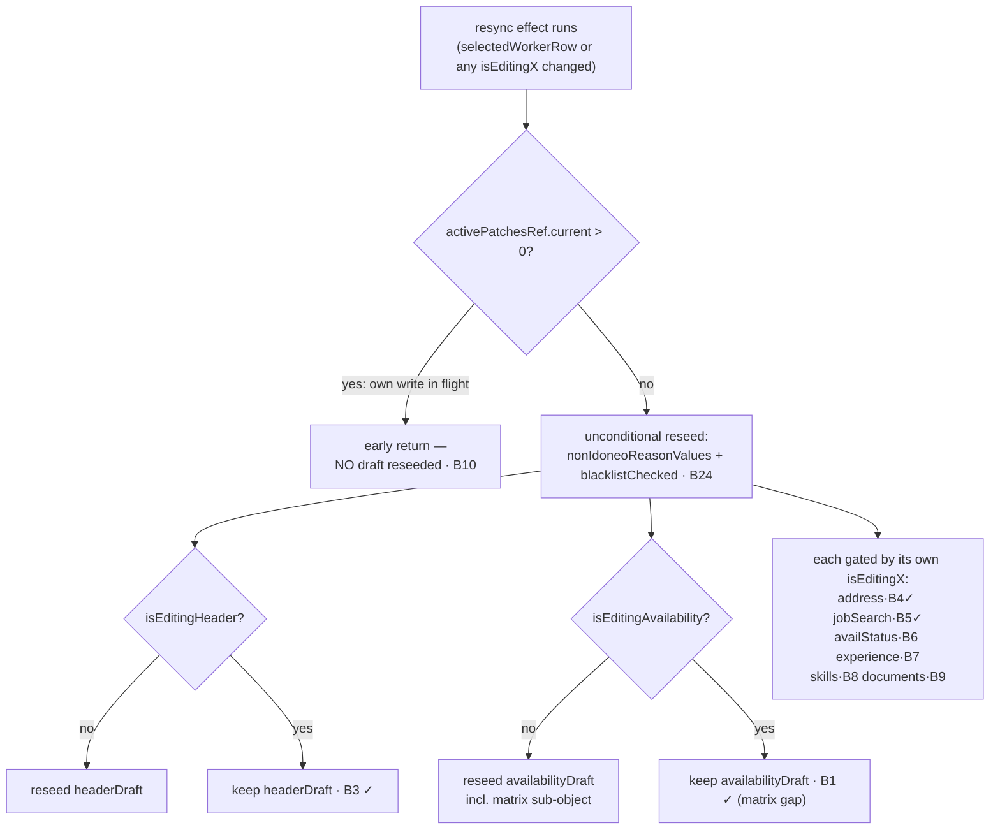
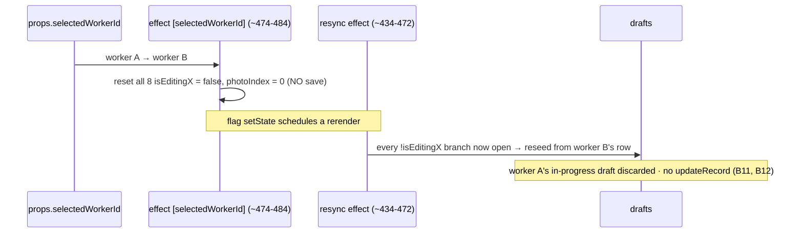

# test: Complete Target A — data-layer refactor safety net

## Summary

Close out **Target A** of `docs/testing-strategy.md` — the behavioral safety net
that must exist before the data layer is refactored. Three gaps remain after the
prior work (U3 write-tracking net, U4 autosave/realtime cluster net):

1. **A1 pure transform** — `normalizeTableResponse` is the data layer's *only*
   genuinely-pure shaper, and it is currently untested (the U3 plan deliberately
   skipped it as out-of-scope). Pin its exact output shape with a no-mocks unit
   test.
2. **A1 "verify the Supabase-call contract at the hook level"** — four
   simple/medium board hooks that consume the data layer have no tests
   (`use-riattivazioni-board`, `use-payroll-board`, `use-contributi-inps-board`,
   `use-prove-colloqui-data`). Pin their fetcher-args-in / card-mapping-out
   contract, including `use-payroll-board`'s Pattern-A `preserveDetailFields`
   (the realtime stale-field guard the data-layer refactor is most likely to
   break).
3. **A2 highest-risk hook** — `use-selected-worker-editor` (38KB, 1,137 lines)
   has only 6 pre-existing tests (5 echo + 1 error toast, from FASE 4 BIS, before
   the net). Extend
   them into a **full characterization net**: all 8 draft-resync guards,
   identity-switch flag-reset (cross-record draft bleed), the in-flight
   `activePatchesRef` resync gate, the `pendingAddressCreateRef` single-INSERT
   serialization, no-save-on-switch/unmount, error visibility on every write
   path, and the commit no-op short-circuits.

Test-only, with one minimal `export`-for-test of a pure function per unit where
needed (matches the existing exported-mapper pattern). No behavior change. The
**four giant board hooks** (`use-anagrafiche-data`, `use-ricerca-board`,
`use-ricerca-workers-pipeline`, `use-support-tickets-board`) are explicitly
**out of scope** — the strategy reserves them for Target B (just-in-time
characterization before splitting).

---

## Problem Frame

Target A is ~80% done. The write-tracking primitives
(`anagrafiche-api.write-tracking.test.ts`, U3) and the autosave/realtime cluster
(`use-auto-save-form`, `use-auto-save-form-fields`, `use-realtime-rows`,
`use-realtime-board-sync`, `use-debounced-save`, `use-board-mutations`, U4) are
netted. What is left is exactly the surface a Fase 3 data-layer refactor is most
likely to break, and where a regression silently reintroduces the
realtime/draft/concurrency bug class.

A key reframing emerged during research: **A1's "pure transforms (row mappers,
shapers, validators)" bucket is almost empty in `anagrafiche-api.ts`.** The file
is 1,736 lines of thin `fetch*`/RPC wrappers around a single shared
`queryTable`. The only genuinely-pure transform is `normalizeTableResponse`
(`src/lib/anagrafiche-api.ts:378-388`). The row-mappers the strategy imagined
actually live in the **board hooks** — which is why A1's second bullet ("Supabase
calls → test via the hooks that consume them") and the board-hook contract tests
in this plan, not more `anagrafiche-api` unit tests, are where the data layer's
shaping logic gets pinned.

The dominant risk in this plan is **false greens**. A green-but-vacuous test in
this cluster is the worst outcome: it reads as "covered" over exactly the guard a
refactor will break. The prior learnings
(`docs/solutions/best-practices/characterization-testing-module-level-state.md`,
`docs/solutions/best-practices/characterization-testing-rhf-realtime-false-greens.md`)
catalogue the specific traps; every guard test in this plan must be
**mutation-verified** (delete the guard in production → the test must red →
`git checkout --` to restore).

This is also a **learning exercise** (per the operator's study goals): the novel
mechanics here — the dual-effect identity-switch resync, the `activePatchesRef`
in-flight gate, and the `pendingAddressCreateRef` create-serialization — are
non-obvious and worth a compounding doc.

---

## Requirements

**A1 — `anagrafiche-api.ts` data layer**

- **R1.** `normalizeTableResponse` has a no-mocks unit test pinning its exact
  output shape across both code paths (array input, object input) and its
  nullish-vs-falsy precedence rules; the `EMPTY_ROWS` structural-identity
  contract is confirmed. (Advances strategy A1 "pure transforms → unit tests";
  origin R2, R5.)
- **R2.** The four in-scope board hooks (`use-riattivazioni-board`,
  `use-payroll-board`, `use-contributi-inps-board`, `use-prove-colloqui-data`)
  have contract tests pinning **which args go to their fetchers** and **how rows
  map to card fields**, including `use-payroll-board`'s Pattern-A
  `preserveDetailFields` realtime guard. (Advances strategy A1 "Supabase calls →
  via consuming hooks"; origin R5.)

**A2 — `use-selected-worker-editor` (highest risk)**

- **R3.** Every delicate `use-selected-worker-editor` behavior has a
  **fails-without-the-fix** test: all 8 draft-resync-without-clobber guards, the
  unconditional-resync asymmetry, identity-switch flag-reset (no cross-record
  bleed), no-save-on-switch, no-save-on-unmount, null-id write guards, the
  `activePatchesRef` in-flight resync gate, the `pendingAddressCreateRef`
  single-INSERT
  serialization, error visibility (`toast.error`) on every write path, the
  composite save orchestration (`updateRecord` + `invokeWorkerAvailability`
  side-effect + `toast.success`), and the commit no-op short-circuits.
  (Advances strategy A2; origin R4; closes the A2 "Definition of done" — every
  `realtime-bug-class-plan.md` behavior for this hook has a red-without-fix
  test.)

**Cross-cutting**

- **R4.** Every guard/clamp/floor test is **mutation-verified** (guard deleted →
  test reds → restored). No false greens. (Origin learnings.)
- **R5.** Tests mock at the module boundary (`@/lib/*`, `sonner`,
  `@/lib/supabase-client`), never the deep Supabase query-builder chain; no DOM
  snapshots; assertions on observable behavior; no Docker/backend dependency.
  The existing green suite stays green and the pre-push gate (test + tsc + lint)
  stays fast and hermetic. (Origin R5, R10.)
- **R6.** The four giant board hooks (`use-anagrafiche-data`,
  `use-ricerca-board`, `use-ricerca-workers-pipeline`,
  `use-support-tickets-board`) are **not** covered here — reserved for Target B
  per the strategy's A/B split.

---

## Key Technical Decisions

- **`normalizeTableResponse`: export-for-test (revisits the U3 skip).** The U3
  write-tracking test intentionally skipped it because it was "a private helper
  and exporting production code solely to test it is out of scope" *for that
  unit*. Completing A1's pure-transform mandate ("unit tests, no mocks, pin the
  exact output shape") requires testing it directly, so this plan adds `export`
  to the function. This is a zero-behavior-change change and matches the
  established pattern — the board contract tests for assunzioni/variazioni/
  chiusure already rely on exported pure mappers. (Alternative — test it
  indirectly through `queryTable`/`fetchFamiglie` with the edge function mocked —
  is rejected: it violates the "no mocks" mandate and couples the transform test
  to a fetcher.)

- **Board-hook contract tests: the pure pattern works for helpers, the rendered
  pattern for everything else.** The `use-assunzioni-board.test.ts` /
  `use-variazioni-board.test.ts` / `use-chiusure-board.test.ts` precedent works
  **only because those hooks export a synchronous pure mapper**
  (`mapAssunzioniBoardCard` etc.) + binding arrays + `preserveMissingFields`.
  **None of the four in-scope hooks have that** — verified: the per-card mapping
  is inline inside a non-exported async orchestrator
  (`fetchPayrollBoardData` / `fetchContributiBoardData` /
  `fetchRiattivazioniBoardData` / the prove builder), and extracting a pure mapper
  is a real refactor, not "one `export`". So: the **fetcher-call-args** and
  **full per-card mapping** scenarios go through `renderHookWithQueryClient` with
  `@/lib/anagrafiche-api` fetchers `vi.mock`ed → `*.integration.test.tsx` →
  `test:integration`. Pure no-mocks `*.test.ts` files are kept **only** for the
  genuinely-extractable helpers — payroll `preserveDetailFields` (`:249`),
  riattivazioni `resolveStage`, contributi `getQuarterDateRange` — each added via a
  minimal, low-risk `export`. Do **not** smuggle a whole mapper extraction in as a
  "minimal export".

- **`preserveMissingFields` / `preserveDetailFields` — three signatures
  (confirmed).** assunzioni = pure `(fresh, previous, bindings) → merged`;
  variazioni & chiusure = in-place `(target, previous, freshRow, bindings) →
  void`; and `use-payroll-board`'s `preserveDetailFields(card, previousCard) →
  merged` (2-arg pure-return, `src/hooks/use-payroll-board.ts:249`) — the preserved
  fields are the module constant `PRESERVED_DETAIL_FIELDS =
  ['presenze','presenzeRegolari']`, **not** a `bindings` argument. Its rule:
  restore `merged[field]` from `previousCard` whenever `card[field] == null`. The
  board mapper always seeds those two fields `null`, so the only observable
  behavior is restore-from-previous-when-fresh-is-null (see U2 — there is **no**
  "DB-clear / fresh-null-wins" case for this helper).

- **Extend the existing `use-selected-worker-editor.integration.test.tsx` — do
  not rewrite.** It already has the complete module-boundary mock harness
  (`sonner`, `@/lib/anagrafiche-api` → `{createRecord, deleteRecord,
  updateRecord}`, `@/lib/availability-functions`, `@/lib/stripe-connect-api`),
  the `makeRow`/`makeProps` factories, and the `renderHookWithQueryClient` render
  flow. All A2 units append `it(...)` cases (or new `describe` blocks) and reuse
  this harness.

- **Concurrency gates need a manually-deferred promise.** `activePatchesRef`
  (B10) and `pendingAddressCreateRef` (B22) only matter while a write is
  in-flight. A `mockResolvedValue` writer closes the window before the rerender,
  so the gate is never exercised (a false green). Mock the writer with a manual
  deferred (`let resolve; new Promise(r => { resolve = r })`) so the in-flight
  window is observable, assert the gated behavior, then resolve.

- **No fake timers for `use-selected-worker-editor`.** Unlike the write-tracking
  and debounced-save tests, this hook has **no internal debounce or
  flush-on-unmount** — callers (`DebouncedInput`/`useDebouncedSave`) own the
  debounce, then invoke `commit*`/`patch*`. So A2 tests are synchronous
  `act()` + `rerender(...)` for resync, and `await act(async () => …)` for write
  paths. (This corrects any assumption carried from the cluster tests that fake
  timers are needed here.)

- **Identity resync is flag-reset-driven, not `realtimeTick`-driven.** This hook
  has **no** `realtimeTick`. Switching `selectedWorkerId` fires the
  `[selectedWorkerId]` effect (~`474-484`), which resets all 8 `isEditingX` flags
  to `false`; the resync effect (~`434-472`) then re-seeds every draft from the
  new row because every `if (!isEditingX)` branch is now open. Pin this exact
  mechanism (B11) — do **not** look for a tick counter that doesn't exist.

- **Mutation-test-the-floor is mandatory (R4).** For every guard, delete it in
  the production source, run the test, confirm it reds, then restore. Watch the
  documented traps: balanced +1/−1 pairs never drive a counter below its floor;
  `null ?? null === null` masks a deleted `?? null`; compound `||`/`&&` guards
  need each half reached; a preservation test is vacuous unless the relevant
  `isEditingX` is **on** and the echoed row actually **differs**.

| Behavior class | Lives in | Tested via |
| --- | --- | --- |
| Pure shape transform | `anagrafiche-api.ts:378` | `*.test.ts`, no mocks (export the fn) |
| Board fetcher-args + card mapping | the 4 in-scope `use-*-board/data` hooks | mostly `*.integration.test.tsx` (render + mocked fetchers); pure `*.test.ts` only for extractable helpers |
| Draft echo / resync / write paths | `use-selected-worker-editor.ts` | extend the existing `*.integration.test.tsx` harness |
| Concurrency gates (in-flight) | `use-selected-worker-editor.ts` | same harness + a manual deferred-promise writer mock |

---

## High-Level Technical Design

### `use-selected-worker-editor` resync effect — the two guard layers

The resync effect (`~434-472`) has a top-level **own-write gate** and then a
**per-section editing guard** per draft, plus two drafts that resync
unconditionally. Each diamond is a behavior with its own red-without-fix test.

### Identity switch — the dual-effect resync (no `realtimeTick`)

### Coverage matrix — `use-selected-worker-editor` (existing vs to-add)

| Behavior | B-ID | Status | Unit |
| --- | --- | --- | --- |
| headerDraft / availabilityDraft / addressDraft / jobSearchDraft resync-clobber guard (+ availability resync) | B1–B5 (B2 = availability resync) | ✅ covered (FASE 4 BIS) | — |
| availabilityDraft **matrix** sub-object preservation | B1+ | gap | U3 |
| availabilityStatus / experience / skills / documents resync-clobber guard | B6–B9 | gap | U3 |
| nonIdoneo / blacklist **unconditional** resync asymmetry | B24 | gap | U3 |
| identity-switch flag reset + reseed (cross-record bleed) | B11 | gap (high risk) | U4 |
| no-save-on-identity-switch / on-unmount / null-id early return | B12, B13, B27 | gap | U4 |
| `activePatchesRef` in-flight resync gate | B10 | gap (subtle) | U5 |
| `pendingAddressCreateRef` single-INSERT serialization | B22 | gap (high risk) | U5 |
| field-patch error toast (lavoratori) | B14 | ✅ covered | — |
| error toast: address / availability / status / stripe / experience-ref | B15–B17, B25, B26 | gap | U6 |
| `saveWorkerAvailability` orchestration (+ `invokeWorkerAvailability`) | B16 | gap | U6 |
| commit no-op short-circuits + `come_ti_sposti` routing | B18–B21, (B23) | gap | U7 |

> B-IDs index the `use-selected-worker-editor` behavior catalogue produced during
> research (see Sources & Research); they are intentionally non-monotonic across
> units and do not imply ordering.

---

## Implementation Units

### Phase A — `anagrafiche-api.ts` data layer (A1)

### U1. `normalizeTableResponse` pure-transform unit test

- **Goal:** Pin the data layer's only pure shaper so the file can be reorganized
  without changing how every fetcher's response is shaped.
- **Requirements:** R1, R5
- **Dependencies:** none
- **Files:**
  - `src/lib/anagrafiche-api.ts` — add `export` to `normalizeTableResponse`
    (`~line 378`); no other change.
  - `src/lib/anagrafiche-api.normalize.test.ts` (new) — `*.test.ts`, no mocks.
- **Approach:** Table-driven input→output assertions on the exported function.
  Cover both code paths and the nullish-coalescing precedence exactly.
- **Execution note:** Characterization — pin the CURRENT semantics (including the
  surprising ones: array-by-reference, `total` can disagree with `rows.length`).
- **Patterns to follow:** `src/lib/anagrafiche-api.write-tracking.test.ts`
  (same file, sibling test), `src/lib/datetime.test.ts` (table-driven pure test).
- **Test scenarios:**
  - **Array input:** `[a, b]` → `{ rows: [a,b], total: 2, columns: [], groups: [] }`;
    and `normalizeTableResponse(arr).rows === arr` (returned **by reference**, not
    cloned).
  - **Empty array:** `[]` → `{ rows: [], total: 0, columns: [], groups: [] }`.
  - **Object with `data`:** `{ data: [a] }` → rows `[a]`, total `1`.
  - **`data` precedence over `rows`:** `{ data: [a], rows: [b] }` → rows `[a]`
    (rows ignored when data non-nullish).
  - **Nullish-vs-falsy on `data`:** `{ data: [], rows: [b] }` → rows `[]` (empty
    array is NOT nullish, does not fall through to `rows`). Red-without-fix
    distinguishes `??` from `||`.
  - **`total` precedence:** `{ data:[a], total: 500 }` → total `500` (disagrees
    with `rows.length` 1, not reconciled); `{ data:[a], count: 7 }` → total `7`;
    `{ data:[a,b] }` → total `2` (falls through to `rows.length`).
  - **Explicit `total: 0` preserved:** `{ data:[a], total: 0 }` → total `0`
    (0 not nullish).
  - **`columns`/`groups` defaults:** `{ data:[a] }` → `columns: []`, `groups: []`;
    `{ data:[a], columns: C, groups: GR }` → those values kept.
  - **Empty object:** `{}` → `{ rows: [], total: 0, columns: [], groups: [] }`.
  - **`EMPTY_ROWS` structural identity:** assert the module's `EMPTY_ROWS`
    constant (`~line 1166`) is structurally equal to the empty-input output (the
    rpc short-circuit shape the function intentionally mirrors). If `EMPTY_ROWS`
    is not exported, assert the shape via an exported fetcher's empty-input
    short-circuit instead, or skip with a one-line note — do not export it solely
    for this.
- **Verification:** new tests green under `test:unit`; deleting the `??` chain or
  swapping `??`→`||` reds the nullish-vs-falsy scenarios; coverage of
  `anagrafiche-api.ts` lines `378-388` rises from 0.

### U2. Board-hook contract tests — the four in-scope data hooks

- **Goal:** Pin the contract of the data-layer-consuming hooks the strategy's A1
  routes here: which args reach each fetcher, and how rows map to card fields —
  with `use-payroll-board`'s Pattern-A detail-field preservation as the headline
  (the realtime stale-field guard a data-layer refactor is most likely to break).
- **Requirements:** R2, R5
- **Dependencies:** none (U1 independent)
- **Files (new, next to each hook in `src/hooks/`):** suffix is per file, not
  fixed — a file that renders the hook (`renderHookWithQueryClient` + mocked
  fetchers, needed for the fetcher-call-args + full card-mapping scenarios) is
  `use-<hook>.integration.test.tsx` (`test:integration`); a file that tests only an
  extracted pure helper stays `use-<hook>.test.ts` (`test:unit`).
  - `src/hooks/use-payroll-board.integration.test.tsx` (+ optional
    `use-payroll-board.test.ts` for the pure `preserveDetailFields`)
  - `src/hooks/use-contributi-inps-board.integration.test.tsx` (+ optional pure
    `getQuarterDateRange` test)
  - `src/hooks/use-riattivazioni-board.integration.test.tsx` (+ optional pure
    `resolveStage` test)
  - `src/hooks/use-prove-colloqui-data.integration.test.tsx`
  - plus minimal `export` additions for the cleanly-extractable pure helpers only
    (`preserveDetailFields`, `resolveStage`, `getQuarterDateRange`); do **not**
    extract a whole inline mapper as a "minimal export" (see KTD).
- **Approach:** Two test shapes. (1) For the **pure extractable helpers**
  (`preserveDetailFields`, `resolveStage`, `getQuarterDateRange`): mirror the
  existing pure board-contract tests — import the helper, build
  `make<Record>(overrides)` / `makePrevious*` fixtures with `PREV-`/`FRESH-`
  sentinels, assert on returned shape, **no `vi.mock`/render/QueryClient**. (2) For
  the **fetcher-call-args and full per-card mapping** scenarios (inline in the
  non-exported async orchestrators): render the hook with
  `renderHookWithQueryClient` and `@/lib/anagrafiche-api` fetchers `vi.mock`ed, then
  assert which args reached each fetcher and the produced card/column/event arrays.
  **Stub every fetcher the orchestrator calls** or the hook throws (e.g. contributi
  fans out `Promise.all([fetchContributiInpsByPeriod, fetchMesiCalendarioAll(500),
  fetchRapportiLavorativiAll(3000, <trimmed cols>), fetchLookupValues()])`).
- **Execution note:** Characterization — pin current mapping (stage-drop rules,
  currency/date formatting, name-fallback order) as the contract.
- **Patterns to follow:** `src/hooks/use-assunzioni-board.test.ts`,
  `src/hooks/use-variazioni-board.test.ts`, `src/hooks/use-chiusure-board.test.ts`.
- **Test scenarios:**
  - **`use-payroll-board` (Pattern A — priority):**
    - `fetchCedoliniBoard` is called with the selected month; the rapporto-name
      enrichment fetcher is called with the **deduped, non-null** rapporto-id list.
    - Card mapping: `importoLabel = formatCurrency(importo_busta_estratto)`,
      `dataInvioLabel = formatItalianDate(data_invio_famiglia)`; `presenze` /
      `presenzeRegolari` seeded `null`.
    - **REGRESSION (Pattern A):** `preserveDetailFields` operates on the BUILT
      card (not the raw DB row) and keys only off `card[field] == null`. Since the
      board mapper always seeds `presenze: null` / `presenzeRegolari: null`
      (`use-payroll-board.ts` ~319-320), the only observable behavior is: when
      `previousCard[field]` is non-null → restore it; when it is null → stays null.
      Assert (a) narrow fresh card + rich `previousCard` → `presenze`/
      `presenzeRegolari` restored from previous; (b) `previousCard` with null
      `presenze` → merged stays null; (c) `previousCard` + sub-rows **not mutated**.
      Do **not** assert a "fresh present-null wins / DB-clear propagates" case —
      that semantic does not exist in payroll's card-level helper (it belongs to
      `preserveMissingFields` in assunzioni / crm-pipeline, which key off `column
      in row`).
    - Stage resolution: a row whose `stato_mese_lavorativo` has no alias is
      dropped.
  - **`use-contributi-inps-board`:**
    - `fetchContributiInpsByPeriod` called with the quarter date-range derived
      from `(selectedYear, selectedQuarter)`; `fetchRapportiLavorativiAll` called
      with the **trimmed column-select** string; the name fetcher called only with
      rapporti **referenced** by the period's contributi (deduped).
    - Quarter filter: a card is kept iff its creation-date quarter/year OR resolved
      `trimestre` OR parsed `trimestre_id` matches the selection (table-drive the
      three strategies); `importoLabel`/`pagopaLabel` currency-formatted.
  - **`use-riattivazioni-board`:**
    - `resolveStage` normalizes status to one of the 4 stage ids, defaulting to
      `da sentire` on unknown/empty.
    - Inclusion filter: card kept when `stato_riattivazione_famiglia` is non-empty
      **or** `rapporto.stato_servizio` normalizes to `non attivo`; otherwise
      dropped.
    - Field mapping: `email` falls back record → famiglia → `'-'`;
      `tipoLabel = tipo_licenziamento ?? tipo_decesso ?? '-'`; assunzione names take
      priority over rapporto labels.
  - **`use-prove-colloqui-data`** (lowest-value of the four — keep tight):
    - `fetchProveColloquiBoard` called with the effective calendar range
      (provided range or computed default month window).
    - Prova columns built from the trial-status lookup; ad-hoc statuses become
      dynamic columns.
    - Calendar dedup + event tone: **derive the exact dedup-key composition and the
      tone predicate from `use-prove-colloqui-data.ts` first and pin CURRENT
      behavior verbatim — do not assume the shape.** If neither is cleanly
      extractable, render the hook with the fetchers mocked and assert on the
      produced events array; if the cost outweighs the value, defer the
      dedup/tone scenarios and keep only the fetcher-range arg assertion.
  - Mark as passthrough — no assertion — any hook whose mapping turns out to be a
    trivial passthrough after inspection; note the reason inline.
- **Verification:** pure-helper tests green under `test:unit`, rendered-hook tests
  green under `test:integration`; for payroll, deleting the `preserveDetailFields`
  restore reds the Pattern-A regression scenario; the fetcher-arg assertions fail
  if the wrong args/dedup are passed.

### Phase B — `use-selected-worker-editor` full characterization net (A2)

> All Phase B units **extend** `src/hooks/use-selected-worker-editor.integration.test.tsx`,
> reusing its existing mock harness and `makeRow`/`makeProps` factories. They all
> touch the same file, so land them **one-at-a-time** (any order) to avoid
> conflicts — each only needs the existing harness; there is no content dependency
> between them.

### U3. Complete the draft-resync-without-clobber net across all 8 drafts

- **Goal:** Extend the existing echo tests (4 preservation drafts + 1 availability
  resync) to the **4** uncovered `isEditing`-guarded drafts, the availability
  **matrix** sub-object, and the unconditional-resync asymmetry — so every draft's
  clobber guard is pinned.
- **Requirements:** R3, R4, R5
- **Dependencies:** none (extends existing file)
- **Files:** `src/hooks/use-selected-worker-editor.integration.test.tsx` (extend)
- **Approach:** For each draft: set its `isEditingX = true` via `act()`, type/seed
  a draft value, `rerender(makeProps(echoedRow))` with the relevant column
  **changed**, assert the draft is **preserved**; then a second case with
  `isEditingX = false` asserting it **does** resync. Reuse the existing harness.
- **Execution note:** Characterization-first; mutation-verify each
  `if (!isEditingX)` guard.
- **Patterns to follow:** the existing 5 tests in the same file (lines `104-278`).
- **Test scenarios:**
  - **B6 `availabilityStatusDraft`** (`disponibilita`, `data_ritorno_disponibilita`):
    editing → preserved on echo; not editing → resynced.
  - **B7 `experienceDraft`** (`anni_esperienza_*` via `asInputValue`,
    `situazione_lavorativa_attuale` via `asString`): editing → preserved; not
    editing → resynced.
  - **B8 `skillsDraft`** (one of the 24 skill columns): editing → preserved; not
    editing → resynced.
  - **B9 `documentsDraft`** (`stato_verifica_documenti`, `iban`,
    `id_stripe_account`, …): editing → preserved; not editing → resynced.
  - **B1+ matrix preservation:** with `isEditingAvailability = true`, an echoed
    row changing `availability_final_json` → the in-progress **matrix sub-object**
    is preserved (the existing test only asserts the two scalar/array fields).
  - **B24 unconditional-resync asymmetry:** set **every** `isEditingX = true`,
    rerender with changed `motivazione_non_idoneo` / `check_blacklist` → assert
    `nonIdoneoReasonValues` and `blacklistChecked` **did** update (they are NOT
    `isEditing`-gated — only the `activePatchesRef` gate protects them). Red-without
    -fix if an `isEditing` guard is ever added here.
  - **Non-vacuity:** for each preservation case, confirm the echoed row's column
    actually differs from the seeded draft, and that `isEditingX` is on (a clean
    field resyncs regardless — see `falseGreenTraps`).
- **Verification:** all 8 drafts have a preservation test (and the editing-off
  resync is covered for availability + the 4 newly-added drafts); deleting any
  single `if (!isEditingX)` guard reds exactly its preservation scenario; full
  suite green.

### U4. Identity-switch, lifecycle no-save, and null-id guards

- **Goal:** Pin the highest-risk lifecycle behaviors — that switching workers
  mid-edit discards the draft and reseeds from the new worker (no cross-record
  bleed) **without** a write, and that the hook never auto-flushes.
- **Requirements:** R3, R4, R5
- **Dependencies:** none (extends the existing file; land one-at-a-time with the
  other Phase B units)
- **Files:** `src/hooks/use-selected-worker-editor.integration.test.tsx` (extend)
- **Approach:** Drive the `[selectedWorkerId]` effect by rerendering with a
  **different `selectedWorkerId` AND a different row**; assert flag reset + reseed
  and that no writer fired. Mock the writers with a default resolving value so
  "not called" is met for the right reason.
- **Execution note:** Pin that resync here is **flag-reset-driven**, not
  `realtimeTick`-driven (no tick exists).
- **Patterns to follow:** the existing rerender-echo tests in the same file.
- **Test scenarios:**
  - **B11 identity switch:** set `isEditingHeader = true`, seed a `headerDraft`,
    rerender with new `selectedWorkerId` + new row → `headerDraft` now reflects the
    **new** worker's values AND `isEditingHeader` is back to `false`. Red-without
    -fix if the flag-reset effect is removed (the old draft would freeze onto the
    new worker — cross-record bleed).
  - **B12 no-save-on-switch:** the same id-switch rerender fires **no**
    `updateRecord` / `createRecord` / `deleteRecord`.
  - **B13 no-save-on-unmount:** seed a dirty draft, `unmount()` → no writer called
    (this hook has no flush-on-unmount, unlike `useDebouncedSave`).
  - **B27 null-id early return:** render with `selectedWorkerId = null`, invoke a
    writer callback (e.g. `patchSelectedWorkerField`) → no `updateRecord`.
  - **Non-vacuity:** for the no-save cases, assert the **writers** are not called
    (not merely `toast`), and ensure the writer mock would otherwise resolve.
- **Verification:** id-switch reseeds to the new row with flags cleared; no writer
  fires on switch/unmount/null-id; deleting the flag-reset effect reds B11.

### U5. In-flight write gates — `activePatchesRef` + address-create serialization

- **Goal:** Pin the two subtle concurrency guards that protect against
  self-clobbering optimistic writes and duplicate `indirizzi` INSERTs — the
  behaviors most likely to silently regress and the hardest to catch.
- **Requirements:** R3, R4, R5
- **Dependencies:** none (extends the existing file; land one-at-a-time with the
  other Phase B units)
- **Files:** `src/hooks/use-selected-worker-editor.integration.test.tsx` (extend)
- **Approach:** Mock the relevant writer with a **manual deferred promise** so the
  in-flight window stays open across a rerender; assert the gated behavior, then
  resolve and assert the post-resolution state.
- **Execution note:** A `mockResolvedValue` writer closes the window before the
  rerender — the gate would never be exercised (false green). The deferred is
  load-bearing.
- **Patterns to follow:** the async write test in the same file
  (`mockRejectedValueOnce` + `await act(async …)`), adapted to a held promise.
- **Test scenarios:**
  - **B10 `activePatchesRef` gate:** start a field patch whose `updateRecord` is a
    held (unresolved) deferred → while it is in flight, `rerender(makeProps(newRow))`
    with changed columns → assert **no** draft (even non-editing ones) is reseeded
    (the whole resync effect early-returns). Then resolve the promise → normal
    resync resumes. Red-without-fix if the `if (activePatchesRef.current > 0)
    return` early-return is removed.
  - **B22 `pendingAddressCreateRef` single-INSERT serialization:**
    `pendingAddressCreateRef` is a `Map<string, Promise>` keyed by
    `selectedWorkerId` (`use-selected-worker-editor.ts` ~363), **not** a single
    shared promise. With `selectedWorkerAddress` having **no `id`**, fire two
    `applyAddressPatch` (different fields) concurrently **under the same
    `selectedWorkerId`** (so both hit the same Map entry) against a held
    `createRecord` deferred → assert `createRecord('indirizzi', …)` is called
    **once**; resolve → the second field persists via `updateRecord('indirizzi',
    <id from the resolved create>, …)`, not a second INSERT. Red-without-fix if the
    per-worker `pendingAddressCreateRef` gate is removed (two INSERTs → duplicate
    address row).
    *Non-vacuity:* do **not** rerender with a new `selectedWorkerId` between the two
    calls — that correctly routes them to different Map entries and bypasses the
    gate, failing "called once" for the wrong reason (do not carry B10's
    `rerender(makeProps(newRow))` into B22).
- **Verification:** both gates pinned with deferred promises; deleting either
  guard reds exactly its scenario; full suite green.

### U6. Write paths — error visibility on every catch + save orchestration

- **Goal:** Pin that every write path surfaces failures via `toast.error` (the
  "silent save" class), and that the composite availability save performs its full
  orchestration including the `invokeWorkerAvailability` side-effect.
- **Requirements:** R3, R4, R5
- **Dependencies:** none (extends the existing file; land one-at-a-time with the
  other Phase B units)
- **Files:** `src/hooks/use-selected-worker-editor.integration.test.tsx` (extend)
- **Approach:** `mockRejectedValueOnce` per path for error cases (with
  `vi.mocked(toast.error).mockClear()` first); `mockResolvedValue({ row })` for the
  success-orchestration case, asserting **each** downstream call. Reuse the
  existing error-test shape (the lavoratori-patch path, B14, is the template).
- **Execution note:** For orchestration, assert the side-effect edge-fn call
  (`invokeWorkerAvailability`) AND `toast.success`, not just `updateRecord` — a
  regression that drops the side-effect would otherwise stay green
  (`falseGreenTraps`).
- **Patterns to follow:** the existing error test (lines `281-306`) in the same
  file.
- **Test scenarios:**
  - **B15 address patch failure:** `applyAddressPatch` → rejected `updateRecord`
    (or `createRecord`) → `toast.error` with the message + `setError` + re-throw.
  - **B16 `saveWorkerAvailability` success orchestration:** resolves → calls
    `updateRecord('lavoratori', …)` with the matrix-derived patch, then
    `applyUpdatedWorkerRow`, then `invokeWorkerAvailability`, then `toast.success`;
    toggles `updatingAvailability` + `updatingAvailabilityStatus`. Plus a failure
    case → `toast.error` + re-throw.
  - **B17 `patchWorkerAvailabilityStatus`:** updates `lavoratori` then
    `invokeWorkerAvailability`; failure → `toast.error` + re-throw; toggles only
    `updatingAvailabilityStatus`.
  - **B25 `generateStripeAccount`:** `createStripeConnectAccount` →
    conditional `applyUpdatedWorkerRow` when `result.row`, seeds
    `documentsDraft.id_stripe_account`, `toast.success`; failure → `toast.error` +
    re-throw.
  - **B26 experience/reference structural mutations:** `createExperienceRecord` /
    `deleteExperienceRecord` / `createReferenceRecord` toggle `updatingExperience`
    and invoke the correct apply/append/remove callback; the per-field
    `patchExperienceRecord` / `patchReferenceRecord` deliberately do **not** toggle
    it (avoids disabling `DebouncedInput` mid-type). Pin the `createReferenceRecord`
    → `updatingExperience` shared-flag quirk.
  - **Non-vacuity:** `mockRejectedValueOnce` (not persistent), `mockClear()` toast
    spies, and assert the **specific** message so a different failure path can't
    satisfy the assertion.
- **Verification:** every write path reds when its `toast.error`/side-effect is
  removed; orchestration asserts all four downstream calls; full suite green.

### U7. Commit no-op short-circuits + field routing

- **Goal:** Pin that `commit*` helpers skip redundant writes when the value is
  unchanged (type-aware compares), and that `come_ti_sposti` routes to the
  `lavoratori` table while other address fields route to `indirizzi`.
- **Requirements:** R3, R4, R5
- **Dependencies:** none (extends the existing file; land one-at-a-time with the
  other Phase B units)
- **Files:** `src/hooks/use-selected-worker-editor.integration.test.tsx` (extend)
- **Approach:** Seed the draft equal to the current server value, invoke the
  `commit*` callback, assert **no** writer fired; then a changed value asserting it
  does fire against the **correct** table.
- **Execution note:** Pin the field-specific branches (they are easy to break in a
  refactor): `data_di_nascita` is **not** trimmed; `anni_*` compare numerically;
  `iban` compares against `resolvedIban`; `come_ti_sposti` JSON-equality.
- **Patterns to follow:** the existing write tests in the same file.
- **Test scenarios:**
  - **B18 `commitHeaderField` no-op:** trimmed draft equals current → no patch;
    a changed value → one `updateRecord('lavoratori')`. Assert `data_di_nascita`
    is compared **untrimmed** (a date string must not be trimmed).
  - **B19 `commitExperienceField` type-aware compare:** `situazione_lavorativa_attuale`
    trimmed-string compare; `anni_*` numeric compare (`'5'` vs `'5.0'` → no-op).
  - **B20 `commitDocumentField` iban compare:** uses `resolvedIban`, not the
    generic `selectedWorkerRow[field]`, for the no-op check.
  - **B21 `commitAddressField` routing:** a `come_ti_sposti` change routes to
    `patchSelectedWorkerField` (`lavoratori`) with JSON-equality no-op; other
    address fields route to `applyAddressPatch` (`indirizzi`).
  - **B23 (optional) `handleNonIdoneoReasonsChange` / `handleBlacklistChange`:**
    optimistic local set then patch; `values.length > 0 ? values : null` and the
    blacklist token mapping persisted.
- **Verification:** no-op cases fire no writer; changed cases write to the correct
  table; deleting a no-op short-circuit reds its scenario.

### Phase C — Compounding

### U8. Close out Target A — strategy doc status + characterization learning

- **Goal:** Record that Target A is complete and capture the novel
  `use-selected-worker-editor` characterization mechanics so the next refactor (and
  the AI) start advantaged.
- **Requirements:** R3 (records that the A2 DoD is met), R6 (records the
  four-giant-board-hooks deferral to Target B)
- **Dependencies:** U1–U7
- **Files:**
  - `docs/testing-strategy.md` — mark Target A's "Definition of done" met; update
    the baseline table rows for `anagrafiche-api.ts` (normalize covered),
    `use-selected-worker-editor.ts`, and the four newly-netted board hooks; note
    the four giant board hooks deferred to Target B.
  - `docs/solutions/best-practices/characterization-testing-selected-worker-editor.md`
    (new) — the SWE-specific recipe: the dual-effect identity-switch resync (no
    `realtimeTick`), the `activePatchesRef` in-flight gate and
    `pendingAddressCreateRef` create-serialization tested via a manual deferred
    promise, the no-fake-timers rationale, and the per-draft mutation-verify
    checklist. Cross-link the two sibling learnings and `realtime-bug-class-plan.md`.
- **Approach:** Prose + short snippets distilled from U3–U7. Frame the giant board
  hooks explicitly as Target B candidates, not work to do now.
- **Test expectation:** none — documentation unit.
- **Verification:** `docs/testing-strategy.md` shows Target A done; the new
  learning cross-links the siblings and a teammate/agent can follow the SWE recipe
  cold.

---

## Scope Boundaries

### Deferred to Follow-Up Work (Target B)

- **The four giant board hooks** — `use-anagrafiche-data.ts` (741, AG-Grid
  raw-table browser, 7-way fetcher dispatch, module-level caches),
  `use-ricerca-board.ts` (566, deferred-column lazy-load state machine),
  `use-ricerca-workers-pipeline.ts` (1,023, multi-stage fetch fan-out +
  availability side-effects), `use-support-tickets-board.ts` (937, polymorphic
  hub with ~10 record indexes). The strategy reserves these for **Target B**:
  characterize just-in-time, immediately before splitting each — not as part of
  the data-layer net.

### Non-goals

- No production behavior changes — the only production edits are minimal
  `export`-for-test additions of pure functions (`normalizeTableResponse`; board
  mappers where not already exported).
- No splitting of any giant file (Target B / Fase 3).
- No E2E / Playwright (U5–U6 of the Fase 1 origin plan).
- No global coverage-percentage target — coverage stays a map, not a gate.

---

## Risks & Dependencies

- **False greens are the primary risk (R4).** Every guard test must be
  mutation-verified. Highest-risk vacuity traps for this plan: a preservation test
  with `isEditingX` off (a clean field resyncs regardless); an echoed row whose
  column doesn't actually differ; a concurrency-gate test with a synchronously
  resolving writer (the in-flight window closes before the rerender); swapping
  `??`→`||` not being caught because the test feeds an explicit-null instead of an
  absent key.
- **`export`-for-test reverses a prior local decision (U1).** The U3 test
  deliberately skipped `normalizeTableResponse` as out-of-scope. This plan
  revisits that with a narrow, behavior-preserving `export` — flag it in review so
  the reversal is deliberate, not accidental.
- **Board mapper extractability (U2, resolved).** None of the four hooks exposes a
  separable pure card-mapper — the mapping is inline in a non-exported async
  orchestrator. Fetcher-args + full-card-mapping scenarios therefore use a
  `renderHookWithQueryClient` integration test with mocked fetchers; only the small
  helpers (`preserveDetailFields`, `resolveStage`, `getQuarterDateRange`) are pure
  `*.test.ts`.
- **`preserveDetailFields` is a third signature (U2, resolved).**
  `use-payroll-board`'s `preserveDetailFields(card, previousCard)` is 2-arg
  pure-return with `PRESERVED_DETAIL_FIELDS` baked in — neither the assunzioni
  3-arg nor the chiusure 4-arg shape. Import it directly (after a minimal
  `export`); do not pass a `bindings` array, and do not assert a "fresh-null wins"
  case (it does not exist here).
- **Same-file sequencing (U3–U7).** All Phase B units extend one test file; land
  them one-at-a-time (any order) to avoid conflicts. No content dependency between
  them beyond the shared file.
- **Dependencies:** none blocking. U3 (write-tracking) and U4 (cluster) of the
  prior plans established the module-boundary + mutation-verify conventions these
  tests reuse.

---

## Open Questions

- **`EMPTY_ROWS` assertion in U1** — assert structural identity against the
  module constant (if exportable) vs via an exported fetcher's empty-input
  short-circuit. Decide at execution; do not export `EMPTY_ROWS` solely for the
  test.
- **U2 depth per hook** — pin only the fetcher-args + headline mapping contract
  (tight), or fuller card-mapping characterization? Lean tight (this is A1
  contract-verification, not Target-B characterization); expand only where a
  realtime-bug-class behavior (like payroll's Pattern A) warrants it.
- **Bare `commit*` invocation vs `userEvent` in U7** — invoking the returned
  `commit*` callback directly is sufficient to exercise the no-op branch; a
  `DebouncedInput`-driven path adds fidelity but isn't required. Deferred to
  implementation.

---

## Sources & Research

- **Origin:** `docs/testing-strategy.md` (Target A: A1 + A2, Definition of done);
  `docs/plans/2026-06-19-001-test-fase1-safety-net-plan.md` (R-IDs, U3/U4);
  `docs/plans/2026-06-23-001-test-u4-autosave-realtime-cluster-plan.md`.
- **Under test:** `src/lib/anagrafiche-api.ts` (`normalizeTableResponse` ~378-388,
  `EMPTY_ROWS` ~1166); `src/hooks/use-selected-worker-editor.ts` (1,137 lines —
  resync effect ~434-472, `[selectedWorkerId]` effect ~474-484, `activePatchesRef`
  gate ~435, `applyAddressPatch`/`pendingAddressCreateRef` ~607-672,
  `saveWorkerAvailability` ~737-776, `commit*` helpers ~685-1022);
  `src/hooks/use-payroll-board.ts`, `use-contributi-inps-board.ts`,
  `use-riattivazioni-board.ts`, `use-prove-colloqui-data.ts`.
- **Patterns:** `src/hooks/use-assunzioni-board.test.ts`,
  `src/hooks/use-variazioni-board.test.ts`, `src/hooks/use-chiusure-board.test.ts`
  (pure board-contract tests); `src/hooks/use-selected-worker-editor.integration.test.tsx`
  (the harness to extend); `src/test/test-utils.tsx`
  (`renderHookWithQueryClient`); `src/lib/anagrafiche-api.write-tracking.test.ts`.
- **Learnings (carry the traps forward):**
  `docs/solutions/best-practices/characterization-testing-module-level-state.md`,
  `docs/solutions/best-practices/characterization-testing-rhf-realtime-false-greens.md`,
  `docs/realtime-bug-class-plan.md`, `docs/realtime-board-pattern.md`.
- **Domain vocabulary:** `CONCEPTS.md` — Write tracking, Echo suppression,
  Realtime bug class, Pattern A (merge-preserving).

External research was not run: this is test characterization over a
strongly-patterned local suite; the conventions and traps are already documented
in the repo's own learnings.
