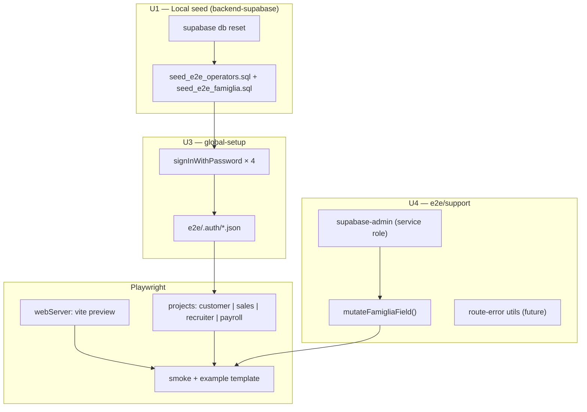
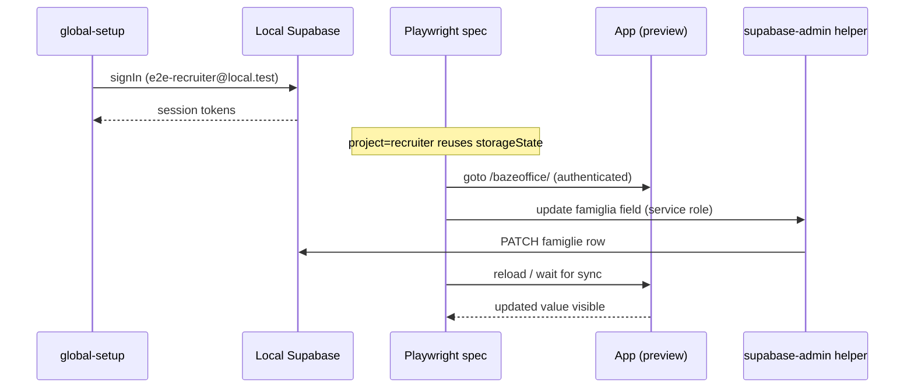

# test: E2E Playwright harness — four operator roles + famiglia fixtures

## Summary

Stand up a **local-only Playwright harness** with U8 bundled: seed four operator-role users and famiglia domain fixtures in the local Supabase stack, wire multi-project `storageState` auth, add support helpers for simulating external famiglia writes via service role, and ship smoke + template specs. Ricerca feature E2E stays deferred. Playwright remains outside `npm test`, lefthook, and CI.

## Problem Frame

Target A (Vitest) is complete (~302 green tests). There is no Playwright install, no `e2e/` directory, and U8 (local Supabase + test users) has not been started. BazeOffice authenticates **office operators only** (`customer`, `sales`, `recruiter`, `payroll`). Famiglia update records in a separate production webapp; E2E must still seed famiglia-linked data and simulate those writes without famiglia browser sessions.

See origin: `docs/brainstorms/2026-06-29-e2e-playwright-harness-requirements.md`.

---

## Requirements

Traceability to origin R-IDs:

| ID | Requirement |
| --- | --- |
| R1–R5 | Local Supabase stack, four operator auth users + `operatori` rows, famiglia seed fixture, hardcoded local harness constants |
| R6–R10 | Playwright dep + scripts, multi-project config, `global-setup`, Vitest isolation, gitignore |
| R11–R14 | `e2e/support/` helpers, smoke spec, template spec, README runbook |
| R15–R16 | Vitest gate unchanged; session tokens gitignored, seed creds committed in backend |

Acceptance examples to satisfy:

| ID | Scenario |
| --- | --- |
| AE1 | Smoke: recruiter project loads authenticated app shell |
| AE2 | `--project=payroll` runs with payroll session only |
| AE3 | Template: service-role famiglia mutation visible in UI |
| AE4 | `npm test` passes without Docker |

---

## Key Technical Decisions

- **Playwright projects per operator role (Approach B).** Four named projects (`customer`, `sales`, `recruiter`, `payroll`), each with `use.storageState` → `e2e/.auth/<role>.json`. Specs run per-project; filter with `--project=<role>`. (see origin)
- **Seed in sibling `backend-supabase`.** Operator users and famiglia fixtures live in local seed SQL wired into `[db.seed].sql_paths` — never migrations. Follow `docs/solutions/integration-issues/local-supabase-test-user-and-auth-schema-500.md` (both `auth.users` + `auth.identities` per user; `supabase db reset` not just `start`).
- **Hardcoded local constants in `e2e/constants.ts`.** Commit localhost URL, publishable anon key, service-role key, operator emails/passwords, and `BASE_PATH` (`/bazeoffice/` per `vite.config.ts`). Local-only throwaway values; frictionless `npm run e2e` after first `supabase status` copy.
- **Operator seed convention.** Emails `e2e-<role>@local.test`, shared password `password123`, fixed UUIDs per role for stable `operatori.id` ↔ `auth.users.id` linkage. Each `operatori.ruolo` is `ARRAY['<token>']::text[]` with `attivo = true`.
- **Famiglia fixture, not famiglia auth.** Seed one identifiable famiglia row (e.g. `E2E Famiglia Rossi`) plus a linked `processi_matching` row. Template spec mutates a famiglia field via service role to simulate the external webapp.
- **Preview default; `e2e:dev` escape hatch.** `webServer` runs `npm run build && npm run preview` with `VITE_*` env injected at build time. Separate `e2e:dev` script points `webServer` at `npm run dev:nostrict` for faster iteration.
- **`global-setup` uses standalone Supabase client.** Do not import `src/lib/supabase-client.ts` (throws without env, wraps `profiledFetch`). Use `@supabase/supabase-js` directly in `e2e/global-setup.ts` and `e2e/support/supabase-admin.ts`.
- **Playwright `baseURL` includes Vite base path.** App routes resolve under `/bazeoffice/` (`src/routes/app-routes.ts` `getBasePrefix`). `baseURL: 'http://127.0.0.1:4173/bazeoffice'` (or whatever preview port).
- **Out of the gate.** No changes to `lefthook.yml`, `.github/workflows/ci.yml`, or `npm test`.

---

## High-Level Technical Design

### Harness layers



### Auth + external-write sequence



---

## Output Structure

```
bazeoffice/
├── playwright.config.ts
├── package.json                    # + @playwright/test, e2e / e2e:ui / e2e:dev scripts
├── .gitignore                      # + e2e/.auth, playwright-report, test-results
├── e2e/
│   ├── constants.ts                # hardcoded local URLs, keys, operator creds
│   ├── global-setup.ts             # four storageState files
│   ├── smoke.spec.ts
│   ├── example.spec.ts             # template: role project + famiglia mutation
│   ├── support/
│   │   ├── supabase-admin.ts       # service-role client
│   │   ├── famiglia-mutations.ts   # simulate external webapp writes
│   │   ├── selectors.ts            # login ids, shell markers
│   │   └── route-errors.ts         # page.route helpers (stub for future U6)
│   ├── .auth/                      # gitignored storageState output
│   └── README.md
└── docs/testing-strategy.md          # + E2E section (U6)

backend-supabase/supabase/          # sibling repo — U1
├── seed_e2e_operators.sql          # 4 auth users + operatori rows
├── seed_e2e_famiglia.sql           # famiglia + processi_matching fixture
└── config.toml                     # wire sql_paths
```

Per-unit `Files:` lists below are authoritative; adjust layout if a cleaner shape emerges during implementation.

---

## Implementation Units

### Phase 0 — Local environment (run first)

### U1. Seed four operator users + famiglia fixture

- **Goal:** Provision login-capable operator users (one per role token) and a minimal famiglia-linked dataset reproducible via `supabase db reset`.
- **Requirements:** R1, R2, R3, R4, R16
- **Dependencies:** none
- **Files:**
  - `../backend-supabase/supabase/seed_e2e_operators.sql` (new)
  - `../backend-supabase/supabase/seed_e2e_famiglia.sql` (new)
  - `../backend-supabase/supabase/config.toml` — append to `[db.seed].sql_paths`
  - `docs/solutions/integration-issues/local-supabase-test-user-and-auth-schema-500.md` — cross-link new seed files (optional one-line)
- **Approach:**
  1. Create idempotent seed for four operators. Per user: insert `auth.users` + `auth.identities` (pgcrypto `crypt('password123', gen_salt('bf'))`), then insert `public.operatori` with matching `id`, `email`, `nome`, `cognome`, `ruolo = ARRAY['<token>']`, `attivo = true`.
  2. Fixed emails: `e2e-customer@local.test`, `e2e-sales@local.test`, `e2e-recruiter@local.test`, `e2e-payroll@local.test`. Fixed UUIDs (document in seed comments) so re-seed is stable.
  3. Famiglia fixture: one `famiglie` row with distinctive `nome`/`cognome` (e.g. `E2E` / `Famiglia Rossi`), one linked `processi_matching` in a board-visible stato. Use only columns required by NOT NULL constraints; keep minimal.
  4. `cd ../backend-supabase && supabase start && supabase db reset`. Verify each operator logs in via curl (pattern in solution doc).
  5. Run `supabase status` → copy publishable + secret keys into `e2e/constants.ts` during U2.
- **Patterns to follow:** `docs/solutions/integration-issues/local-supabase-test-user-and-auth-schema-500.md`
- **Test scenarios:**
  - Idempotent re-run: second `db reset` leaves four users login-capable.
  - Each `operatori_options` RPC returns the seeded operator when filtered by role (manual curl or noted in README).
  - Famiglia fixture row exists and is linked to `processi_matching`.
- **Verification:** All four curl login calls return HTTP 200 + `access_token`; famiglia row queryable in local DB.

### Phase A — Playwright harness

### U2. Install Playwright + constants + gitignore

- **Goal:** Add Playwright dependency, hardcoded local constants, and artifact ignores without touching the Vitest gate.
- **Requirements:** R5, R6, R10, R15
- **Dependencies:** U1 (keys from `supabase status`)
- **Files:**
  - `package.json` — add `@playwright/test` devDep; scripts `e2e`, `e2e:ui`, `e2e:dev`
  - `e2e/constants.ts` (new)
  - `.gitignore` — `e2e/.auth/`, `playwright-report/`, `test-results/`
- **Approach:**
  - `e2e/constants.ts` exports: `LOCAL_SUPABASE_URL`, `LOCAL_PUBLISHABLE_KEY`, `LOCAL_SERVICE_ROLE_KEY`, `LOCAL_FUNCTIONS_URL`, `BASE_PATH` (`/bazeoffice/`), `OPERATORS` map (`customer` | `sales` | `recruiter` | `payroll` → `{ email, password, storageStatePath }`), `E2E_FAMIGLIA` fixture ids/names for template assertions.
  - Scripts: `e2e` → `playwright test`; `e2e:ui` → `playwright test --ui`; `e2e:dev` → `E2E_WEB_SERVER=dev playwright test` (or dedicated config flag — implementer picks one, document in README).
  - Run `npx playwright install chromium` once (note in README).
  - Confirm `vitest.config.ts` `include` stays `src/**` only — no change expected.
- **Test expectation:** none — scaffolding unit.
- **Verification:** `npm test` still green; `package.json` has no Playwright in `test` script.

### U3. Playwright config + global-setup (four storageStates)

- **Goal:** Wire multi-project auth and app boot via preview `webServer`.
- **Requirements:** R7, R8, R12 (partial)
- **Dependencies:** U2
- **Files:**
  - `playwright.config.ts` (new)
  - `e2e/global-setup.ts` (new)
- **Approach:**
  - `testDir: 'e2e'`, `globalSetup: './e2e/global-setup.ts'`.
  - `use.baseURL`: preview origin + `BASE_PATH`. `use.storageState` per project.
  - Four projects named after role tokens; each points at `e2e/.auth/<role>.json`.
  - `webServer` (default): `npm run build` with `env` block setting `VITE_SUPABASE_URL`, `VITE_SUPABASE_ANON_KEY`, `VITE_SUPABASE_FUNCTIONS_URL` from constants; then `npm run preview -- --host 127.0.0.1 --port 4173`. `reuseExistingServer: !process.env.CI`.
  - `e2e:dev` path: when env flag set, `webServer.command` → `npm run dev:nostrict` with same `VITE_*` env.
  - `global-setup.ts`: for each operator in `OPERATORS`, `createClient` + `signInWithPassword`, save `storageState` to path. Fail fast with actionable message if Supabase unreachable.
- **Patterns to follow:** `docs/plans/2026-06-19-001-test-fase1-safety-net-plan.md` U5 sequence diagram; `src/lib/supabase-client.ts` (`persistSession: true` — storageState replays session).
- **Test scenarios:**
  - Covers AE2. After global-setup, four JSON files exist under `e2e/.auth/`.
  - Global-setup failure when local Supabase is down produces clear error (not opaque timeout).
- **Verification:** `npx playwright test --list` shows four projects; global-setup completes against running local stack.

### U4. Support layer — selectors, admin client, famiglia mutations, route stubs

- **Goal:** Shared E2E utilities: stable selectors, service-role writes, future error-injection helpers.
- **Requirements:** R11
- **Dependencies:** U2
- **Files:**
  - `e2e/support/selectors.ts` (new)
  - `e2e/support/supabase-admin.ts` (new)
  - `e2e/support/famiglia-mutations.ts` (new)
  - `e2e/support/route-errors.ts` (new — stub exports with JSDoc for future Ricerca error specs)
- **Approach:**
  - `selectors.ts`: `loginEmail`, `loginPassword`, `sessionLoadingText` (`Verifica sessione...`), shell markers (sidebar nav role or heading present after auth). Reuse `#login-email` / `#login-password` from `src/components/auth/login-view.tsx`.
  - `supabase-admin.ts`: `createClient(LOCAL_SUPABASE_URL, LOCAL_SERVICE_ROLE_KEY, { auth: { persistSession: false } })`.
  - `famiglia-mutations.ts`: `updateFamigliaField(famigliaId, field, value)` wrapping `.from('famiglie').update(...).eq('id', famigliaId)`. Export fixture constants from `e2e/constants.ts`.
  - `route-errors.ts`: export `interceptRpc(page, rpcName, status)` and `interceptEdgeFunction(page, name, status)` skeletons using `page.route` — no specs consume yet; documents U6 pattern.
- **Patterns to follow:** `docs/plans/2026-06-19-001-test-fase1-safety-net-plan.md` error-case approach (`page.route`).
- **Test expectation:** none — library unit; covered by U5 example spec.
- **Verification:** Example spec imports helpers without circular deps; TypeScript compiles.

### U5. Smoke spec + example template spec

- **Goal:** Prove harness wiring and document patterns future feature specs copy.
- **Requirements:** R12, R13; AE1, AE3
- **Dependencies:** U3, U4, U1
- **Files:**
  - `e2e/smoke.spec.ts` (new)
  - `e2e/example.spec.ts` (new)
- **Approach:**
  - **smoke.spec.ts:** For each project run (default — Playwright runs all projects): `page.goto('/')` → assert login form absent → assert app shell visible (sidebar or default anagrafiche famiglie view). Covers AE1 when `--project=recruiter`.
  - **example.spec.ts:** `test.describe` gated to `recruiter` project only (`test.skip` when `testInfo.project.name !== 'recruiter'`). Steps: navigate to anagrafiche famiglie (default route) → assert seeded famiglia name visible → call `updateFamigliaField` → reload → assert updated value. Covers AE3 / F2.
  - No `page.route` error cases yet (deferred to Ricerca U6).
- **Patterns to follow:** Origin AE1–AE3; `src/routes/app-routes.ts` `DEFAULT_ROUTE` (anagrafiche / famiglie).
- **Test scenarios:**
  - Covers AE1. Recruiter smoke: authenticated shell, no white screen.
  - Covers AE3. Example: famiglia field mutation via service role reflected after reload.
  - Smoke under `--project=payroll` uses payroll session (implicit AE2).
- **Verification:** `npm run e2e` green with local stack up; smoke passes on all four projects.

### U6. Documentation

- **Goal:** Runbook for local E2E and pointer in testing strategy.
- **Requirements:** R14
- **Dependencies:** U1–U5
- **Files:**
  - `e2e/README.md` (new)
  - `docs/testing-strategy.md` — add **E2E (Playwright, local-only)** section
- **Approach:**
  - README: prerequisites (Docker, sibling repo), bootstrap (`supabase start`, `db reset`, copy keys to constants if first time), run commands (`e2e`, `e2e:ui`, `e2e:dev`), project filter (`--project=recruiter`), troubleshooting (auth 500 → `db reset`; missing keys → `supabase status`).
  - `testing-strategy.md`: note E2E is opt-in local, not in gate; link README + brainstorm requirements + Fase 1 plan U6 deferral.
- **Test expectation:** none — documentation unit.
- **Verification:** Teammate can follow README cold; `docs/testing-strategy.md` mentions E2E layer.

---

## System-Wide Impact

- Second test runner beside Vitest. Contributors need Docker + local Supabase for E2E — documented, optional.
- `e2e/constants.ts` commits local Supabase keys — acceptable only because E2E is local-only and keys are throwaway dev instances. Never reuse production keys.
- `base: '/bazeoffice/'` affects all Playwright navigation — every `goto` is relative to `baseURL` which must include the prefix.
- Backend seed touches sibling repo — coordinate with anyone else using local `backend-supabase`.

---

## Risks & Dependencies

- **Auth schema drift** after CLI upgrade → `supabase db reset` fixes (documented in solution doc).
- **Missing `auth.identities` row** → login fails silently; seed must insert both tables per user.
- **`operatori.ruolo` mismatch** → role-filtered UI empty; seed tokens must exactly match app tokens (`customer`, `sales`, `recruiter`, `payroll`).
- **Preview build bakes env at compile time** — changing constants requires rebuild; `e2e:dev` mitigates for iteration.
- **Famiglia fixture too thin** — board may not show seeded row if RLS or stato filters exclude it; verify against a real view during U1 and adjust seed stato/fields.
- **Sibling repo path** — `../backend-supabase` assumed; document alternative if checkout layout differs.

---

## Open Questions

All resolved during planning:

- Seed emails → `e2e-<role>@local.test`, password `password123`.
- Service-role key → committed in `e2e/constants.ts` (local throwaway).
- `e2e:dev` → separate npm script with env flag read by `playwright.config.ts`.
- Famiglia fixture → minimal row + `processi_matching`; template asserts on anagrafiche famiglie default route.

**Deferred to implementation**

- Exact `processi_matching.stato` / fields needed for board visibility — discover during U1 seed verification.
- Whether smoke should assert role-specific nav items per project (nice-to-have; not required for harness).

---

## Operational Notes

Local workflow (also in `e2e/README.md`):

```bash
# 1. Backend
cd ../backend-supabase
supabase start
supabase db reset

# 2. Copy keys into e2e/constants.ts on first setup (from supabase status)

# 3. E2E (auto-starts preview)
cd ../bazeoffice
npm run e2e

# Debug UI
npm run e2e:ui

# Faster iteration (dev:nostrict)
npm run e2e:dev
```

Vitest gate unchanged:

```bash
npm test   # no Docker required
```

---

## Sources & Research

- `docs/brainstorms/2026-06-29-e2e-playwright-harness-requirements.md` — origin requirements
- `docs/plans/2026-06-19-001-test-fase1-safety-net-plan.md` — U5/U6/U8 precedent
- `docs/solutions/integration-issues/local-supabase-test-user-and-auth-schema-500.md` — seed + auth 500 fix
- `docs/testing-strategy.md` — Vitest net complete; E2E gap
- `CONCEPTS.md` — operator role tokens
- `vite.config.ts` — `base: '/bazeoffice/'`
- `src/routes/app-routes.ts` — `DEFAULT_ROUTE`, `buildPathForRoute`
- `src/components/auth/login-view.tsx` — login selectors
- `src/lib/supabase-client.ts` — session persistence behavior
- `src/hooks/use-operatori-options.ts` — `ruolo` token normalization
