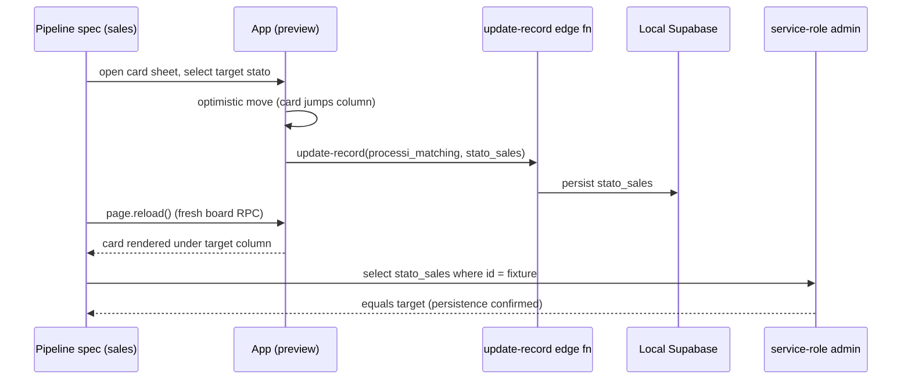
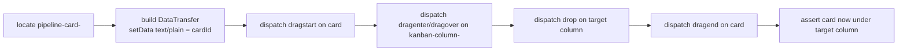

# test: Sales Pipeline E2E — maximum coverage

## Summary

Build a maximum-coverage Playwright E2E suite for the **Sales Pipeline** page
(`/pipeline`, `CrmPipelineFamiglieView`) on top of the existing local harness. Cover the
toolbar **filters** (search, periodo presets, tipo ricerca, preventivo, chiamata) and their
localStorage **persistence**; **kanban card moves** + DB persistence via the reliable sheet
"Stato lead" path *and* a best-effort synthetic native-DnD path; the **acquisition flow**
(Warm → Hot → Won progression); and the card **detail sheet** (open, contact-field autosave,
stato change, duplica dialog). Specs are gated to the `sales` project and stay opt-in (outside
`npm test`, lefthook, CI). The single warm-lead fixture grows into a deterministic multi-stage
seed in the sibling `baze-supabase` repo.

## Problem Frame

The harness plan (`2026-06-29-001`) shipped U1–U6: four operator sessions, a one-row famiglia
fixture, support helpers, and smoke/template specs. There is **no feature coverage** of the
Sales Pipeline yet — the product's core acquisition funnel (flow 4.2). The page is rich:
server-side filters applied through an explicit "Applica filtri" button, localStorage-persisted
filters, optimistic kanban moves persisted through the `update-record` edge function, a deferred
load for closed columns, realtime board sync, and a 760px detail sheet with autosave contact
fields, a grouped stato selector, and a duplica-ricerca confirmation dialog.

Two structural obstacles shape the plan:

1. **The current fixture is a single famiglia in `warm_lead`.** Filters, moves, and the
   acquisition progression need deterministic rows spread across stages with varied
   `tipo_lavoro`, `preventivo_firmato`, `data_call_prenotata`, and `creato_il`.
2. **Drag-and-drop is native HTML5** (`dataTransfer.setData("text/plain", cardId)` on
   `dragstart`, read on `drop`). Playwright's `dragTo`/mouse simulation does not fire the
   native DnD event sequence reliably, so move+persistence is asserted primarily through the
   sheet's "Stato lead" `Select` (same `moveCard` code path), with a separate best-effort
   synthetic-DnD test for the real drag interaction.

See origin: `docs/plans/2026-06-29-001-test-e2e-playwright-harness-plan.md`.

---

## Requirements

| ID | Requirement |
| --- | --- |
| R1 | Deterministic multi-stage pipeline seed in `baze-supabase` (fixed UUIDs, idempotent, reproducible via `supabase db reset`). |
| R2 | Stable, test-friendly selectors for columns, cards, toolbar controls, and the detail sheet (add `data-testid` where missing). |
| R3 | Pipeline support layer: navigation/open helpers, synthetic native-DnD helper, service-role process mutations + stato readback. |
| R4 | Filters spec: search, periodo presets, tipo ricerca, preventivo, chiamata, reset, and localStorage persistence across reload. |
| R5 | Kanban move spec: move via sheet stato Select with optimistic + persisted assertions; acquisition Warm→Hot→Won progression; best-effort native-DnD move. |
| R6 | Detail sheet spec: open from card, contact-field autosave round-trip, stato change reflected on board, duplica confirmation dialog. |
| R7 | Specs gated to the `sales` project; suite stays outside `npm test`, lefthook, and CI. |
| R8 | README + testing-strategy updated with the pipeline spec patterns and seed notes. |

Acceptance examples:

| ID | Scenario |
| --- | --- |
| AE1 | Applying the Preventivo=Accettato filter narrows the board to only accepted-preventivo cards; reload preserves the filter. |
| AE2 | Changing a card's stato in the sheet moves it to the target column, and a reload (fresh board RPC) shows it still there. |
| AE3 | Searching a seeded family surname shows only matching cards across columns; clearing/reset restores the full board. |
| AE4 | Opening a card's sheet, editing the email, and reopening shows the persisted value (autosave round-trip). |
| AE5 | A seeded card progresses Warm → Hot → Won via successive stato changes, each persisted. |

---

## Key Technical Decisions

- **Seed expansion in `baze-supabase` SQL (chosen).** Extend `seed_e2e_famiglia.sql` (or a new
  `seed_e2e_pipeline.sql` wired into `config.toml` `sql_paths`) with ~8 `processi_matching` rows
  under the existing E2E famiglia (or a few sibling famiglie), fixed UUIDs, spread across
  `warm_lead`, several `hot_*`, `cold_ricerca_futura`, and one `won_in_attesa_di_conferma`, with
  deterministic `tipo_lavoro`, `preventivo_firmato`, `data_call_prenotata`, and `creato_il`.
  Reproducible via `supabase db reset`; no migrations. (Rejected: runtime-only seeding — less
  reproducible and pollutes assertions with ordering nondeterminism.)
- **Move + persistence via the sheet "Stato lead" Select as the primary path.** It calls the same
  `onChangeStatoSales` → `moveCard` → `update-record` edge function as drag-drop, but is a
  deterministic `Select` interaction. Persistence is proved by a `page.reload()` (fresh
  `crm_pipeline_famiglie_board` RPC) showing the card in the new column, cross-checked against a
  service-role read of `processi_matching.stato_sales`.
- **Best-effort native DnD via a synthetic-event helper.** A `dragAndDrop(page, cardTestId,
  columnTestId)` helper dispatches `dragstart`/`dragenter`/`dragover`/`drop`/`dragend` with a
  shared `DataTransfer` carrying the card id as `text/plain`, matching `KanbanColumnShell`'s
  handlers. Tagged so a future flake can be quarantined without losing the reliable sheet-path
  coverage.
- **`data-testid` added to pipeline UI (minimal, test-only).** `KanbanColumnShell` gains an
  optional `testId` prop rendered as `data-testid`; `CrmPipelineFamiglieView` stamps
  `pipeline-card-<processId>` on each draggable card wrapper and `kanban-column-<stageId>` on each
  column; the apply/reset buttons already expose `aria-label`s (`Applica filtri`, `Reset filtri`)
  and are selected by role+name. Follows AGENTS.md `data-testid="[context]-[element]-[id]"`.
- **Gate to the `sales` project.** `test.skip(testInfo.project.name !== "sales", …)` in
  `beforeEach`, mirroring `example.spec.ts`'s recruiter gating. Whether the `sales` operator can
  load the board under RLS is verified during implementation (U1/U4).
- **Reads vs writes interception map.** Board read = RPC `crm_pipeline_famiglie_board`; detail =
  RPC `crm_pipeline_famiglia_detail`; all mutations (move, contact edits) = edge function
  `update-record`; duplica = edge function `duplica-processo-matching`. Error-path specs use the
  existing `interceptRpc` / `interceptEdgeFunction` helpers.
- **Filters require explicit apply.** Search and toolbar filters only take effect on the
  "Applica filtri" click (`appliedSearchQuery` / `appliedToolbarFilters`). Only
  `appliedToolbarFilters` is persisted to localStorage (`bazeoffice.crmPipelineFamiglie.filters.v1`);
  **search is not persisted**. Tests assert this asymmetry explicitly.

---

## High-Level Technical Design

### Move + persistence (primary sheet path)



### Synthetic native-DnD helper



Directional guidance, not implementation specification — the exact event set is tuned against
`KanbanColumnShell`'s `onDragOver`/`onDrop` handlers during implementation.

---

## Output Structure

```
bazeoffice/
├── e2e/
│   ├── pipeline-filters.spec.ts        # U4
│   ├── pipeline-moves.spec.ts          # U5 (moves + acquisition + DnD)
│   ├── pipeline-sheet.spec.ts          # U6
│   ├── support/
│   │   ├── pipeline.ts                 # U3 — nav/open helpers, DnD helper, column/card locators
│   │   ├── processo-mutations.ts       # U3 — service-role processi_matching read/write
│   │   └── selectors.ts                # U2/U3 — + pipeline selectors
│   └── README.md                       # U7
├── src/components/crm/crm-pipeline-famiglie-view.tsx   # U2 — card/column testids
├── src/components/shared-next/kanban.tsx               # U2 — optional testId prop
└── docs/testing-strategy.md                            # U7

baze-supabase/supabase/                 # sibling repo — U1
├── seed_e2e_pipeline.sql               # multi-stage processi fixture (or extend seed_e2e_famiglia.sql)
└── config.toml                         # wire sql_paths if a new file
```

Per-unit `Files:` lists are authoritative; adjust layout if a cleaner shape emerges.

---

## Implementation Units

### U1. Multi-stage pipeline seed fixture

- **Goal:** Provide deterministic pipeline data across stages so filters, moves, and the
  acquisition progression have stable, assertable rows.
- **Requirements:** R1
- **Dependencies:** none
- **Files:**
  - `../baze-supabase/supabase/seed_e2e_pipeline.sql` (new) — or extend
    `../baze-supabase/supabase/seed_e2e_famiglia.sql`
  - `../baze-supabase/supabase/config.toml` — append to `[db.seed].sql_paths` if a new file
  - `e2e/constants.ts` — add `E2E_PIPELINE` fixture map (ids, names, expected stages/filter attrs)
- **Approach:**
  1. Keep the existing `E2E_FAMIGLIA` warm-lead row untouched (the template spec relies on it).
  2. Add ~8 `processi_matching` rows with fixed UUIDs (documented in seed comments), linked to the
     E2E famiglia (and 1–2 extra famiglie if distinct surnames make search assertions cleaner):
     - 2× `warm_lead`, 2× `hot_*` (e.g. `hot_in_attesa_di_primo_contatto`,
       `hot_call_attivazione_prenotata`), 1× `cold_ricerca_futura`, 1× `won_in_attesa_di_conferma`,
       plus 1 designated mover that starts in `warm_lead`.
     - Vary `tipo_lavoro` (at least two distinct values so the Tipo ricerca filter splits the set),
       `preventivo_firmato` (mix true/false for the Preventivo filter), `data_call_prenotata`
       (set on some for the Chiamata filter), and `creato_il` (spread across "recent" and "old" so
       periodo presets split the set).
  3. Set `stato_sales` explicitly on every row (do not rely on a DB default).
  4. `cd ../baze-supabase && supabase db reset`; verify rows land in expected columns by loading
     `/pipeline` once, and that the `sales` operator can read the board.
- **Patterns to follow:** existing `seed_e2e_famiglia.sql` `do $$ … on conflict … $$` idempotent style.
- **Test scenarios:**
  - Idempotent re-run: a second `db reset` leaves the same fixed-UUID rows in the same stages.
  - Each filter dimension has both matching and non-matching rows (tipo_lavoro, preventivo,
    chiamata, periodo) — verified by a manual board load.
  - The designated mover starts in `warm_lead` every reset.
- **Verification:** Board at `/pipeline` shows the seeded rows under the expected columns; a
  service-role `select` confirms `stato_sales`, `preventivo_firmato`, `tipo_lavoro`, and
  `data_call_prenotata` distributions match the fixture map in `constants.ts`.

### U2. Add test-only selectors to pipeline UI

- **Goal:** Make columns, cards, and key toolbar/sheet controls stably selectable without relying
  on Italian display text or DOM structure.
- **Requirements:** R2
- **Dependencies:** none (can run parallel to U1)
- **Files:**
  - `src/components/shared-next/kanban.tsx` — add optional `testId?: string` to `KanbanColumnShell`,
    rendered as `data-testid` on the column root
  - `src/components/crm/crm-pipeline-famiglie-view.tsx` — pass `testId={`kanban-column-${column.id}`}`;
    stamp `data-testid={`pipeline-card-${card.id}`}` on the draggable card wrapper; optionally
    `data-testid="pipeline-search-input"` via `SearchInput` and `pipeline-apply-filters` /
    `pipeline-reset-filters` on the apply/reset buttons (or rely on existing `aria-label`s)
- **Approach:**
  - Keep additions purely additive (no behavior/layout change). Reuse the AGENTS.md convention
    `data-testid="[context]-[element]-[id]"`.
  - Prefer `aria-label` role selectors for the apply/reset buttons (already present) to minimize
    source churn; add `data-testid` only where no stable accessible name exists (columns, cards).
- **Patterns to follow:** existing `data-slot` attributes (`section-header`, `sidebar`) used as markers.
- **Test scenarios:** none — UI marker unit; exercised by U4–U6.
- **Verification:** `npm test` and `tsc -b` stay green; columns/cards expose the new `data-testid`s
  in a manual DOM inspection.

### U3. Pipeline support layer

- **Goal:** Shared helpers so the three specs stay declarative: navigation/open, synthetic DnD,
  and service-role process reads/writes.
- **Requirements:** R3
- **Dependencies:** U2 (selectors), U1 (fixture ids in constants)
- **Files:**
  - `e2e/support/pipeline.ts` (new) — `gotoPipeline(page)`, `openCardSheet(page, processId)`,
    `getColumn(page, stageId)`, `getCard(page, processId)`, `setStatoInSheet(page, optionLabel)`,
    `applyFilters(page)`, `resetFilters(page)`, `dragCardToColumn(page, processId, stageId)` (synthetic)
  - `e2e/support/processo-mutations.ts` (new) — service-role `readProcessoStatoSales(id)`,
    `setProcessoField(id, field, value)`, `resetPipelineFixture()` for cleanup
  - `e2e/support/selectors.ts` — add `pipeline` selector group (column/card testid builders,
    toolbar control names, sheet dialog + duplica + close)
- **Approach:**
  - `gotoPipeline`: `page.goto("/pipeline")` then wait for `kanban-column-warm_lead` visible (board
    RPC settled), not just the sidebar.
  - `dragCardToColumn`: `page.evaluate` dispatching the drag-event sequence with a shared
    `DataTransfer` (`text/plain` = processId) against the card and target column elements.
  - `processo-mutations.ts`: reuse `getSupabaseAdmin()` from `support/supabase-admin.ts`; never
    import `src/lib/supabase-client.ts`.
  - Always restore mutated fixture rows in `finally` (mirror `example.spec.ts`'s revert pattern) so
    specs are order-independent under `fullyParallel`.
- **Patterns to follow:** `e2e/support/famiglia-mutations.ts` (service-role PATCH),
  `e2e/support/supabase-admin.ts`, `e2e/example.spec.ts` (revert-in-finally).
- **Test scenarios:** none — library unit; covered by U4–U6.
- **Verification:** Specs import helpers without circular deps; `tsc` compiles; `dragCardToColumn`
  moves a card in a manual run.

### U4. Filters spec

- **Goal:** Cover every toolbar filter, reset, and the localStorage persistence asymmetry.
- **Requirements:** R4; AE1, AE3
- **Dependencies:** U1, U2, U3
- **Files:** `e2e/pipeline-filters.spec.ts` (new)
- **Approach:** Gate to `sales`. Each test navigates via `gotoPipeline`, manipulates a toolbar
  control, clicks "Applica filtri", and asserts the visible card set / "N ricerche" badge. Reset and
  reload assertions restore/verify state. Keep filters independent (reset between tests).
- **Patterns to follow:** `example.spec.ts` project gating; `use-crm-pipeline-preview.test.ts` for
  expected filter semantics.
- **Test scenarios:**
  - Covers AE3. Search a seeded surname → only matching cards visible across columns; the badge
    count drops; clearing search + apply restores the full board.
  - Covers AE1. Preventivo = Accettato → only `preventivo_firmato` cards remain; Non accettato →
    the complement.
  - Tipo ricerca: select one `tipo_lavoro` value → only cards with that badge remain; "Tutti" restores.
  - Chiamata = Sì → only cards with `data_call_prenotata`; No → complement.
  - Periodo preset (e.g. "Ultimi 7 giorni") splits recent vs old `creato_il` seeded rows; "Da sempre"
    restores. Edge: custom `Creato da`/`Creato a` datetime inputs flip the preset to custom.
  - Persistence: apply Preventivo filter, `page.reload()` → filter still applied (localStorage);
    but an applied **search** does **not** survive reload (asserts the documented asymmetry).
  - Reset filtri button clears all filters + search and removes the persisted localStorage entry's effect.
  - Empty result: a filter combination matching zero cards shows "Nessuna ricerca" empty state in columns.
- **Verification:** `npx playwright test --project=sales pipeline-filters` green with local stack up.

### U5. Kanban move, persistence, and acquisition flow spec

- **Goal:** Prove moves persist (sheet path), the acquisition progression works, and the real
  native-DnD interaction moves a card (best-effort).
- **Requirements:** R5; AE2, AE5
- **Dependencies:** U1, U2, U3
- **Files:** `e2e/pipeline-moves.spec.ts` (new)
- **Approach:** Gate to `sales`. Use the designated mover fixture; restore its `stato_sales` in
  `afterEach`/`finally` via `processo-mutations.ts`. Assert both the optimistic UI move and the
  post-reload persisted state, cross-checked with a service-role stato read.
- **Execution note:** Treat the synthetic-DnD test as best-effort — assert the move outcome, and if
  it proves flaky, quarantine it (`test.fixme`) without weakening the sheet-path persistence tests.
- **Test scenarios:**
  - Covers AE2. Open mover's sheet, select a different stato → card leaves source column and appears
    in target (optimistic); `page.reload()` shows it under target; service-role read equals target.
  - Move-to-same-stage is a no-op (no error, card stays).
  - Covers AE5. Acquisition progression: warm_lead → a `hot_*` stage → `won_in_attesa_di_conferma`,
    each step persisted (reload between or read stato after each).
  - Deferred column: `won_ricerca_attivata` / `lost` / `out_of_target` render the "Carica N ricerche"
    deferred action when no filters are active; clicking it loads the closed column.
  - Move failure path: `interceptEdgeFunction(page, "update-record", 500)` → optimistic move rolls
    back and the error banner ("Errore aggiornando stato ricerca…") appears.
  - Best-effort native DnD: `dragCardToColumn(mover, targetStage)` moves the card to the target column.
- **Verification:** `npx playwright test --project=sales pipeline-moves` green; mover fixture
  restored after the run (re-running is stable).

### U6. Detail sheet spec

- **Goal:** Cover opening the sheet, autosave contact round-trip, stato change reflected on the
  board, and the duplica confirmation dialog.
- **Requirements:** R6; AE4
- **Dependencies:** U1, U2, U3
- **Files:** `e2e/pipeline-sheet.spec.ts` (new)
- **Approach:** Gate to `sales`. Open via `openCardSheet`; assert the `role="dialog"` sheet shows the
  family name and primary controls. Restore any edited field in `finally`.
- **Test scenarios:**
  - Open a card → sheet (`role="dialog"`) opens with the family name, "Duplica ricerca" button, and
    the "Stato lead" select; close button (`aria-label="Chiudi dettaglio"`) closes it.
  - Covers AE4. Enable contact editing (pencil → "Modifica contatti famiglia"), change the email to a
    valid value → autosave fires (`update-record`); reopen the sheet and the new email persists.
  - Invalid email entered → inline `toast` error and no persisted change (service-role read unchanged).
  - Stato change in the sheet is reflected on the board card's column after closing the sheet
    (shared `moveCard` path; overlaps U5 but asserted from the sheet's perspective).
  - Duplica dialog: click "Duplica ricerca" → confirmation `AlertDialog` ("Duplicare la ricerca?")
    appears; "Annulla" closes without duplicating; confirm path stubbed via
    `interceptEdgeFunction(page, "duplica-processo-matching")` to assert success toast and error toast
    without creating uncontrolled rows.
- **Verification:** `npx playwright test --project=sales pipeline-sheet` green; edited fixture fields
  restored.

### U7. Documentation

- **Goal:** Document the pipeline specs, fixture, and DnD caveat for the next contributor.
- **Requirements:** R8
- **Dependencies:** U1–U6
- **Files:**
  - `e2e/README.md` — add a "Pipeline specs" section (fixture map, `--project=sales`, DnD caveat,
    revert-in-finally convention)
  - `docs/testing-strategy.md` — note the pipeline feature E2E coverage under the E2E section
- **Approach:** Cross-link the new seed file and the three specs; call out that real DnD is
  best-effort and the sheet path is the persistence source of truth.
- **Test expectation:** none — documentation unit.
- **Verification:** A teammate can run `--project=sales` pipeline specs cold from the README.

---

## System-Wide Impact

- Source change (U2) is additive `data-testid`/`testId` only — no behavior or layout change — but it
  touches a production component (`KanbanColumnShell`) used by other boards; the new prop is optional.
- Seed expansion touches the sibling `baze-supabase` repo — coordinate with anyone using the local
  backend; all rows are fixed-UUID and idempotent.
- Specs run under `fullyParallel`; every mutating test must restore fixture state in `finally` to stay
  order-independent.
- Suite remains opt-in: no change to `npm test`, `lefthook.yml`, or `.github/workflows/ci.yml`.

---

## Risks & Dependencies

- **Native DnD flakiness** — the synthetic-event helper may not perfectly match React's synthetic
  drag handling; mitigated by making it best-effort and keeping the sheet path authoritative.
- **`sales` operator board visibility under RLS** — if `sales` cannot read `crm_pipeline_famiglie_board`,
  switch the gating role or adjust the seed/operator; verified in U1/U4.
- **Realtime board sync** (`useRealtimeBoardSync`, 600ms debounce) may re-fetch mid-assertion after a
  service-role write — prefer `page.reload()` + explicit waits over racing the realtime channel.
- **Filter apply semantics** — forgetting the "Applica filtri" click yields false negatives; helpers
  (`applyFilters`) centralize it.
- **`stato_sales` default assumption** — the current seed omits `stato_sales` yet renders in warm_lead;
  U1 sets it explicitly to avoid depending on an undocumented DB default.
- **Closed-column deferral** — `won_ricerca_attivata` / `lost` / `out_of_target` are not loaded unless
  filters are active or the column is explicitly loaded; acquisition tests targeting `won_*` use
  `won_in_attesa_di_conferma` (always visible) or trigger the deferred load.

---

## Open Questions

Resolved during planning:

- Seed strategy → SQL expansion in `baze-supabase` (reproducible via `db reset`).
- Move/persistence approach → sheet "Stato lead" Select primary + best-effort synthetic DnD.
- Project gating → `sales`.

Deferred to implementation:

- Exact fixture UUIDs, surnames, and per-row attribute distribution — finalized in U1 against the
  real board render.
- Whether extra famiglie (distinct surnames) are needed for clean search assertions, or one famiglia
  with many processi suffices.
- Whether `won_ricerca_attivata` is reachable for the acquisition test or `won_in_attesa_di_conferma`
  is the practical terminal assertion.

---

## Sources & Research

- `docs/plans/2026-06-29-001-test-e2e-playwright-harness-plan.md` — harness this builds on
- `/Users/work/Desktop/flussi-prodotto.md` §4.2 — Sales pipeline domain flow (Warm→Hot→Won)
- `src/components/crm/crm-pipeline-famiglie-view.tsx` — toolbar, filters, kanban, sheet wiring
- `src/hooks/use-crm-pipeline-preview.ts` — `moveCard`, optimistic + rollback, filters, stage order
- `src/components/crm/famiglia-processo-detail-content.tsx` — sheet controls, autosave, stato select, duplica
- `src/components/shared-next/kanban.tsx` — native HTML5 DnD handlers
- `src/routes/app-routes.ts` — `/pipeline` route resolution
- `src/lib/anagrafiche-api.ts` — `crm_pipeline_famiglie_board` RPC, `update-record` / `duplica-processo-matching` edge fns
- `e2e/constants.ts`, `e2e/example.spec.ts`, `e2e/support/*` — harness conventions
- `../baze-supabase/supabase/seed_e2e_famiglia.sql` — current fixture
