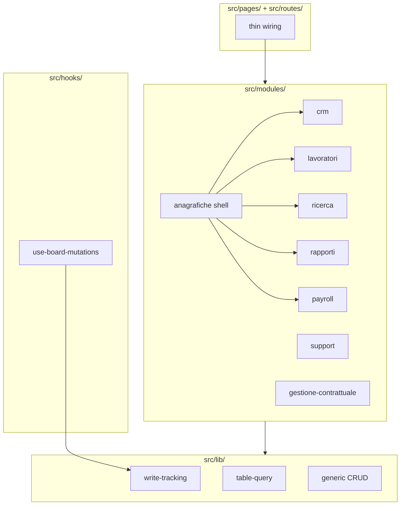
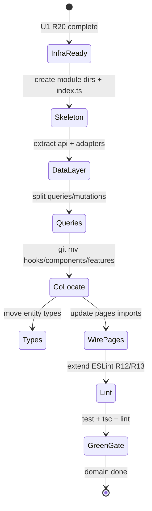

# refactor: Domain modules structure migration

## Summary

Dissolve `src/lib/anagrafiche-api.ts` into eight Italian domain modules under `src/modules/<dominio>/`, extract shared Supabase infra into `src/lib/` first, then migrate one domain per PR with green CI. The `support` module is the reference template; the `anagrafiche` CRUD UI shell migrates last after home modules export entity CRUD.

---

## Problem Frame

BazeOffice routes all Supabase access through a 1,739-line monolith consumed from 48 files. UI is domain-sliced at `components/` and `hooks/`, but the data layer has no boundaries — contributors cannot tell where domain logic belongs, and field renames require hunting the monolith. The stabilization plan (piano §6) targets module anatomy; this plan sequences the cut defined in the origin brainstorm.

---

## Requirements

Requirements trace to `docs/brainstorms/2026-06-30-domain-modules-structure-requirements.md`. IDs preserved for downstream verification.

**Module inventory and route mapping**

- R1. `anagrafiche` module — generic AgGrid CRUD UI for all anagrafiche tabs; entity CRUD imported from home modules via public barrels.
- R2. `support` module — customer-support routes: tickets, prove e colloqui, riattivazioni.
- R3. `crm` module — pipeline famiglie, assegnazione; includes `features/richieste-attivazione/`.
- R4. `lavoratori` module — gate 1, gate 2, cerca lavoratori.
- R5. `ricerca` module — ricerca board and detail.
- R6. `gestione-contrattuale` module — assunzioni, chiusure, variazioni boards; excludes rapporti and riattivazioni.
- R7. `rapporti` module — rapporti lavorativi list/detail/board; includes `features/rapporti/`.
- R8. `payroll` module — cedolini and contributi INPS.

**Module skeleton**

- R9. Every module follows the R9 layout from the origin doc (`queries/`, `mutations/`, `schemas/`, `types/`, `lib/`, `components/`, `hooks/`, `__tests__/`).
- R10. Consumers import only from `@/modules/<dominio>` public `index.ts`.
- R11. Adapters are the sole place Supabase column names appear per domain.

**Lint and enforcement**

- R12. ESLint blocks importing `<dominio>.api.ts` or `<dominio>.adapters.ts` from outside the owning module.
- R13. ESLint chokepoints referencing `anagrafiche-api.ts` retarget as domains migrate.

**Migration from legacy layout**

- R14. `anagrafiche-api.ts` dissolved domain-by-domain into module `.api.ts` + `.adapters.ts`.
- R15. Legacy paths migrate with `git mv` per mapping tables in origin doc.
- R16. After a domain migrates, no new code in legacy paths for that domain.
- R17. `src/features/` and `src/types/entities/` retired per domain as migrated.

**Documentation**

- R18. `AGENTS.md` updated with eight Italian modules, R9 skeleton, lint rules, CRUD-in-home-module pattern.

**Testing gate**

- R19. Each PR lands with green `npm run test`, `tsc`, and `lint`; mocks at `@/modules/<dominio>` boundary.

**Infra prerequisite**

- R20. Before the first domain migration PR, extract write-tracking, generic CRUD, and `table-query` from the monolith into `src/lib/`.

---

## Key Technical Decisions

- KTD1. **Standalone infra PR (R20) before any domain migration.** Lower review blast radius; characterization tests retarget cleanly; `use-board-mutations` imports `runTracked` from `@/lib/write-tracking` before domain work starts.
- KTD2. **`support` as first reference domain.** Bounded surface (tickets, prove e colloqui, riattivazioni), clear route ownership, riattivazioni already assigned to support not gestione-contrattuale, board helpers partially netted. Establishes the full F1 template without giant-view risk.
- KTD3. **`use-board-mutations` stays global, not domain-owned.** File remains at `src/hooks/use-board-mutations.ts`; after U1 it imports write-tracking from `@/lib/write-tracking`. ESLint Rule 1 globs extend to `src/modules/*/hooks/` incrementally per migration PR.
- KTD4. **`anagrafiche` shell migrates last.** It imports CRUD from home modules (F2); migrating it before home modules would leave circular or monolith dependencies.
- KTD5. **Adapters introduced during extraction, not deferred.** Even when types move unchanged initially, adapters are the seam for future DB field cleanup (see origin: piano §6 adapter rationale).
- KTD6. **One function per file in `queries/` and `mutations/`.** Hybrid layout from origin R9; TanStack wrappers stay thin.
- KTD7. **Pages and routes remain global in v1.** `src/pages/` imports from `@/modules/<dominio>` only; no page co-location inside modules during this program.
- KTD8. **v1 lint targets `.api.ts` and `.adapters.ts` only.** Deep-import lint on `components/` and `hooks/` deferred per origin scope.

---

## High-Level Technical Design

### Target topology

### Per-domain migration state machine

### Migration sequence

| Order | Module | Rationale |
|---|---|---|
| 0 | Infra (U1) | R20 prerequisite; unblocks all domains |
| 1 | `support` | Reference template; bounded; AE3 ownership clear |
| 2 | `crm` | Partial `features/richieste-attivazione/`; famiglie home for anagrafiche tab |
| 3 | `payroll` | Smaller surface; `preserveDetailFields` netted |
| 4 | `rapporti` | `features/rapporti/` exists; rapporti anagrafiche tab owner |
| 5 | `gestione-contrattuale` | Assunzioni/chiusure/variazioni boards; cross-imports from rapporti types |
| 6 | `ricerca` | Many cross-cutting fetchers; benefits from prior module barrels |
| 7 | `lavoratori` | Giant views; characterize board hooks JIT before move (testing-strategy Target B) |
| 8 | `anagrafiche` | CRUD UI shell; imports all home-module table queries |

---

## Scope Boundaries

**In scope**

- Eight domain modules with R9 skeleton
- R20 infra extraction
- ESLint R12 + R13 retargeting
- `AGENTS.md` update (R18)
- Per-domain `git mv` of components, hooks, features, entity types
- Test mock retarget to module barrels

**Deferred for later** (from origin — carried verbatim)

- Splitting giant view files — Phase 3 refactoring
- Deep-import lint on `components/` and `hooks/` — v2
- Bulk migration of all eight modules in one PR
- Renaming URL slugs or `MainSection` values
- Creating `src/shared/` — cross-cutting stays in `src/lib/`

**Outside this product's identity** (from origin — carried verbatim)

- Server layer or `'use server'` actions
- Backend Supabase schema changes as part of this work

### Deferred to Follow-Up Work

- Piano §6 flat-file skeleton in `docs/piano-stabilizzazione.md` — superseded by R9; update piano doc in a separate docs PR if desired
- `src/lib/lavoratori/`, `src/lib/ricerca/`, `src/lib/assunzioni/` — evaluate per-domain whether to move into module `lib/` during that domain's PR or leave as cross-cutting pure utils
- Monolith deletion PR after all eight domains land — remove `anagrafiche-api.ts` stub or re-export shim only when zero consumers remain

---

## System-Wide Impact

- **Developers:** import paths change from `@/lib/anagrafiche-api`, `@/hooks/use-*`, `@/components/<dominio>` to `@/modules/<dominio>`. ESLint catches drift on `.api.ts`/`.adapters.ts`.
- **CI:** lefthook pre-push gate unchanged; each PR must stay green.
- **Tests:** four integration tests mock `@/lib/anagrafiche-api` today — retarget per consumer domain. Write-tracking and normalize characterization tests retarget to `src/lib/` in U1.
- **Realtime cluster:** `runTracked`, echo suppression, Pattern A/B must survive module moves unchanged (see `CONCEPTS.md`, `docs/realtime-board-pattern.md`).
- **Cross-module types:** board hooks export types (`AssunzioneRecord`, `CrmPipelineCardData`) — public barrels must re-export types used across modules (AE5).

---

## Risks and Dependencies

| Risk | Mitigation |
|---|---|
| R20 extraction breaks write-tracking semantics | Retarget `anagrafiche-api.write-tracking.test.ts` in same PR; use `vi.resetModules()` pattern from `docs/solutions/best-practices/characterization-testing-module-level-state.md` |
| Cross-domain type leakage after move | Explicit type exports in `index.ts`; forbid adapter deep imports (R12) |
| Riattivazioni UI in `components/gestione-contrattuale/` but home is `support` | `git mv` riattivazioni components/hooks to `support` module in U3 |
| `lavoratori` giant views obscure regressions | Do not split views during migration; characterize `use-lavoratori-data` helpers JIT per testing-strategy Target B |
| ESLint glob drift as hooks move | Extend Rule 0/1/2 targets incrementally each PR; add module-path patterns in U2 scaffold |
| Anagrafiche tab imports before home module ready | Defer `anagrafiche` module to U10; tabs keep monolith imports until their home module lands |

**Dependencies**

- Target A test safety net complete (`docs/testing-strategy.md` — 302 green tests)
- Origin brainstorm decisions on entity overlap and CRUD ownership
- `eslint.config.js` flat-config supports per-path `no-restricted-imports`

---

## Acceptance Examples

- AE1. Import from `@/modules/lavoratori/lavoratori.api.ts` outside module → ESLint error. Import `useLavoratoriQuery` from `@/modules/lavoratori` → allowed.
- AE2. `/lavoratori` anagrafiche tab UI in `@/modules/anagrafiche` imports table query from `@/modules/lavoratori`; `/gate-1` workflow in `@/modules/lavoratori`.
- AE3. `fetchRiattivazioniBoard` exported from `@/modules/support`, not `@/modules/gestione-contrattuale`.
- AE4. After support migrates, `anagrafiche-api.ts` has no support fetch functions.
- AE5. `@/modules/rapporti` imports type `Lavoratore` from `@/modules/lavoratori` → allowed. Import from `lavoratori.adapters.ts` → ESLint error.

---

## Implementation Units

### U1. Extract shared infra from monolith (R20)

- **Goal:** Move write-tracking, generic CRUD, and `table-query` out of `anagrafiche-api.ts` into dedicated `src/lib/` files so domain extraction does not duplicate infra.
- **Requirements:** R20, R19
- **Dependencies:** none
- **Files:**
  - Create `src/lib/write-tracking.ts` (or equivalent split: `trackWrite`, `beginPendingWrite`, `endPendingWrite`, `getPendingWriteCount`, `getMillisSinceLastLocalWrite`, `runTracked`, `runTrackedEdgeFunction`, `clearReadCaches`)
  - Create `src/lib/table-query.ts` (private `queryTable`, `normalizeTableResponse`, shared filter types used by Anagrafiche CRUD)
  - Create `src/lib/record-crud.ts` (`createRecord`, `updateRecord`, `deleteRecord`)
  - Modify `src/lib/anagrafiche-api.ts` — re-export from new files temporarily or thin-wrap for backward compat during transition
  - Modify `src/hooks/use-board-mutations.ts` — import `runTracked` from `@/lib/write-tracking`
  - Modify `eslint.config.js` — retarget Rule 0 chokepoint from `anagrafiche-api.ts` to `src/lib/table-query.ts`; retarget Rule 2 `clearReadCaches` import path
  - Modify `src/lib/anagrafiche-api.write-tracking.test.ts` — import from new module path
  - Modify `src/lib/anagrafiche-api.normalize.test.ts` — import from new module path
  - Modify consumers of write-tracking directly from monolith (grep `from '@/lib/anagrafiche-api'` for tracking symbols)
- **Approach:** Extract without behavior change. Keep monolith as facade re-exporting infra until U3 removes domain functions — avoids updating 48 consumers in one PR. `table-query` stays Anagrafiche-only per `docs/audits/fase-4-bis-analisi-migrazione.md`.
- **Execution note:** Retarget characterization tests before moving implementation — tests must stay green at each cut.
- **Patterns to follow:** `docs/solutions/best-practices/characterization-testing-module-level-state.md`
- **Test scenarios:**
  - Happy path: `runTracked` increments pending count during async op and decrements after; successful write updates last-local-write timestamp
  - Edge case: failed write releases pending slot without updating last-local-write timestamp
  - Edge case: `getMillisSinceLastLocalWrite` returns effectively infinite before first write
  - Happy path: `normalizeTableResponse` maps Supabase payload to typed records (existing cases preserved)
  - Integration: `use-board-mutations` integration test passes with new `runTracked` import path
- **Verification:** `npm run test`, `tsc`, `lint` green; write-tracking and normalize test files pass against new paths; no new `table-query` call sites outside chokepoint file.

### U2. ESLint module boundary scaffold (R12, R13)

- **Goal:** Add ESLint rules blocking deep imports of `*.api.ts` and `*.adapters.ts`; prepare glob patterns for board hooks under `src/modules/*/hooks/`.
- **Requirements:** R12, R13
- **Dependencies:** U1
- **Files:**
  - Modify `eslint.config.js`
  - Create `src/modules/.gitkeep` or document empty scaffold (optional)
  - Add `src/modules/__tests__/eslint-boundary.test.ts` or extend an existing lint smoke test if present
- **Approach:** Add `no-restricted-imports` patterns matching `@/modules/*/*.api` and `@/modules/*/*.adapters` from outside owning module. Use regex or generated paths. Extend Rule 1 `files` to include `src/modules/*/hooks/use-*-board.ts` (and sibling globs) alongside legacy `src/hooks/` paths during transition.
- **Test scenarios:**
  - Covers AE1: deliberate import of `@/modules/support/support.api.ts` from `src/pages/` → ESLint error in CI
  - Covers AE5: import from `@/modules/lavoratori` barrel → no error
  - Happy path: import within `src/modules/support/` of `support.api.ts` → allowed
- **Verification:** ESLint fires on a deliberate violation fixture; existing codebase still passes lint (no modules yet beyond scaffold).

### U3. Migrate `support` module (reference template)

- **Goal:** First full domain migration establishing the template all subsequent domains follow.
- **Requirements:** R2, R9–R11, R14–R16, R19; F1; AE3, AE4
- **Dependencies:** U1, U2
- **Files:**
  - Create `src/modules/support/` full R9 skeleton
  - Create `src/modules/support/support.api.ts`, `support.adapters.ts`, `index.ts`
  - Create `src/modules/support/queries/`, `mutations/` per fetch/mutation
  - `git mv` `src/components/support/` → `src/modules/support/components/`
  - `git mv` `src/components/prove-colloqui/` → `src/modules/support/components/prove-colloqui/`
  - `git mv` `src/components/gestione-contrattuale/riattivazioni-*` → `src/modules/support/components/` (riattivazioni ownership)
  - `git mv` `src/hooks/use-support-tickets-board.ts`, `use-prove-colloqui-data.ts`, `use-riattivazioni-board.ts` → `src/modules/support/hooks/`
  - Move `src/types/entities/ticket.ts` → `src/modules/support/types/`
  - Extract from monolith: `fetchSupportTicketsBundle`, `fetchRiattivazioniBoard`, `fetchProveColloquiBoard`, `fetchTickets` (if support-owned), related RPC helpers
  - Modify `src/pages/` support/prove-colloqui routes — import from `@/modules/support`
  - Modify `src/lib/anagrafiche-api.ts` — remove support functions
  - Update tests mocking support fetchers
- **Approach:** Follow F1 checklist. Adapters normalize ticket/riattivazioni/prove-colloqui rows. Public barrel exports hooks, queries, components needed by pages. Cross-import `AssunzioneRecord` type from gestione-contrattuale stays as monolith import until U7; document temporary exception or import type from hook still in `src/hooks/` until gestione migrates.
- **Patterns to follow:** `src/hooks/use-riattivazioni-board.test.ts`, `docs/realtime-board-pattern.md`
- **Test scenarios:**
  - Covers AE3: `fetchRiattivazioniBoard` importable only from `@/modules/support` barrel
  - Covers AE4: grep `anagrafiche-api.ts` — no `fetchRiattivazioniBoard`, `fetchSupportTicketsBundle`, `fetchProveColloquiBoard`
  - Happy path: support tickets board hook pure helpers tests pass after `git mv`
  - Integration: page-level import resolves via `@/modules/support` (smoke render if integration test exists)
  - Error path: deep import of `support.adapters.ts` from outside → ESLint error
- **Verification:** Green CI; support routes render; monolith line count reduced; no new legacy-path support code.

### U4. Migrate `crm` module

- **Goal:** Migrate CRM pipeline, assegnazione, and richieste attivazione; establish famiglie entity ownership for anagrafiche tab.
- **Requirements:** R3, R9–R11, R14–R16, R19; F2 (famiglie CRUD owner)
- **Dependencies:** U3
- **Files:**
  - Create `src/modules/crm/` skeleton
  - `git mv` `src/components/crm/` → `src/modules/crm/components/`
  - `git mv` `src/features/richieste-attivazione/` → `src/modules/crm/features/richieste-attivazione/` (or flatten into module layout)
  - `git mv` `src/hooks/use-crm-pipeline-preview.ts`, `use-crm-assegnazione.ts` → `src/modules/crm/hooks/`
  - Move `src/types/entities/famiglie.ts`, `richiesta-attivazione.ts` → `src/modules/crm/types/`
  - Extract CRM fetchers from monolith (`fetchCrmPipelineFamiglieBoard`, `fetchFamiglie`, `fetchRichiesteAttivazione`, etc.)
  - Modify CRM pages; update `src/types/index.ts` re-exports
- **Approach:** Replace `features/richieste-attivazione/api.ts` monolith imports with `crm.api.ts`. Export `CrmPipelineCardData` type from barrel for ricerca cross-imports (currently from hook).
- **Test scenarios:**
  - Happy path: `use-crm-pipeline-preview` pure helper tests pass after move
  - Happy path: famiglie table query exported from `@/modules/crm` for future anagrafiche tab
  - Covers AE5 pattern: ricerca may import `CrmPipelineCardData` from `@/modules/crm` barrel
- **Verification:** Green CI; pipeline and assegnazione routes work; famiglie fetchers removed from monolith.

### U5. Migrate `payroll` module

- **Goal:** Migrate cedolini and contributi INPS boards plus payroll entity types.
- **Requirements:** R8, R9–R11, R14–R16, R19; F2 (mesi_lavorati, pagamenti tabs)
- **Dependencies:** U4
- **Files:**
  - Create `src/modules/payroll/`
  - `git mv` `src/components/payroll/` → `src/modules/payroll/components/`
  - `git mv` `src/hooks/use-payroll-board.ts`, `use-contributi-inps-board.ts` → `src/modules/payroll/hooks/`
  - Move payroll entity types: `pagamento.ts`, `mese-lavorato.ts`, `mese-calendario.ts`, `presenza-mensile.ts`, `contributo-inps.ts`, `transazione-finanziaria.ts`
  - Extract payroll fetchers from monolith
  - Modify payroll pages
- **Test scenarios:**
  - Happy path: `preserveDetailFields` / board mapper tests in `use-payroll-board.test.ts` pass
  - Happy path: contributi board mapper tests pass
  - Covers AE4: payroll fetchers absent from monolith after PR
- **Verification:** Green CI; payroll routes functional.

### U6. Migrate `rapporti` module

- **Goal:** Migrate rapporti lavorativi workflow and entity ownership.
- **Requirements:** R7, R9–R11, R14–R16, R19; F2 (rapporti_lavorativi tab)
- **Dependencies:** U5
- **Files:**
  - Create `src/modules/rapporti/`
  - `git mv` rapporti components from gestione-contrattuale area and `src/features/rapporti/`
  - `git mv` `src/hooks/use-rapporti-lavorativi-data.ts` → module hooks
  - Move `src/types/entities/rapporto-lavorativo.ts`
  - Extract rapporti fetchers from monolith
- **Test scenarios:**
  - Happy path: rapporti status/label pure utils tests pass (`features/rapporti/` tests)
  - Covers AE5: `@/modules/rapporti` may import `Lavoratore` type from `@/modules/lavoratori` only after U9 — until then from `@/types` or temporary barrel; document sequencing
- **Verification:** Green CI; rapporti-lavorativi route functional.

### U7. Migrate `gestione-contrattuale` module

- **Goal:** Migrate assunzioni, chiusure, variazioni boards (excluding rapporti and riattivazioni).
- **Requirements:** R6, R9–R11, R14–R16, R19
- **Dependencies:** U6
- **Files:**
  - Create `src/modules/gestione-contrattuale/`
  - `git mv` assunzioni/chiusure/variazioni board views and hooks
  - Move `chiusura-contratto.ts`, `variazione-contrattuale.ts` types
  - `git mv` `src/lib/assunzioni/` → `src/modules/gestione-contrattuale/lib/` if domain-owned
  - Extract gestione fetchers from monolith
  - Resolve `use-support-tickets-board` → `AssunzioneRecord` import to `@/modules/gestione-contrattuale` barrel
- **Test scenarios:**
  - Happy path: assunzioni/chiusure/variazioni board mapper tests pass
  - Integration: `deep-link-selection.ts` imports updated
- **Verification:** Green CI; assunzioni/chiusure/variazioni routes functional.

### U8. Migrate `ricerca` module

- **Goal:** Migrate ricerca pipeline, processi matching, selezioni; processi/selezioni anagrafiche tab owners.
- **Requirements:** R5, R9–R11, R14–R16, R19; F2
- **Dependencies:** U7
- **Files:**
  - Create `src/modules/ricerca/`
  - `git mv` `src/components/ricerca/`, `src/features/ricerca/`
  - `git mv` `src/hooks/use-ricerca-board.ts`, `use-ricerca-workers-pipeline.ts`
  - `git mv` `src/lib/ricerca/` → module `lib/`
  - Move `processi-matching.ts` type
  - Extract ricerca fetchers (largest cross-cutting set)
  - Update ricerca detail views importing `use-crm-pipeline-preview` → `@/modules/crm`
- **Execution note:** Characterize `use-ricerca-board` and `use-ricerca-workers-pipeline` pure helpers before move if not already netted (Target B JIT).
- **Test scenarios:**
  - Happy path: `stati-ricerca.ts` unit tests pass
  - Happy path: board mapper tests pass post-move
  - Integration: ricerca detail cross-imports CRM types via barrels only
- **Verification:** Green CI; ricerca routes functional.

### U9. Migrate `lavoratori` module

- **Goal:** Migrate gate 1/2, cerca lavoratori, and lavoratori entity ownership.
- **Requirements:** R4, R9–R11, R14–R16, R19; F2
- **Dependencies:** U8
- **Files:**
  - Create `src/modules/lavoratori/`
  - `git mv` `src/components/lavoratori/`, `src/features/lavoratori/`
  - `git mv` `src/hooks/use-lavoratori-data.ts`, `use-selected-worker-editor.ts`
  - `git mv` `src/lib/lavoratori/` → module `lib/`
  - Move lavoratore entity types (`lavoratore.ts`, `documento-lavoratore.ts`, etc.)
  - Extract lavoratori fetchers from monolith
- **Execution note:** Do not split `gate1-view.tsx` or other giant views — move only. Characterize `use-selected-worker-editor` integration net before extraction (`docs/solutions/best-practices/characterization-testing-selected-worker-editor.md`).
- **Test scenarios:**
  - Happy path: `features/lavoratori/lib/*` unit tests pass
  - Integration: `use-selected-worker-editor.integration.test.tsx` mocks `@/modules/lavoratori` boundary
  - Covers AE1/AE2: lavoratori barrel exports table query; deep api import blocked
- **Verification:** Green CI; gate-1, gate-2, cerca-lavoratori routes functional.

### U10. Migrate `anagrafiche` shell module

- **Goal:** Migrate AgGrid CRUD UI shell; wire tabs to home module queries per F2 mapping table.
- **Requirements:** R1, R9–R11, R14–R16, R19; F2; AE2
- **Dependencies:** U4, U5, U6, U8, U9 (all anagrafiche tab home modules)
- **Files:**
  - Create `src/modules/anagrafiche/`
  - `git mv` `src/components/anagrafiche/`
  - `git mv` `src/hooks/use-anagrafiche-data.ts`
  - Tab components import table queries from `@/modules/crm`, `@/modules/lavoratori`, `@/modules/rapporti`, `@/modules/ricerca`, `@/modules/payroll` per origin mapping
  - `table-query` / schema-loader remain in `src/lib/` — anagrafiche module imports infra only
  - Modify anagrafiche page route
- **Test scenarios:**
  - Covers AE2: lavoratori tab component imports `useLavoratoriTableQuery` (or equivalent) from `@/modules/lavoratori`, not monolith
  - Happy path: each tab resolves correct home module import (famiglie→crm, processi→ricerca, etc.)
  - Error path: anagrafiche module does not define famiglie/lavoratori CRUD in its own `.api.ts`
- **Verification:** Green CI; all anagrafiche tabs render and CRUD via home modules.

### U11. Retire monolith and update AGENTS.md (R17, R18)

- **Goal:** Remove remaining `anagrafiche-api.ts` (or reduce to deprecated re-export shim with zero consumers), finalize `AGENTS.md`, verify ESLint targets.
- **Requirements:** R17, R18; success criteria from origin
- **Dependencies:** U10
- **Files:**
  - Delete or gut `src/lib/anagrafiche-api.ts`
  - Modify `AGENTS.md` — R9 skeleton, eight modules, lint rules, CRUD pattern, anagrafiche distinction
  - Modify `eslint.config.js` — remove monolith-specific paths; all chokepoints on `src/lib/` + modules
  - Grep and fix any remaining `@/lib/anagrafiche-api` imports
  - Update `src/types/index.ts` — entity re-exports from module barrels or remove migrated entities
- **Test scenarios:**
  - Happy path: zero imports of `@/lib/anagrafiche-api` in `src/` (except possibly test fixtures marked for deletion)
  - Happy path: full test suite green
  - Covers AE1: ESLint boundary rules still fire on deliberate violation
- **Verification:** Monolith gone or empty; AGENTS.md matches R9; planner can sequence future work without re-deciding boundaries.

---

## Open Questions

Resolved during planning (no blockers):

- **Migration order:** See migration sequence table — infra → support → crm → payroll → rapporti → gestione-contrattuale → ricerca → lavoratori → anagrafiche → cleanup.
- **`use-board-mutations` home:** global hook at `src/hooks/use-board-mutations.ts`; imports write-tracking from `src/lib/` after U1 (KTD3).

Deferred to implementation:

- Exact adapter field mappings per entity — discovered during each domain's extraction when reading Supabase row shapes.
- Whether `lookup-values.ts` stays global in `src/types/` permanently (origin says yes) or moves to a future shared lookup module.
- Final filename split inside `src/lib/` for R20 (one vs three files) — implementer chooses minimal diff that preserves characterization test seams.

---

## Sources and Research

- `docs/brainstorms/2026-06-30-domain-modules-structure-requirements.md` — origin requirements R1–R20, F1–F2, AE1–AE5
- `docs/piano-stabilizzazione.md` §6 — domain list, adapter rationale, sequencing
- `docs/testing-strategy.md` — Target A complete; mock-at-module-boundary; Target B JIT for giant hooks
- `CONCEPTS.md` — domain vocabulary, realtime concepts
- `src/routes/app-routes.ts` — route → MainSection ownership
- `src/lib/anagrafiche-api.ts` — monolith inventory (~70 fetch functions)
- `eslint.config.js` — Rules 0–2 chokepoints to retarget
- `src/hooks/use-board-mutations.ts` — cross-domain mutation wrappers
- `docs/solutions/best-practices/characterization-testing-module-level-state.md`
- `docs/solutions/best-practices/characterization-testing-board-hook-contract-patterns.md`
- `docs/solutions/best-practices/characterization-testing-selected-worker-editor.md`
- `docs/realtime-board-pattern.md` — Pattern A/B preservation
- `docs/audits/fase-4-bis-analisi-migrazione.md` — table-query Anagrafiche-only scope
