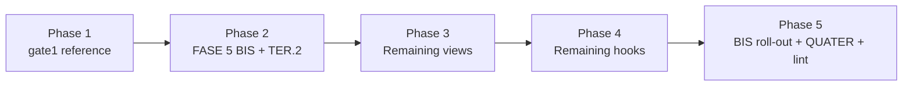
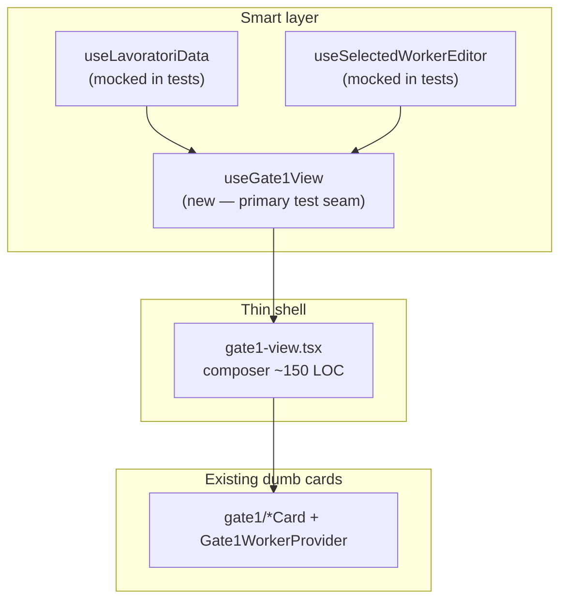

# refactor: Large file split + FASE 5 stabilization program

## Summary

Phased program to split giant views and hooks under Target B characterization nets, executing the Linear checklist and full FASE 5 (BIS, TER, QUATER) from `docs/realtime-bug-class-plan.md`. gate1-view is the reference cycle: full render characterization, `use-gate1-view` extraction, hook-primary tests plus view smoke. Each landed unit stays green on `npm run test` + `tsc` + `lint` and compounds learnings via `/ce-compound`.

---

## Problem Frame

Production SPA with ~85k LOC and thin coverage on its largest files. Four views exceed 2,400 lines; multiple hooks exceed 900 lines. Hand-rolled save handlers and god-hooks amplify realtime/autosave risk. `docs/piano-stabilizzazione.md` mandates net-first, one-file-at-a-time work. Origin requirements: `docs/brainstorms/2026-07-06-large-file-split-requirements.md`.

---

## Requirements

Traceability to origin R-IDs. This plan implements the full origin scope.

**Program rules**

- R1. Characterize → split → green for every target.
- R2. Mock at module boundary only.
- R3. One concern per PR (~400 LOC target).
- R4. `/ce-compound` after each completed cycle.

**Views (Linear order)**

- R5. `gate1-view` — reference cycle.
- R6. `ricerca-workers-pipeline-view`.
- R7. `lavoratori-cerca-view`.
- R8. `assunzioni-detail-sheet`.

**Hooks**

- R9. `use-crm-pipeline-preview`.
- R10. `use-ricerca-workers-pipeline`.
- R11. `use-selected-worker-editor` — FASE 5 TER.2 (8 section hooks).
- R12. `use-lavoratori-data` — FASE 5 TER.1 (7 hooks).
- R13. Shared `deleteMutation` helper.

**FASE 5 BIS**

- R14–R19. Field context roll-out, pilot, lint, CRM/rapporti panels.

**FASE 5 TER + QUATER**

- R20–R21. Memoization + soft size lint.
- R22–R23. Residual complex forms.

**Flows (origin)**

- F1. Per-file Target B cycle — each implementation unit follows this.
- F2. gate1 reference cycle — U3–U5.
- F3. BIS panel roll-out — U7+.

---

## Key Technical Decisions

- **KTD1 — gate1 TER before gate1 BIS roll-out:** Extract `use-gate1-view` and stabilize orchestration (U3–U4) before migrating gate1 handlers to Field components (U7–U8). Rationale: both touch the same handlers; splitting structure first reduces merge conflict surface. (Resolves origin OQ1.)
- **KTD2 — `use-lavoratori-data` split after gate1 cycle:** Characterization mocks `useLavoratoriData` at the module boundary; TER.1 runs in Phase 4 after gate1 reference doc exists. Rationale: gate1 is the teaching template; data hook split is higher blast-radius. (Resolves origin OQ2.)
- **KTD3 — `deleteMutation` early parallel PR:** Land shared helper (U1) before gate1 characterization (U2) as a low-risk warm-up; does not block gate1. (Resolves origin OQ3.)
- **KTD4 — gate1 test seam:** Primary net on `use-gate1-view` via `renderHookWithQueryClient` post-split; 1–2 full `Gate1View` smoke renders via `renderWithProviders` with hoisted `vi.mock` on `use-lavoratori-data` and `use-selected-worker-editor` (pattern: `payroll-overview-view.integration.test.tsx`).
- **KTD5 — Characterization over snapshots:** Assert visible behavior and hook return transitions; no DOM snapshots (origin + `docs/testing-strategy.md`).
- **KTD6 — Pure helper export before mapper moves:** For hooks with inline mappers (`use-crm-pipeline-preview`), export cleanly separable pure functions and test them before moving code (`docs/solutions/best-practices/characterization-testing-board-hook-contract-patterns.md`).
- **KTD7 — TER.2 preserves facade:** `useSelectedWorkerEditor` remains the public hook composing 8 section hooks so gate1 cards need not churn consumer imports during TER.2.
- **KTD8 — TER.4 soft warnings only:** `max-lines` as ESLint warning (500 for `use-*.ts`, 800 for `*.tsx`), not error — matches origin scope boundary.

---

## High-Level Technical Design

### Phased delivery

### gate1 smart-hook target shape

### TER.2 section-hook composition

Eight section hooks (`useWorkerHeaderEditor`, `useWorkerAvailabilityEditor`, …) each own one draft+save+error slice. `useSelectedWorkerEditor` composes them and re-exports the same public API. Tests in `use-selected-worker-editor.integration.test.tsx` stay on the facade.

---

## Implementation Units

### U1. Shared board deleteMutation helper

**Goal:** DRY delete path for assunzioni and chiusure boards (origin R13).

**Requirements:** R13

**Dependencies:** None

**Files:**
- Modify: `src/hooks/use-board-mutations.ts`
- Modify: `src/modules/gestione-contrattuale/hooks/use-assunzioni-board.ts`
- Modify: `src/modules/gestione-contrattuale/hooks/use-chiusure-board.ts`
- Test: `src/hooks/use-board-mutations.integration.test.tsx` (extend)

**Approach:** Add `useDeleteBoardRecordMutation` (or equivalent) parameterized by table name, query key, and optimistic filter shape (flat columns vs nested `columns`). Both board hooks call the helper with their entity-specific config.

**Patterns to follow:** Existing `useCreateMutation` in `use-board-mutations.ts`; optimistic update patterns already in assunzioni/chiusure boards.

**Test scenarios:**
- Happy path: `mutateAsync` calls `deleteRecord` with correct table and id.
- Optimistic: card removed from correct column shape (assunzioni flat vs chiusure nested).
- Error path: mutation rejects; cache rolls back.

**Verification:** Both boards still delete; integration test green; no behavior change in UI.

---

### U2. gate1 full-render characterization

**Goal:** Safety net before splitting `gate1-view` (origin R5, F2 step 1).

**Requirements:** R5, R1, R2

**Dependencies:** U1 optional (no hard dependency)

**Execution note:** Characterization-first — all tests written against current `Gate1View` behavior before any extraction.

**Files:**
- Create/extend: `src/modules/lavoratori/components/gate1-view.integration.test.tsx`
- Create: `src/modules/lavoratori/components/__tests__/gate1-view-test-fixtures.ts` (factories for worker row, editor return, lavoratori data return)
- Reference: `src/modules/payroll/components/payroll-overview-view.integration.test.tsx` (hoisted mock pattern)

**Approach:**
- Hoist `vi.mock` on `../hooks/use-lavoratori-data` and `../hooks/use-selected-worker-editor`.
- Factory helpers: `makeLavoratoriDataReturn`, `makeEditorReturn`, `makeWorkerRow`.
- Render real `Gate1View` with `renderWithProviders`.
- Keep existing `GateDraftHarness` draft-resync tests; add new `describe("Gate1View render")` block.

**Test scenarios:**
- Smoke: renders list + detail shell when `selectedWorkerId` set; shows worker name from mock row.
- Filter: changing provincia/followup filter calls `setFilters` or equivalent from mocked `useLavoratoriData`.
- Selection: clicking worker in list calls `setSelectedWorkerId`.
- Empty state: no workers shows empty list message (assert visible text/role).
- Error state: `error` from `useLavoratoriData` surfaces to user (toast or inline — pin current behavior).
- Covers F2: characterization lands before split PR.

**Verification:** New tests fail if mocks incomplete; pass on current implementation; no production code changes.

---

### U3. Extract `use-gate1-view` smart hook

**Goal:** Move ~1,300 LOC orchestration out of `gate1-view.tsx` (origin R5, KTD1, KTD4).

**Requirements:** R5, R1

**Dependencies:** U2

**Files:**
- Create: `src/modules/lavoratori/hooks/use-gate1-view.ts`
- Modify: `src/modules/lavoratori/components/gate1-view.tsx`
- Modify: `src/modules/lavoratori/hooks/index.ts` (export if needed for tests only — prefer testing via component or direct hook import in `__tests__`)
- Test: `src/modules/lavoratori/hooks/use-gate1-view.integration.test.tsx`

**Approach:** Move state, effects, handlers, memos from `Gate1View` body into `useGate1View(props)`. View becomes: call hook, wrap in `Gate1WorkerProvider`, render JSX. Pure helpers (`sanitizeFileName`, `includesBabysitterType`) move to `src/modules/lavoratori/lib/gate1-utils.ts` if not already shared.

**Patterns to follow:** Smart/dumb from `docs/realtime-bug-class-plan.md` FASE 5 TER; `Gate1WorkerProvider` unchanged.

**Test scenarios:**
- Hook: `gateDraft` resync preserves in-progress field when server echo arrives (mirror existing harness behavior via `renderHookWithQueryClient`).
- Hook: `scrollToSection` updates `activeGateSection`.
- Hook: identity switch (`selectedWorkerId` change) resets gate draft baseline.
- View smoke (1–2): `Gate1View` still renders selected worker header after split.
- Mutation-verify: temporarily break resync guard; hook test must fail.

**Verification:** U2 tests stay green; `gate1-view.tsx` under ~400 LOC (orchestration moved); suite green.

---

### U4. gate1 TER.3 memo + compound playbook

**Goal:** Stabilize callback identity on gate1 cards; document reference cycle (origin R20, R4, F2).

**Requirements:** R20, R4

**Dependencies:** U3

**Files:**
- Modify: `src/modules/lavoratori/components/gate1/*.tsx` (wrap exports in `React.memo` where not already)
- Modify: `src/modules/lavoratori/hooks/use-gate1-view.ts` (`useCallback` on handlers passed to cards)
- Create: `docs/solutions/best-practices/gate1-view-split-characterization-playbook.md`

**Approach:** Audit props drilling from `use-gate1-view` to cards; stabilize with `useCallback`/`useMemo`. Compound doc covers: mock boundary, fixture factories, characterize-before-split, smart-hook extraction, test seam choice.

**Test scenarios:**
- Test expectation: none — memo/callback changes; U2/U3 nets must stay green (regression guard).

**Verification:** No functional change; playbook doc exists; optional React profiler spot-check on scroll (manual).

---

### U5. BIS.2 pilot — `disponibilita_nel_giorno`

**Goal:** Validate Field pattern closes save-omission bug class on one gate1 field (origin R15).

**Requirements:** R15, R14

**Dependencies:** U3 (KTD1 — after TER split)

**Files:**
- Create if missing: `FieldMultiSelect` in `src/components/forms/field-components.tsx`
- Modify: relevant gate1 card or section owning `disponibilita_nel_giorno`
- Test: component integration asserting patch called on selection change

**Approach:** Replace hand-rolled `on*Change` + draft for this field with `<FieldMultiSelect name="disponibilita_nel_giorno" />` inside existing `useAutoSaveForm` context. Follow `docs/solutions/best-practices/characterization-testing-rhf-realtime-false-greens.md` (use `fireEvent`, not bare `setValue`).

**Test scenarios:**
- Selecting option triggers debounced save with expected patch key.
- Save paused when `isEditing` guard active (if applicable to this field).
- Server error surfaces via toast (pin current behavior).

**Verification:** Pilot field cannot omit save; test fails if handler removed.

---

### U6. BIS.3 gate1 Field roll-out (incremental PRs)

**Goal:** Migrate remaining gate1 detail handlers to Field components (origin R16).

**Requirements:** R16, R14

**Dependencies:** U5

**Approach:** One PR per card cluster or ~5–8 handlers; each PR adds component smoke tests. Track progress until gate1 detail panels lint-clean.

**Files:** `src/modules/lavoratori/components/gate1/*.tsx`, `gate1-view.tsx` (only if handlers remain in orchestrator)

**Test scenarios:** Per migrated handler — user interaction → `patchWorker` / `updateRecord` called with expected payload.

**Verification:** Incremental; each PR green; no big-bang migration.

---

### U7. TER.2 — `use-selected-worker-editor` 8 section hooks

**Goal:** Split god-hook into 8 responsibility hooks behind stable facade (origin R11, KTD7).

**Requirements:** R11

**Dependencies:** U4 (gate1 reference stable); strong existing net

**Files:**
- Create: `src/modules/lavoratori/hooks/worker-editor/use-worker-header-editor.ts` (and 7 siblings)
- Modify: `src/modules/lavoratori/hooks/use-selected-worker-editor.ts` (compose facades)
- Test: extend `src/modules/lavoratori/hooks/use-selected-worker-editor.integration.test.tsx`

**Approach:** One section per PR or pair of PRs. Each section hook uses `useAutoSaveFormFields`. Public `useSelectedWorkerEditor` return shape unchanged.

**Patterns to follow:** `docs/solutions/best-practices/characterization-testing-selected-worker-editor.md`

**Test scenarios:**
- All existing describe blocks in integration test stay green after each section extraction.
- Per section: echo preservation, identity switch, in-flight gate (where applicable).
- Mutation-verify on each `isEditing` guard extracted.

**Verification:** Facade API unchanged for `gate1-view` / cards; integration file remains primary net.

---

### U8. `ricerca-workers-pipeline-view` characterize + split

**Goal:** Origin R6.

**Requirements:** R6, R1

**Dependencies:** U4 (playbook available)

**Execution note:** Characterization-first.

**Files:**
- `src/modules/ricerca/components/ricerca-workers-pipeline-view.tsx`
- Create: `src/modules/ricerca/lib/worker-pipeline-view-utils.ts` (pure helpers)
- Create: `src/modules/ricerca/components/ricerca-workers-pipeline-view.integration.test.tsx`
- Possibly extract: `worker-pipeline-column.tsx`, expand `PipelineWorkerCard`

**Approach:** Smart hook `use-ricerca-workers-pipeline-view` + thin shell; move pure functions first (testable without mock).

**Test scenarios:**
- Render smoke with mocked `useRicercaWorkersPipeline`.
- Column group visibility for a given pipeline stage prop.
- Worker search filter narrows visible cards (user types in search → count changes).

**Verification:** File under soft 800 LOC target; suite green.

---

### U9. `lavoratori-cerca-view` characterize + split

**Goal:** Origin R7.

**Requirements:** R7

**Dependencies:** U8 optional

**Files:**
- `src/modules/lavoratori/components/lavoratori-cerca-view.tsx`
- Extract inline field components to `src/modules/lavoratori/components/lavoratori-cerca/`
- Create: integration test file

**Test scenarios:** Render smoke; filter apply; worker selection opens detail.

**Verification:** LOC reduced; green suite.

---

### U10. `assunzioni-detail-sheet` characterize + split

**Goal:** Origin R8; natural seam `DatoreDetail` / `LavoratoreDetail`.

**Requirements:** R8

**Dependencies:** None hard

**Files:**
- `src/modules/gestione-contrattuale/components/assunzioni-detail-sheet.tsx`
- Extract sub-trees to separate files under `assunzioni-detail/`
- Create: integration test with mocked assunzioni board/data

**Test scenarios:** Sheet opens with assunzione selected; tab switch datore/lavoratore; field edit triggers autosave (pin current).

**Verification:** Shell under ~800 LOC; green suite.

---

### U11. `use-crm-pipeline-preview` characterize + split

**Goal:** Origin R9, KTD6.

**Requirements:** R9

**Dependencies:** None hard

**Files:**
- `src/modules/crm/hooks/use-crm-pipeline-preview.ts`
- Extend: `src/modules/crm/hooks/use-crm-pipeline-preview.test.ts`
- Create: `use-crm-pipeline-preview.integration.test.tsx` for hook body

**Approach:** Export remaining pure mappers; test; extract `useCrmPipelinePreview` data-fetch/state to smaller modules; keep bindings maps in dedicated file.

**Test scenarios:**
- Existing pure helper tests stay green.
- Hook: `mapCardData` output shape for fixture row.
- Hook: filter serialization round-trip.

**Verification:** Hook file under 500 LOC soft target or split across `crm-pipeline-preview/` folder.

---

### U12. `use-ricerca-workers-pipeline` characterize + split

**Goal:** Origin R10.

**Requirements:** R10

**Dependencies:** U8 (view may consume hook)

**Files:**
- `src/modules/ricerca/hooks/use-ricerca-workers-pipeline.ts`
- Create: `use-ricerca-workers-pipeline.integration.test.tsx`

**Test scenarios:** `renderHook` with mocked ricerca API module; column state transitions; card move mutation invalidates correct query key.

**Verification:** Green suite; hook split by responsibility (filters, columns, mutations).

---

### U13. TER.1 — `use-lavoratori-data` 7-hook split

**Goal:** Origin R12, KTD2.

**Requirements:** R12

**Dependencies:** U3, U7 (gate1 + editor stable)

**Files:**
- `src/modules/lavoratori/hooks/use-lavoratori-data.ts` → split into:
  - `use-lavoratori-pagination.ts`
  - `use-lavoratori-filters.ts`
  - `use-lavoratori-list.ts`
  - `use-selected-lavoratore.ts`
  - `use-selected-lavoratore-detail.ts`
  - `use-gate1-filters.ts`
  - `use-gate2-filters.ts`
- Facade: `useLavoratoriData` composes all (public API unchanged per FASE 5 TER.1)

**Test scenarios:** Per hook unit tests with module-boundary mocks; facade integration test proving gate1 page still receives same return keys.

**Verification:** No consumer import churn; `gate1-view` tests pass with facade.

---

### U14. BIS.5 CRM onboarding Field roll-out

**Goal:** Origin R18.

**Requirements:** R18

**Dependencies:** U6 pattern established

**Files:** `src/modules/crm/components/cards/onboarding-*.tsx`, zod schema for processo fields

**Test scenarios:** Card field change triggers `updateProcessCard` with expected patch.

**Verification:** Onboarding cards use Field components; no hand-rolled save handlers.

---

### U15. BIS.6 Rapporto + assunzioni + variazioni roll-out

**Goal:** Origin R19.

**Requirements:** R19

**Files:** `rapporto-detail-panel.tsx`, `assunzioni-detail-sheet.tsx`, `variazioni-board-view.tsx`

**Verification:** Lint shows zero legacy handler warnings on migrated panels.

---

### U16. BIS.4 anti-hand-rolled-handler ESLint rule

**Goal:** Origin R17.

**Requirements:** R17

**Dependencies:** U15 (enough migrated surface to validate rule)

**Files:** `eslint.config.js`, optional custom rule or `no-restricted-syntax` pattern

**Approach:** Warn/error on `on*Change` + `setXxxDraft` pattern in detail panel paths; suggest Field component.

**Verification:** Migrated files clean; legacy files flagged until U15 complete.

---

### U17. TER.4 soft file-size lint

**Goal:** Origin R21, KTD8.

**Requirements:** R21

**Files:** `eslint.config.js`

**Approach:** `max-lines` warning at 500 for `**/hooks/use-*.ts`, 800 for `**/*.tsx` under `src/modules/`.

**Verification:** Rule warns on remaining giants; does not fail CI.

---

### U18. FASE 5 QUATER residual complex forms

**Goal:** Origin R22–R23.

**Requirements:** R22, R23

**Dependencies:** U6, U15

**Files:** `worker-profile-header.tsx`, creation modals, cross-field validation sites (discover during U15)

**Test scenarios:** Submit modals validate zod schema; cross-field fee min/max rejects invalid pair.

**Verification:** Grep shows no `useState(buildDraft(` outside RHF/Field paths.

---

## Scope Boundaries

**In scope:** Full origin requirements R1–R23; FASE 5 BIS/TER/QUATER.

**Deferred for later (origin):**
- FASE 6 BIS+ (realtime reconnect, OCC, anti-freeze structural refactor).
- `anagrafiche-api.ts` monolith dissolution (separate track).

**Outside program identity:**
- Global coverage % targets.
- max-lines as blocking error.

### Deferred to Follow-Up Work

- Storybook stories for `Gate1View` states (helpful catalogue; not blocking — origin allows manual catalogue).
- E2E coverage for gate1 (opt-in local only per `docs/testing-strategy.md`).

---

## System-Wide Impact

- **Operators:** No intentional behavior change; characterization pins current behavior.
- **Developers (Mattia):** U4 playbook is onboarding artifact; phased units are independently assignable.
- **CI:** Every PR must pass lefthook gate; no new mandatory E2E.
- **Realtime/autosave:** BIS roll-out and TER.2 directly reduce save-omission and blast-radius risk.

---

## Risks & Dependencies

| Risk | Mitigation |
|---|---|
| gate1 full-render mock setup is large | Fixture module (U2); copy payroll board pattern |
| BIS + TER touch same handlers | KTD1 sequencing |
| TER.1 breaks gate1 data contract | Facade preserves `useLavoratoriData` API |
| False-green characterization tests | Mutation-verify guards per solutions docs |
| PR scope creep | Strict one-unit-per-PR; defer adjacent cleanup |

**Prerequisites:** FASE 5 BIS.0 shipped (`useAutoSaveFormFields`, Field components). Vitest infra operational.

---

## Sources & Research

| Source | Use |
|---|---|
| `docs/brainstorms/2026-07-06-large-file-split-requirements.md` | Origin |
| `docs/testing-strategy.md` Target B | Characterize → split |
| `docs/realtime-bug-class-plan.md` FASE 5 | BIS/TER/QUATER checklists |
| `docs/solutions/best-practices/characterization-testing-*.md` | Test patterns |
| `src/modules/payroll/components/payroll-overview-view.integration.test.tsx` | Full render mock pattern |

---

## Open Questions

None blocking — OQ1–OQ3 resolved in KTD1–KTD3. During U13, confirm whether `buildRelatedSelectionsMap` export moves to `lib/` or stays on facade.
