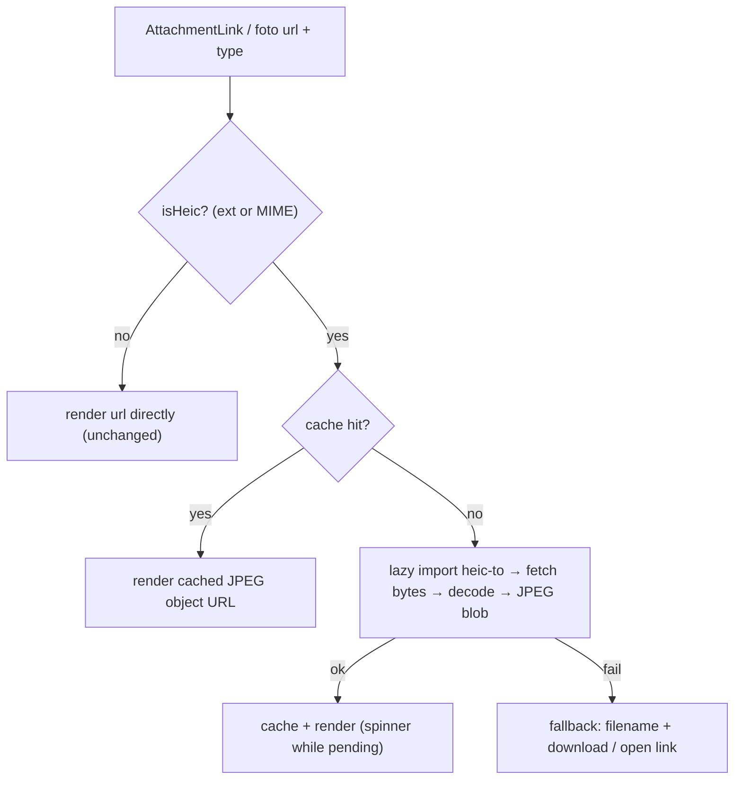

# fix: HEIC render-time conversion in the Baze Office viewer

## Summary

Add a shared image layer that decodes HEIC/HEIF to JPEG in the browser at render time, so every place Baze Office shows a stored image renders HEIC correctly. A new `heic-to`-backed conversion module (lazy-loaded, per-session cache, main-thread with a spinner) feeds a shared `AttachmentImage` component that replaces the raw `` in the document thumbnail slot, the document preview modal, and the worker profile foto in the detail views. Non-HEIC files render unchanged; decode failures fall back to a filename + download/open link instead of a broken image.

---

## Problem Frame

`.HEIC`/`.HEIF` files (the iPhone default) don't display in Baze Office — the viewer renders documents with a plain `` on the Storage public URL, Storage returns the bytes (HTTP 200), and desktop Chrome/Firefox cannot decode HEIC, so the image is broken. Reported for a worker document (Maria Piedad) and not the only case; it is intermittent because iOS sometimes converts to JPEG on web upload and sometimes doesn't. The current detection helper `isImageUrl` excludes `.heic` entirely, so HEIC is not even offered as a preview. Files reach Storage from three pipelines (office upload, the onboarding webapp, a Make scenario), two of which keep producing HEIC — so a render-time fix is the source-agnostic choice (see origin, and the workspace ADR "HEIC conversione a render").

---

## Requirements

Carried from origin (`docs/brainstorms/2026-07-09-baz-21-heic-render-conversion-requirements.md`).

- R1. HEIC/HEIF images decode to a renderable format in the browser and display correctly in the document modal preview, the attachment thumbnail slot, and the worker profile foto in the detail views (overview + header).
- R2. Behavior is source-agnostic — it works for HEIC already in Storage and future HEIC from any pipeline, with no change to stored files, paths, or DB records.
- R3. Only HEIC/HEIF is converted; already-renderable formats (JPG, PNG, WebP, GIF) and PDFs render unchanged, with no decode attempt.
- R4. HEIC/HEIF references are recognized as images by the viewer's image detection so they attempt to render — today `.heic` is excluded and shows no preview.
- R5. On decode failure (or any non-renderable file reaching the viewer), the viewer shows a graceful fallback — filename + download / open-in-new-tab link — never a broken ``.
- R6. The decoder is loaded lazily — only when a HEIC actually needs rendering — adding nothing to the initial app load.
- R7. A decoded HEIC is cached for the session; the same object is decoded at most once per session.
- R8. Decoding never blocks the UI: a loading state shows while a HEIC decodes, and a detail view with a HEIC document/foto stays responsive.

---

## Key Technical Decisions

- **Single conversion module wrapping `heic-to`.** All decode logic lives in one module (dynamic `import()` of `heic-to`, detection helpers, session cache). The rest of the app never imports `heic-to` directly. This keeps the ~735 KB gz chunk lazy and makes swapping to the worker entry a one-file change. `heic-to` chosen over `heic2any` because heic2any is unmaintained and crashes/black-images on iOS 17/18 HEIC (see origin Key Decisions; feasibility spike verified). LGPL-3.0, used unmodified as a dynamic dependency.
- **Detect HEIC by extension OR MIME type.** `AttachmentLink` carries both `url` (path ends `.heic`) and `type` (`image/heic`). Detect HEIC when either matches, so Make/webapp-origin files with an odd filename but a HEIC MIME are still caught.
- **Shared `AttachmentImage` component is the single seam.** One component owns the decode-or-passthrough decision, the loading state, and the fallback. Every `` on a stored image in scope is replaced with it, so the fix lands in one place and can't drift per-surface.
- **Main-thread decode + spinner is the MVP; the web worker is deferred.** A single detail-view image is one decode; main-thread behind a spinner meets R8 for the in-scope surfaces. `heic-to/next` (worker entry) is the escape hatch behind the module if jank appears — see Deferred to Follow-Up Work.
- **List avatars are out of scope.** `toAvatarThumbnailUrl` feeds many small images per list; per-avatar HEIC decode is the exact many-images jank case this design avoids, and a fallback icon there is low-impact. Only single large-image surfaces are converted.
- **Session cache keyed by URL, object-URLs revoked on eviction.** A module-level `Map<url, objectUrl>` with a small cap (revoke the evicted entry's object URL). Bounded scope (no list avatars) keeps the working set tiny. Resolves the origin's cache-lifecycle question.
- **No download rename, no PDF change.** Downloads keep the original `.heic` name (origin-accepted). PDFs never reach the ``/modal path (`isImageUrl` excludes them and the modal only opens on an image `previewLink`) — confirmed, untouched. Resolves those origin questions.

---

## High-Level Technical Design

The conversion module (U1) is the only `heic-to` importer. The `AttachmentImage` component (U2) consumes it and is dropped into each in-scope `` site (U3–U5).

---

## Implementation Units

### U1. HEIC conversion module + `heic-to` dependency

- **Goal:** One module that detects HEIC and converts a Storage URL to a renderable JPEG object URL, lazily and cached.
- **Requirements:** R2, R3, R6, R7 (and enables R1, R5, R8).
- **Dependencies:** none.
- **Files:** `package.json` (add `heic-to`), `src/lib/heic-image.ts` (new), `src/lib/heic-image.test.ts` (new).
- **Approach:** Export `isHeic(input: { url?: string; type?: string })` — true when the url ends in `.heic`/`.heif` (ignoring query) or the type is `image/heic`/`image/heif`. Export `getRenderableImageSrc(url, type?): Promise<string>` — returns `url` unchanged for non-HEIC; for HEIC, return a cached object URL if present, else dynamically `import("heic-to")`, `fetch(url)` → blob, convert to JPEG blob, `URL.createObjectURL`, store in a module-level `Map<string,string>` with a size cap (revoke the evicted object URL), and return it. Errors reject (caller renders fallback). Keep the decode call isolated so the `heic-to/next` worker entry can replace it later without touching callers.
- **Patterns to follow:** dynamic `import()` as used for lazy pages (`src/pages/app-pages.tsx`, `src/App.tsx:10`); `attachmentPathToPublicUrl` in `src/lib/attachments.ts` for URL shape.
- **Test scenarios:**
  - `isHeic` true for `photo.heic`, `x.HEIF?token=1`, `{type:"image/heic"}`; false for `.jpg`, `.pdf`, `{type:"image/png"}`.
  - Non-HEIC url returns the same string synchronously-resolved, with no `heic-to` import (mock module, assert not called).
  - HEIC url: mock `heic-to` to return a blob; asserts `fetch` called once, returns an object URL, second call for the same url is a cache hit (mock called once).
  - Cache eviction beyond the cap revokes the evicted object URL (`URL.revokeObjectURL` spy).
  - Conversion failure (mock rejects) propagates a rejection.
- **Verification:** `npm run test:unit` covers the module; `npm run build` type-checks the new dep import.

### U2. Shared `AttachmentImage` component

- **Goal:** A drop-in replacement for a raw `` on a stored image that converts HEIC, shows a spinner while decoding, and renders a fallback on failure.
- **Requirements:** R1, R5, R8.
- **Dependencies:** U1.
- **Files:** `src/components/shared-next/attachment-image.tsx` (new), `src/components/shared-next/attachment-image.test.tsx` (new).
- **Approach:** Props `{ src: string; type?: string; alt: string; className?: string; downloadName?: string }`. On mount / when `src` changes, if `isHeic` call `getRenderableImageSrc` and track `loading | ready | error`; otherwise render `` immediately. While loading show a spinner (reuse `LoaderCircleIcon`, as in `attachment-upload-slot.tsx`). On error render a fallback block: filename + a download/open link (`<a href={src} target="_blank" rel="noreferrer">`), mirroring the existing external-link affordance. Guard against setting state after unmount (the decode is async).
- **Patterns to follow:** `AttachmentUploadSlot` iconography and link markup (`src/components/shared-next/attachment-upload-slot.tsx`); `cn()` styling convention.
- **Test scenarios:**
  - Covers R3. Non-HEIC `src` renders an `` with that `src` immediately (no loading state).
  - Covers R1, R8. HEIC `src`: shows loading state, then renders `` with the converted object URL (mock U1).
  - Covers R5. HEIC decode rejects → renders the fallback with the filename and a link to the original `src`, no broken ``.
  - Unmounting mid-decode does not throw / set state.
- **Verification:** `npm run test:unit`; visual check deferred to U3–U5 wiring.

### U3. Detection + wire the attachment thumbnail slot

- **Goal:** Make HEIC count as a previewable image and render it through `AttachmentImage` in the slot thumbnail.
- **Requirements:** R1, R4.
- **Dependencies:** U1, U2.
- **Files:** `src/components/shared-next/attachment-upload-slot.tsx`, `src/components/shared-next/attachment-upload-slot.test.tsx` (new if absent).
- **Approach:** Replace the local `isImageUrl` gate at the `previewLink` computation (line ~63) with detection that also accepts HEIC via `isHeic` on the link's `url`/`type`, so a HEIC link yields a `previewLink` (thumbnail + zoom button appear). Replace the thumbnail `` (line ~120) with `<AttachmentImage src={previewLink.url} type={previewLink.type} ...>`. Leave the raw external-link `<a>` affordances as-is (they open the original in a new tab).
- **Patterns to follow:** existing `previewLink`/`onPreviewOpen` flow in the same file.
- **Test scenarios:**
  - Covers R4. A link with a `.heic` url (or `image/heic` type) produces a `previewLink` → the zoom button renders (previously it did not).
  - Covers R1. The thumbnail renders `AttachmentImage` for a HEIC link (assert component/loading present, mock U1).
  - Regression: a `.jpg` link still renders its thumbnail unchanged; a `.pdf` link still shows the file icon and no preview button.
- **Verification:** `npm run test:unit`; `npm run lint` (the file is under FASE-5-BIS-adjacent conventions — no `committedValue`/`useDebouncedSave` introduced).

### U4. Wire the document preview modal

- **Goal:** The zoom modal renders HEIC via `AttachmentImage`.
- **Requirements:** R1, R5, R8.
- **Dependencies:** U2.
- **Files:** `src/modules/lavoratori/components/documents-card.tsx`, `src/modules/lavoratori/components/documents-card.test.tsx` (new if absent).
- **Approach:** Replace the modal `` (line ~828) with `<AttachmentImage src={selectedPreview.url} type={selectedPreview.type} alt={selectedPreview.label} ...>`, preserving the existing `object-contain`/max-height classes. No change to how `selectedPreview` is set.
- **Patterns to follow:** the existing `Dialog`/`selectedPreview` block in the same file.
- **Test scenarios:**
  - Covers R1, R8. Opening a HEIC preview shows the loading state then the converted image (mock U1).
  - Covers R5. A HEIC that fails to decode shows the fallback in the modal, not a broken image.
  - Regression: opening a JPG/PNG preview renders immediately as before.
- **Verification:** `npm run test:unit`; manual check that the modal still closes and sizes correctly.

### U5. Wire the worker profile foto (detail views)

- **Goal:** The single large worker foto in the profile detail views renders HEIC.
- **Requirements:** R1.
- **Dependencies:** U2.
- **Files:** `src/modules/lavoratori/components/worker-profile-overview.tsx` (~line 136), `src/modules/lavoratori/components/worker-profile-header.tsx` (~line 420); tests for these if present.
- **Approach:** Replace the foto `` in each detail view with `<AttachmentImage src={toAvatarUrl(row)} ...>`. Detection is by URL extension (foto paths carry `.heic`); no `type` is available from `toAvatarUrl`, which is fine. Do NOT touch `toAvatarThumbnailUrl` / list avatars (out of scope, KTD).
- **Patterns to follow:** `toAvatarUrl` in `src/modules/lavoratori/lib/base-utils.ts`; existing foto `` markup in each file.
- **Test scenarios:**
  - Covers R1. A worker whose `foto` path is `.heic` renders `AttachmentImage` (loading → converted) in the profile header and overview (mock U1).
  - Regression: a JPG foto renders unchanged; the "imposta come foto principale" controls still work.
  - Confirm list avatars are unchanged (no `AttachmentImage` in `toAvatarThumbnailUrl` render paths).
- **Verification:** `npm run test:unit`; `npm run build`.

---

## Scope Boundaries

In scope: HEIC/HEIF render-time conversion at the document thumbnail slot, the document preview modal, and the worker profile foto in the detail views (overview + header).

Out of scope (non-goals):
- The Make "Upload Foto" scenario and the onboarding webapp — they keep producing HEIC; converting at source is separate.
- Storage-side / ingest conversion and any backfill of stored files.
- Conversion of non-HEIC "non-standard" formats (TIFF/RAW/…) — fallback only.

### Deferred to Follow-Up Work

- Web worker decode via `heic-to/next` — swap behind the U1 module if main-thread decode janks in practice.
- List avatars (`toAvatarThumbnailUrl`) — many small images; convert only if a follow-up justifies the per-image cost.
- Cosmetic `.heic → .jpg` download rename.

---

## Testing Strategy

- Framework: Vitest (`happy-dom`), per `bazeoffice/CLAUDE.md`. Unit tests only for this work (`npm run test:unit`); no integration seams added.
- Mock `heic-to` at the module boundary (`vi.mock`) — no real WASM decode in tests; U1 is the only place that imports it, so U2–U5 tests mock U1's `getRenderableImageSrc`/`isHeic`.
- Use `renderWithProviders` from `src/test/test-utils.tsx` for component tests.
- Assert the three states per surface (loading, converted, fallback) and the non-HEIC passthrough (regression).
- Gates before PR: `npm run test`, `npm run build` (tsc), `npm run lint` (the pre-push hook runs all three).

---

## Risks & Dependencies

- **New dependency `heic-to` (LGPL-3.0, ~735 KB gz, WASM inlined).** Lazy-loaded so it doesn't hit initial load. License acceptable for the hosted front-end used unmodified (origin Assumptions).
- **Single-threaded build required.** GitHub Pages can't set COOP/COEP, so no SharedArrayBuffer threading — use `heic-to`'s default/single-thread path; verify no SAB requirement at implementation. `heic-to` inlines its WASM, so there is no separate `.wasm` asset to resolve under the Vite base path (`/bazeoffice/`, `/staging-bazeoffice/`).
- **libheif limits:** HDR flattened to SDR, only the primary image of a multi-image HEIC — acceptable for document/ID photos (origin Assumptions).
- **Perf if scope creeps to list avatars** — explicitly excluded to avoid many concurrent decodes.

---

## Sources & Research

- Origin requirements: `docs/brainstorms/2026-07-09-baz-21-heic-render-conversion-requirements.md`.
- Workspace ADR "HEIC conversione a render" (render-time vs storage-side) and Linear BAZ-21.
- Feasibility spike (multi-agent, adversarially verified): `heic-to` v1.5.2, libheif 1.22.2, worker entry `heic-to/next`, gzip ~735 KB, WASM inlined; `heic2any` excluded for iOS-18 decode failures.
- Grounded seam (re-verified by hand): `src/components/shared-next/attachment-upload-slot.tsx:20` (`isImageUrl`), `:63` (`previewLink`), `:120` (thumbnail ``); `src/modules/lavoratori/components/documents-card.tsx:526` (`selectedPreview`), `:828` (modal ``); `src/lib/attachments.ts` + `src/components/shared-next/attachment-utils.ts` (`AttachmentLink` shape); `src/modules/lavoratori/lib/base-utils.ts:253` (`toAvatarUrl`), `:272` (`toAvatarThumbnailUrl`, list avatars); foto `` at `src/modules/lavoratori/components/worker-profile-overview.tsx:136` and `worker-profile-header.tsx:420`.
- Build: Vite 7, `React.lazy`/dynamic `import()` established; no CSP (GitHub Pages).
