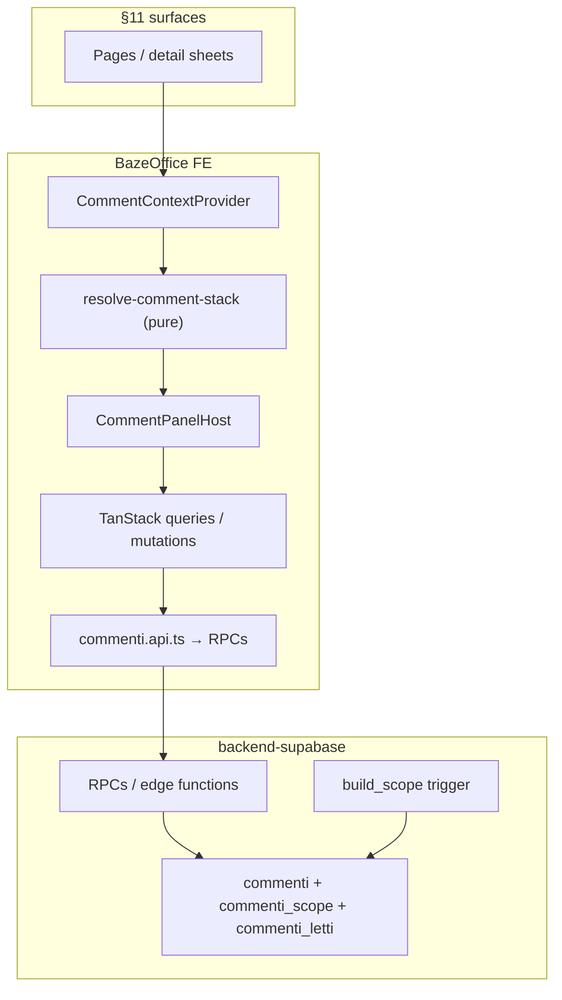
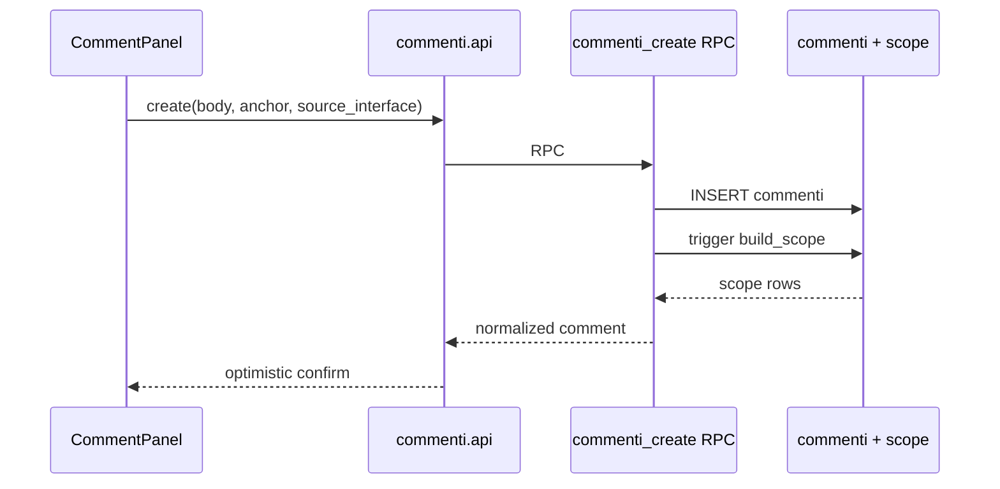

# Contextual Comments - Plan

## Goal Capsule

- **Objective:** Ship PRD v2.2 contextual comments for BazeOffice — entity-anchored threads with hierarchical read visibility, unified floating panel on every listed surface, Gate phase notes, and @-mention autocomplete with storage — so operational conversations move off Google Chat.
- **Product authority:** [PRD — Commenti contestuali (BAZ-83)](https://linear.app/bazeapp/document/prd-commenti-contestuali-baz-83-6ac58af007d7) for behavior; brainstorm deviations recorded in Scope Boundaries below.
- **UI authority:** `docs/references/comment-panel-spec-ui-ux.html` — layout, spacing, interaction states, phase-note styling.
- **Backend authority:** `Bazeapp/backend-supabase` — migrations, RLS, `build_scope` trigger, RPCs. Frontend blocks on backend RPC availability in dev/staging.
- **Open blockers:** None. Comment deletion is out of scope until an admin operator role exists. BAZ-84 owns notification effects.

---

## Product Contract

**Product Contract preservation:** Unchanged from brainstorm except Outstanding Questions resolved in Planning Contract (module slug, role pill precedence, count RPC). R1–R29, flows, and acceptance examples stand.

### Summary

A cross-cutting comments capability anchors each thread to a domain entity, propagates visibility to ancestor entities via a scope table at write time, and surfaces everything in one floating panel per page. Operators read unified context along the entity hierarchy and write with an explicit target chip. Legacy `feedback_recruiter` coexists unchanged for v1.

### Problem Frame

Internal coordination on famiglie, ricerche, lavoratori, and payroll today happens on Google Chat, disconnected from the records operators are working on. Context is lost when switching surfaces, and Gate assessments live partly in an append-only text column (`lavoratori.feedback_recruiter`) rather than a structured, propagating thread. The product goal is to centralize operational communication inside BazeOffice so opening any entity shows the relevant history without leaving the workflow.

**Success signal (from PRD):** operational conversations on famiglie/lavoratori/payroll move off Google Chat within 30 days of release.

---

### Key Decisions

- **PRD as behavioral reference, repo as naming source of truth.** Entity types, table names, and role tokens map to what already exists in Supabase and `operatori.ruolo`. Do not rename tables or add a new role column to match PRD prose.
- **Full PRD v1 in one release.** All §11 surfaces and §17 acceptance criteria, except the deviations listed under Scope Boundaries.
- **Coexist with `feedback_recruiter`.** `RecruiterFeedbackPanel` and the `lavoratori.feedback_recruiter` column stay for v1. No backfill, no retirement.
- **Comments-first on mentions.** Ship @ autocomplete and `@[Nome Cognome](user_id)` storage in BAZ-83. Pill shows total comment count only; red dot for unread mentions waits for BAZ-84.
- **No comment deletion in v1.** No delete UI or user-facing soft-delete flow. Authors correct mistakes via edit (author-only, unlimited).
- **Operator role pills use existing tokens.** Map PRD display labels to `operatori.ruolo` values (`customer`, `sales`, `recruiter`, `payroll`).
- **UI follows the standalone HTML spec.** `docs/references/comment-panel-spec-ui-ux.html` is the visual/interaction reference.

---

### PRD → repo entity mapping

| entity_type | Supabase table | Notes |
| --- | --- | --- |
| `famiglia` | `famiglie` | L0 anagrafica |
| `lavoratore` | `lavoratori` | L0; Gate phase notes anchor here |
| `ricerca` | `processi_matching` | L1; CRM pipeline cards are same record |
| `candidatura` | `selezioni_lavoratori` | L2; dual parent |
| `rapporto` | `rapporti_lavorativi` | L2; triple parent incl. `processi_matching` FK |
| `assunzione` | `assunzioni` | L3 documento |
| `variazione` | `variazioni_contrattuali` | PRD: `variazioni` |
| `chiusura` | `chiusure_contratti` | PRD: `chiusure` |
| `cedolino` | `mesi_lavorati` | Payroll cedolini |
| `contributi` | `contributi_inps` | Payroll contributi |
| `ticket` | `ticket` | customer/payroll is row field, not entity type |

---

### PRD → operator role mapping

| PRD label | Repo token | UI pill |
| --- | --- | --- |
| Customer Success | `customer` | Customer |
| Sales | `sales` | Sales |
| Recruiter | `recruiter` | Recruiter |
| Payroll | `payroll` | Payroll |

---

### Requirements

**Data model and propagation**

- R1. Comments persist in `commenti` with anchor, threading, author, body (mention markup), `comment_type`, `phase_label`, `source_interface`, timestamps, edit metadata. Soft-delete columns may exist in schema; no user-facing delete in v1.
- R2. Visibility via `commenti_scope` rows with `depth`, built at insert by walking real FKs. Replies inherit root scope.
- R3. Read path joins on scope — no fan-out copy at write time.
- R4. RLS: backoffice operators only; never exposed to famiglie or lavoratori.

**Panel shell and sections**

- R5. Floating panel: collapsed `💬 N` pill; expanded ~440px. Pill anchors to open drawer when present.
- R6. Sections = focus + ancestors (tie-break: Candidatura → Rapporto → Lavoratore → Ricerca → Famiglia) + `↗ Da entità collegate`. Max 5 ancestor + 1 aggregated section. No per-page config.
- R7. Accordion: one section open; focus expanded on open even if empty.
- R8. Origin badges only in `↗ Da entità collegate`.
- R9. Newest at bottom; scroll to latest on open; paginate 20 roots, `Carica altri` at top.

**Composer and target chip**

- R10–R13. Target chip always visible; dropdown limited to current stack; default = focus; section ↔ chip invariant; `↗ Visibile anche su` on input focus only.

**Threads, edit, and read state**

- R14–R15. Reply to root only; one visual nesting level; reply from ancestor section attaches to original root.
- R16. Author edit, unlimited.
- R17. Personal unread blue dot via `commenti_letti` + viewport >1s.
- R18. Deactivated author: grey avatar, `(disattivato)`.

**Phase notes**

- R19–R21. Auto `phase_note` from Gate surfaces on `lavoratore`; pinned in lavoratore section; per-ricerca fit = free comment on `candidatura`.

**Mentions**

- R22–R24. @ autocomplete + `@[Nome](user_id)` storage; notification effects deferred to BAZ-84.

**Surfaces**

- R25. Panel on every PRD §11 surface with correct focus and `source_interface`.

**Realtime and performance**

- R26–R28. Realtime + optimistic send; collapsed = count only; expanded = lazy section fetch; pill red dot deferred to BAZ-84.

**Legacy**

- R29. `feedback_recruiter` / `RecruiterFeedbackPanel` unchanged.

---

### Key Flows

- F1. Write on page focus — R2, R3, R10, R13, R26, R27.
- F2. Write on ancestor via chip — R3, R10, R12, R13.
- F3. Gate phase note — R19, R20, R25.
- F4. Thread reply from ancestor section — R14, R15.
- F5. @-mention autocomplete (no notification) — R22, R23, R24.

---

### Acceptance Examples

- AE1. Famiglia comment visible on future ricerca — R3.
- AE2. Ricerca comment visible on cedolino via rapporto FK — R3.
- AE3. Chip-section invariant — R13.
- AE4. Phase note pinned above newer free comments — R20.
- AE5. No delete action in comment menu — out-of-scope.
- AE6. Collapsed pill fetches count only — R27, R28.

---

### Scope Boundaries

**Deferred for later**

- Comment deletion (admin-only) until `admin` role exists.
- BAZ-84 notification effects and pill red dot for unread mentions.
- Migration of `feedback_recruiter` and scattered `note_*` fields.
- PRD §16 exclusions (attachments, reactions, mobile, etc.).

**Outside v1 identity**

- Renaming Supabase tables to match PRD shorthand.
- New `operatori.ruolo` enum.
- Exposing comments to famiglie/lavoratori.

**Deliberate PRD deviations**

| PRD | This plan |
| --- | --- |
| Admin-only delete | No delete at all |
| PRD role enum | Existing `customer`/`sales`/`recruiter`/`payroll` tokens |
| Red pill dot on pill | Count only until BAZ-84 |
| `chiusure`, `variazioni` table names | `chiusure_contratti`, `variazioni_contrattuali` |

### Deferred to Follow-Up Work

- Bulk-migrate legacy `note_*` columns into commenti.
- Retire `RecruiterFeedbackPanel` after team adoption.
- Admin delete UI when admin role ships.

---

### Sources / Research

- [BAZ-83](https://linear.app/bazeapp/issue/BAZ-83/implementare-sistema-commenti-contestuali-bazeoffice) · [PRD v2.2](https://linear.app/bazeapp/document/prd-commenti-contestuali-baz-83-6ac58af007d7)
- UI: `docs/references/comment-panel-spec-ui-ux.html`
- Prior art: `src/modules/lavoratori/components/recruiter-feedback-panel.tsx`
- Patterns: `src/hooks/use-realtime-board-sync.ts`, `src/lib/record-crud.ts`, `docs/realtime-board-pattern.md`

---

## Planning Contract

### Key Technical Decisions

- **Dedicated `commenti` domain module** at `src/modules/commenti/` per AGENTS.md Italian slug convention. Internal `commenti.api.ts` is the sole Supabase caller; `commenti.adapters.ts` normalizes row shapes.
- **Backend RPCs, not generic `create-record`.** Scope expansion (`build_scope` trigger) and multi-parent FK walks belong server-side. Frontend calls named RPCs / edge functions: `commenti_count_for_page`, `commenti_list_section`, `commenti_create`, `commenti_edit`, `commenti_reply`, `commenti_mark_read`. Do not add `commenti` to `record-crud.ts` allow-lists.
- **Pure `resolve-comment-stack` lib** in `src/modules/commenti/lib/` builds the section list from a loaded focus entity row (FK fields already on the detail payload). Same function drives chip options and `↗ Visibile anche su` labels — no per-page section config.
- **Single `CommentPanelHost` at app shell.** Mount in `src/App.tsx` (or wrapper around `AppPageContent`) with a React context (`CommentContextProvider`) that each surface sets via a small hook (`useCommentRouteContext`). Avoid duplicating the panel in 15 page files.
- **Drawer anchor via DOM ref.** Surfaces with open `Sheet`/detail pass `anchorRef` to the provider (pattern: `src/modules/crm/components/assegnazione-detail-sheet.tsx`). Pill uses `position: fixed` with coordinates derived from anchor rect, else viewport bottom-right.
- **Realtime on `commenti` table** filtered by `entity_type` + `entity_id` of the page focus; invalidates TanStack Query keys for count + open section. Mutations use `runTrackedWrite` from `src/lib/write-tracking.ts`.
- **Role pill precedence** when `operatori.ruolo` has multiple tokens: `recruiter` → `customer` → `sales` → `payroll` (first match wins). Unknown/empty → `Operatore`.
- **Mention autocomplete** reuses `useOperatoriOptions` / `fetchOperatoriOptionsRows`; "coinvolti in questa ricerca" = recruiter assegnato + thread authors + current user, derived from context payload already on ricerca/candidatura views.
- **Visual implementation** follows `docs/references/comment-panel-spec-ui-ux.html` for component structure; implement with existing shadcn primitives (`Sheet` is for entity detail, not the comment panel — panel is custom fixed overlay per spec).

### Assumptions

- `backend-supabase` PR lands before frontend integration tests against staging; local dev uses staging Supabase until RPCs exist.
- `prove_colloqui` and `riattivazioni` are out of PRD §11 — panel mounts only on listed surfaces; those routes stay without comments until product adds them.
- Board list views without an open detail (e.g. ricerca board, assunzioni kanban with no card open) hide the pill or show count=0 until a detail focus exists.

### High-Level Technical Design



**Write sequence**



### Output Structure

```text
src/modules/commenti/
  commenti.api.ts          # internal — RPC calls only
  commenti.adapters.ts     # row → domain types
  commenti.types.ts
  index.ts                 # types, hooks, components barrels
  lib/
    entity-map.ts          # entity_type ↔ table
    resolve-comment-stack.ts
    mention-markup.ts
    role-pill.ts
    section-order.ts
    source-interface-map.ts
    __tests__/
  queries/
    fetch-comment-count.ts
    fetch-section-comments.ts
  mutations/
    create-comment.ts
    edit-comment.ts
    reply-comment.ts
    mark-comment-read.ts
  hooks/
    use-comment-panel.ts
    use-comment-context.ts
    use-comment-route-context.ts
    use-mention-autocomplete.ts
    __tests__/
  components/
    comment-panel-host.tsx
    comment-panel.tsx
    comment-section.tsx
    comment-thread.tsx
    comment-composer.tsx
    comment-target-chip.tsx
    mention-autocomplete.tsx
    index.ts
    __tests__/
  __tests__/
```

---

## Implementation Units

### U1. Backend schema and RPCs (backend-supabase)

- **Goal:** Persist comments with scope propagation, RLS, and RPC surface the FE module calls.
- **Requirements:** R1–R4, R2 scope trigger.
- **Dependencies:** none (parallel track; FE stubs until merged).
- **Files:** `Bazeapp/backend-supabase` — migrations for `commenti`, `commenti_scope`, `commenti_letti`; `build_scope()` trigger; RPCs listed in KTD; RLS policies for authenticated operators.
- **Approach:** Trigger walks FK graph per PRD §2 (multi-parent for `rapporti_lavorativi`, `selezioni_lavoratori`). `commenti_list_section` accepts `(page_entity_type, page_entity_id, section_entity_type, section_entity_id, cursor)` and returns roots + replies. `commenti_count_for_page` aggregates scope-visible non-deleted roots+replies for pill. `commenti_edit` RPC enforces author-only at server (reject when `author_id` ≠ caller). No delete RPC in v1.
- **Test expectation:** none — backend repo owns SQL/integration tests.
- **Verification:** RPCs callable from staging; RLS denies anon; scope rows created on insert for famiglia → visible from ricerca query.

### U2. Module foundation — types, entity map, adapters

- **Goal:** Domain types and PRD→repo mapping in one place.
- **Requirements:** R1, entity mapping table, role mapping.
- **Dependencies:** U1 (adapter shapes match RPC response).
- **Files:** `src/modules/commenti/commenti.types.ts`, `lib/entity-map.ts`, `lib/role-pill.ts`, `lib/section-order.ts`, `commenti.adapters.ts`, `lib/__tests__/entity-map.test.ts`, `lib/__tests__/role-pill.test.ts`, `index.ts` (types only initially).
- **Approach:** Zod schemas at adapter boundary for RPC payloads. `entity-map.ts` exports `EntityType`, table name, section icon/label helpers. `role-pill.ts` implements precedence chain.
- **Test scenarios:**
  - Maps `chiusura` → `chiusure_contratti`, `variazione` → `variazioni_contrattuali`.
  - `resolveRolePill(['payroll','recruiter'])` → `recruiter`.
  - Adapter maps DB row to `Comment` with parsed mention tokens.
- **Verification:** `npm run test` green for new unit tests.

### U3. `resolve-comment-stack` pure lib

- **Goal:** Given focus entity + hydrated row, produce ordered sections, chip options, and visibility hints.
- **Requirements:** R6, R10, R12, R13.
- **Dependencies:** U2.
- **Files:** `src/modules/commenti/lib/resolve-comment-stack.ts`, `lib/__tests__/resolve-comment-stack.test.ts`.
- **Approach:** Input: `{ focus: EntityRef, row: Record<string, unknown> }`. Walk FK fields (`id_famiglia`, `id_lavoratore`, `id_processo_matching`, etc.) per entity type. Output: `sections[]` with `entityRef`, `label`, `kind: 'focus' | 'ancestor' | 'descendants'`, `visibilityHint`. Descendants section is synthetic (no entity ref). Tie-break uses `section-order.ts`.
- **Test scenarios:**
  - Covers AE3 inputs: candidatura focus yields Candidatura, Lavoratore, Ricerca, Famiglia + collegate.
  - Rapporto focus includes Ricerca when `id_processo_matching` present.
  - CRM ricerca focus yields Ricerca, Famiglia + collegate (no Candidatura).
- **Verification:** Unit tests cover all §11 focus types with fixture rows.

### U4. Data layer — api, queries, mutations, realtime

- **Goal:** TanStack wrappers over RPCs with optimistic updates and realtime invalidation.
- **Requirements:** R14–R17, R26–R28.
- **Dependencies:** U1, U2.
- **Files:** `commenti.api.ts`, `queries/fetch-comment-count.ts`, `queries/fetch-section-comments.ts`, `mutations/create-comment.ts`, `mutations/edit-comment.ts`, `mutations/reply-comment.ts`, `mutations/mark-comment-read.ts`, `hooks/use-comment-panel.ts`, `hooks/__tests__/use-comment-panel.integration.test.tsx`.
- **Approach:** Query keys: `['commenti','count', pageRef]`, `['commenti','section', sectionRef, cursor]`. `create`/`reply` use optimistic insert at 60% opacity; rollback + toast on error. Realtime: subscribe to `commenti_scope` inserts/updates where `entity_type`/`entity_id` = **page focus** (not anchor only) so ancestor-scoped comments (e.g. famiglia thread visible on ricerca) invalidate count and open section. Alternatively subscribe to `commenti` and invalidate all section keys for the page — prefer scope channel to limit noise. `mark-comment-read` debounced on viewport intersection (IntersectionObserver in panel). Gate pages pass `comment_type: phase_note` + `phase_label` from `source_interface`.
- **Patterns:** `src/lib/write-tracking.ts`, `src/hooks/use-realtime-rows.ts`, `src/modules/crm/mutations/update-processo-matching-stato-sales.ts`.
- **Test scenarios:**
  - Covers AE6: count query fires; section query disabled until `expanded`.
  - Optimistic create rolls back on RPC error.
  - Reply always sets `thread_root_id` to root id.
  - `mark read` not called for own comments.
- **Verification:** Hook integration tests with mocked `commenti.api.ts`.

### U5. Comment panel UI shell (pill + expanded frame)

- **Goal:** Collapsed pill and expanded container matching HTML spec.
- **Requirements:** R5, R27, R28.
- **Dependencies:** U4.
- **Files:** `components/comment-panel-host.tsx`, `components/comment-panel.tsx`, `hooks/use-comment-context.ts`, `components/__tests__/comment-panel-shell.integration.test.tsx`.
- **Approach:** `CommentPanelHost` reads context; if no focus, render null. Pill: `💬 {count}`; no red dot in v1. Expanded: ~440px, header `💬 Commenti · N`, close chevron. Anchor positioning from `anchorRef`. `data-testid` prefixes: `comments-pill`, `comments-panel`, `comments-panel-close`.
- **Patterns:** Visual reference `docs/references/comment-panel-spec-ui-ux.html`; z-index above drawers but below modals.
- **Test scenarios:**
  - Pill hidden when context null.
  - Expand toggles panel; collapsed does not mount section list fetcher (mock query).
- **Verification:** RTL tests for shell interactions.

### U6. Sections, composer, chip invariant, threads

- **Goal:** Full panel internals — accordion, composer, threads, edit, phase note rendering.
- **Requirements:** R6–R16, R19–R20.
- **Dependencies:** U3, U4, U5.
- **Files:** `comment-section.tsx`, `comment-thread.tsx`, `comment-composer.tsx`, `comment-target-chip.tsx`, `components/__tests__/comment-chip-section-sync.integration.test.tsx`, `components/__tests__/comment-phase-note.integration.test.tsx`.
- **Approach:** Single `activeSectionId` + `targetEntityRef` state in `use-comment-panel` (one state, two views per PRD). `+ Commenta` on section header sets target + focuses input. Phase notes sorted before free comments in lavoratore section. Thread UI: indent 16px, collapse >3 replies. Edit menu for author only; no delete menu item (AE5). `source_interface` chip on roots only.
- **Test scenarios:**
  - Covers AE3: expanding lavoratore section moves chip and updates placeholder.
  - Covers AE4: phase note renders first with badge and `#EFF6FF` background.
  - Covers AE5: author menu has Edit, not Delete.
  - Empty focus section shows empty-state copy.
- **Verification:** Integration tests for invariants; manual check against HTML spec.

### U7. Mentions autocomplete

- **Goal:** @ picker and markup rendering without notification side effects.
- **Requirements:** R22, R23, R24, F5.
- **Dependencies:** U6.
- **Files:** `mention-autocomplete.tsx`, `lib/mention-markup.ts`, `hooks/use-mention-autocomplete.ts`, `lib/__tests__/mention-markup.test.ts`, `components/__tests__/mention-autocomplete.integration.test.tsx`.
- **Approach:** On `@`, show floating list above input. Sections: context-involved operators, then all operators. Insert `@[Nome Cognome](uuid)` into body. Render pass highlights mentions in blue (non-clickable). No calls to notification APIs.
- **Test scenarios:**
  - Insert mention produces correct markup string.
  - Render parses markup to blue spans.
- **Verification:** Unit + shallow integration tests.

### U8. App integration — context wiring for all §11 surfaces

- **Goal:** Mount panel and provide correct focus/`source_interface` on every PRD §11 route.
- **Requirements:** R25, R19 (gate auto-tag via source_interface).
- **Dependencies:** U5, U6, U3.
- **Files:** `src/App.tsx` (host mount), `src/modules/commenti/hooks/use-comment-route-context.ts`, per-surface thin wiring in: `crm-pipeline-famiglie-page`, `crm-assegnazione-page`, `ricerca-detail-page`, `lavoratori-cerca-page`, `gate1-page`, `gate2-page`, `rapporti-lavorativi-page`, `assunzioni-page`, `chiusure-page`, `variazioni-page`, `payroll-page`, `support-tickets-page`; `lib/source-interface-map.ts`.
- **Approach:** `useCommentRouteContext` maps `AppRoute.mainSection` + open detail ids to `CommentContextValue` (focus ref, row snapshot for stack resolver, `sourceInterface`, `anchorRef` from detail sheet). Board-only views without open detail: context disabled. Map `mainSection` → PRD `source_interface` enum (e.g. `gate_1` → `gate_1`, tickets → `ticket_customer` / `ticket_payroll`).
- **Patterns:** `src/routes/app-routes.ts` `MainSection` enum; detail sheets pass ref callback.
- **Test scenarios:**
  - Ricerca detail with selection id → focus `candidatura`.
  - CRM pipeline with open scheda → focus `ricerca`.
  - Gate 1 with selected worker → focus `lavoratore`, `phase_note` on create.
- **Verification:** Manual walkthrough of §11 table; spot-check AE1/AE2 on staging with two browser sessions.

---

## Verification Contract

| Gate | Command / check | Applies to |
| --- | --- | --- |
| Unit + integration | `npm run test` | U2–U8 |
| Typecheck | `npm run build` (tsc -b) | all FE units |
| Lint | `npm run lint` | all touched files |
| Staging smoke | Open ricerca scheda lavoratore → pill → write → reply → appears for second operator via realtime | U8 |
| HTML spec parity | Visual compare panel states to `docs/references/comment-panel-spec-ui-ux.html` | U5, U6 |

---

## Definition of Done

- [ ] Backend RPCs deployed to staging; FE integrated against staging Supabase.
- [ ] R1–R29 satisfied except documented deviations (no delete, no mention notifications, count-only pill).
- [ ] All §11 surfaces wire `CommentContext` when a detail focus is open.
- [ ] `feedback_recruiter` unchanged and still usable on Gate 1 / ricerca.
- [ ] `npm run test`, `npm run build`, `npm run lint` pass on `dev`.
- [ ] Acceptance examples AE1–AE6 verified on staging (AE5 = absence of delete control).

---

## System-Wide Impact

- **Operators:** Single collaboration surface; training note that Google Chat is deprecated for entity-tied threads.
- **Other modules:** No changes to entity CRUD; comments are read-only sidecar except new RPCs.
- **Realtime:** Additional subscription per page with open focus; follow `docs/realtime-board-pattern.md` to avoid clobbering in-flight entity edits.
- **BAZ-84:** Mention markup format and `commenti_letti` table are extension points; do not hardcode notification assumptions in FE.

---

## Risks and Mitigation

| Risk | Mitigation |
| --- | --- |
| Backend PR delayed | FE builds against mocked RPC responses in tests; feature flag `VITE_COMMENTI_ENABLED` optional until RPCs land |
| Multi-parent scope bugs | U3 fixture tests per entity type; staging AE1/AE2 before prod |
| Panel obscures drawer actions | Anchor to drawer; z-index and offset per HTML spec |
| Performance on hot pages | Count RPC + lazy section fetch (R27); paginate roots |

---

## Open Questions

**Deferred to implementation (non-blocking)**

- Exact copy for Italian empty states — mirror PRD/HTML spec during U6.
- Whether assunzioni/chiusure/variazioni board cards without open sheet should ever show pill (default: no).
