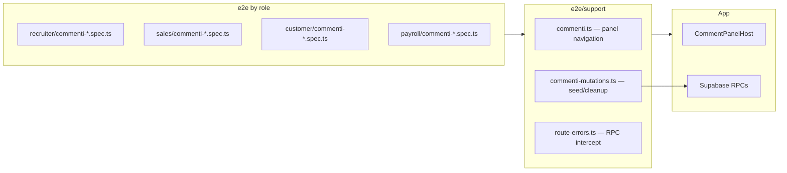
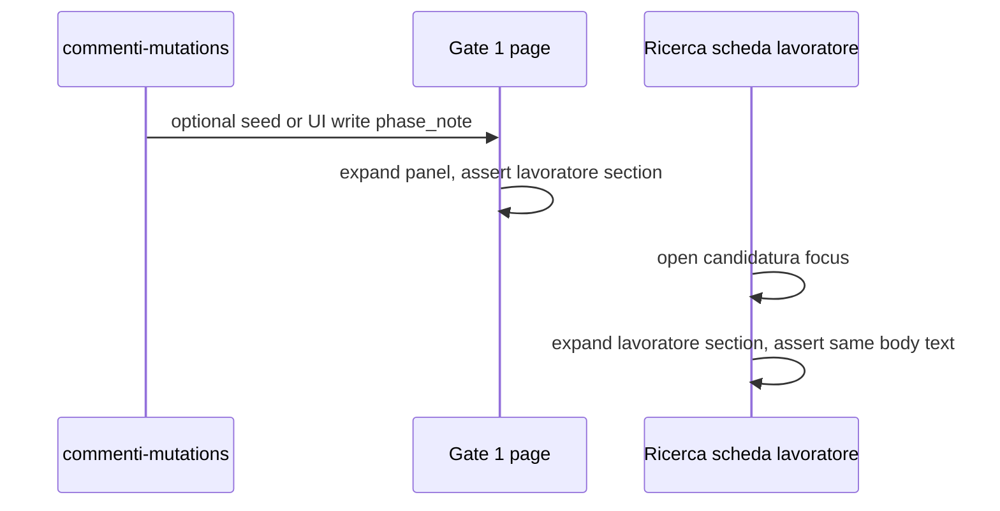

# feat: Contextual comments E2E coverage

## Goal Capsule

- **Objective:** Add Playwright E2E coverage for the contextual comments feature (`src/modules/commenti`) so PRD §17 acceptance criteria and the team's priority flows are proven against **real local Supabase**, not mocked APIs.
- **Product authority:** [PRD — Commenti contestuali (BAZ-83)](https://linear.app/bazeapp/document/prd-commenti-contestuali-baz-83-6ac58af007d7) for behavior; [2026-07-14 contextual comments plan](docs/plans/2026-07-14-001-feat-contextual-comments-plan.md) for v1 deviations (no delete UI, count-only pill, BAZ-84 notifications deferred).
- **Test authority:** Existing E2E conventions in `e2e/README.md` — role-scoped projects, service-role mutations for setup/teardown, `data-testid` selectors already on comment components.
- **Stop conditions:** Do not add E2E for admin delete, unread-mention red pill (BAZ-84), or realtime dual-tab sync in this pass.

---

## Product Contract

**Product Contract preservation:** Unchanged from origin plan and PRD. This artifact defines **verification** of shipped behavior, not new product scope.

### Summary

End-to-end tests exercise the floating comment panel on representative §11 surfaces: read/mark-read, send per entity type, correct section stacks per page focus, gate phase notes, @-mentions persistence, cross-surface visibility (Gate → Ricerca), long-thread collapse, and send-error rollback.

### Problem Frame

The commenti module has strong unit and integration tests (adapters, stack resolver, chip-section sync, optimistic rollback in hook tests), but **no Playwright coverage**. Regressions in surface wiring, RPC integration, or scope propagation would only surface in manual staging walks. E2E closes the gap on flows that cross UI, auth, and Supabase RPCs.

### Requirements (E2E traceability)

| ID | Requirement | E2E coverage |
| --- | --- | --- |
| E2E-R1 | Mark-read: unread dot clears after comment is visible >1s | U3 |
| E2E-R2 | Send free comment on each representative entity type | U4 |
| E2E-R3 | Section stack matches page focus (ancestors + collegate) | U5 |
| E2E-R4 | Gate phase_note auto-tagged and pinned on lavoratore | U5 |
| E2E-R5 | @-mention inserted, stored, and rendered after reload | U6 |
| E2E-R6 | Comment on lavoratore at Gate visible on same worker in Ricerca scheda | U7 |
| E2E-R7 | Famiglia comment visible on ricerca of that famiglia (scope propagation) | U7 |
| E2E-R8 | Threads with >3 replies collapsed; "Mostra N risposte" expands | U8 |
| E2E-R9 | `Carica altri` pagination at section top | U8 |
| E2E-R10 | RPC failure shows error toast and removes optimistic comment | U9 |
| E2E-R11 | Collapsed pill shows count only (no list fetch until expand) | U3 |
| E2E-R12 | Chip-section invariant on expand / target change | U5 |

PRD §17 items **out of E2E scope** (covered elsewhere or deferred): admin delete (v1 deviation), red mention pill (BAZ-84), realtime without refresh (deferred), dual-operator realtime (deferred).

### Key Flows (from origin)

- F1 Write on page focus → E2E-R2, E2E-R3
- F2 Write on ancestor via chip → E2E-R3 (chip target change)
- F3 Gate phase note → E2E-R4, E2E-R6
- F4 Reply from ancestor section → E2E-R8 (thread attach)
- F5 @-mention → E2E-R5

### Acceptance Examples (origin → E2E)

- AE1 Famiglia → future ricerca: E2E-R7 (existing ricerca fixture, not future creation)
- AE2 Ricerca → cedolino via rapporto FK: defer to U4 matrix row for cedolino if rapporto chain exists in `E2E_RAPPORTI`; otherwise follow-up
- AE3 Chip-section invariant: E2E-R12
- AE4 Phase note pinned: E2E-R4
- AE5 No delete menu: assert absence in U3 smoke
- AE6 Collapsed count-only: E2E-R11

### Scope Boundaries

**In scope**

- Playwright specs under `e2e/<role>/` plus shared helpers in `e2e/support/`
- Optional `seed_e2e_commenti.sql` in `baze-supabase` for stable baseline rows (preferred for propagation tests)
- Service-role helpers for insert/cleanup of `commenti`, `commenti_scope`, `commenti_letti`
- Dual browser context in one spec where cross-operator read matters (writer ≠ reader)

**Deferred for later**

- Realtime dual-tab test (new comment appears without refresh)
- Full §11 surface matrix (every board + every sheet variant) — use representative parameterized table
- AE2 full cedolino chain if fixture rapporto lacks `id_processo_matching` link
- E2E for `feedback_recruiter` coexistence
- CI inclusion (E2E remains opt-in per `e2e/README.md`)

**Outside this plan**

- New comment feature work (only testids if missing block selectors)
- Backend RPC/schema changes except optional E2E seed file

### Deferred to Follow-Up Work

- Add E2E to GitHub Actions after flake budget is understood
- Realtime cross-session spec when Playwright websocket stability is proven locally

---

## Planning Contract

### Key Technical Decisions

- **Follow existing E2E anatomy.** Role projects from `playwright.config.ts`; specs in `e2e/recruiter/`, `e2e/sales/`, `e2e/customer/`, `e2e/payroll/`; helpers in `e2e/support/commenti.ts` and `e2e/support/commenti-mutations.ts`. Pattern mirrors `e2e/support/ricerca-mutations.ts` + `e2e/support/lavoratori.ts`.
- **Prefer `data-testid` over brittle text.** Module already exposes `comments-pill`, `comments-panel`, `comments-section-*`, `comments-composer-input`, `comments-target-chip`, `comments-thread-*`, `comments-show-replies-*`, `comments-mention-*`. Extend only where a spec cannot target behavior (e.g. unread dot if no testid — add `comments-unread-dot` in a minimal FE touch).
- **Service-role for setup/teardown.** `getSupabaseAdmin()` inserts comments via RPC or direct table write (service role bypasses RLS) and deletes by fixture prefix (`E2E comment `) in `afterEach`/`afterAll`. Avoid UI-only seeding for propagation tests — too slow and flaky.
- **Representative entity matrix, not 15 duplicate specs.** One parameterized table (Playwright `test.describe` + data array) maps entity → navigation helper → expected focus section → `source_interface`. Covers: `ricerca`, `candidatura`, `lavoratore`, `rapporto`, `assunzione`, `cedolino`, `ticket` (customer + payroll as two rows).
- **Read/mark-read timing.** IntersectionObserver debounce is ~1s in production; E2E uses `page.waitForResponse` on `commenti_mark_read` **or** `expect.poll` on unread indicator disappearance with timeout ≥ 2500ms after scroll-into-view. Do not mock the observer.
- **Error injection via `interceptRpc`.** Reuse `e2e/support/route-errors.ts` `interceptRpc(page, 'commenti_create', 500)` after expand + compose; assert toast (sonner) and optimistic row removed from DOM.
- **Long-thread collapse.** Seed 4 replies on one root via service role (faster than UI loop); UI spec only toggles `comments-show-replies-{id}`.
- **Pagination.** Seed 21 root comments via service role; assert `comments-load-more` visible and first page shows 20 roots.

### Assumptions

- Local `baze-supabase` on branch includes comment RPCs (`commenti_create`, `commenti_list_section`, `commenti_count_for_page`, `commenti_mark_read`, etc.) from BAZ-83 backend work.
- E2E operator IDs resolve from `seed_e2e_operators.sql`; mention tests target a second operator (e.g. `e2e-customer@local.test`) present in seed.
- `qualificatoMi` worker exists on Gate 1 and can be linked to `assignedToday` ricerca via existing `cerca-lavoratori-ricerca-nav` flow or pre-seeded `selezioni_lavoratori` row.

### High-Level Technical Design



**Cross-surface propagation (Gate → Ricerca)**



### Output Structure

```text
e2e/
  support/
    commenti.ts                 # open/expand panel, section helpers, sendComment
    commenti-mutations.ts         # seedComment, seedReplies, resetCommentiFixture
  recruiter/
    commenti-panel.spec.ts        # shell, read, gate phase, gate→ricerca
    commenti-entities.spec.ts     # parameterized send + sections (recruiter surfaces)
  sales/
    commenti-entities.spec.ts     # CRM pipeline / assegnazione ricerca focus
  customer/
    commenti-entities.spec.ts     # rapporto, assunzione, variazione, chiusura, ticket customer
  payroll/
    commenti-entities.spec.ts     # cedolino, contributi, ticket payroll
  constants.ts                    # E2E_COMMENTI prefix, operator ids if needed
```

Optional in `baze-supabase`:

```text
supabase/seed_e2e_commenti.sql    # baseline threads for propagation/pagination specs
```

---

## Implementation Units

### U1. E2E support layer — navigation and mutations

- **Goal:** Reusable helpers to open the panel, target sections/chip, send comments, and seed/cleanup DB state.
- **Requirements:** E2E-R2 foundation, all downstream units.
- **Dependencies:** none.
- **Files:** `e2e/support/commenti.ts`, `e2e/support/commenti-mutations.ts`, `e2e/constants.ts` (add `E2E_COMMENTI` prefix + helper to resolve operator UUIDs from auth if needed).
- **Approach:** `openCommentsPill(page)` → click `[data-testid="comments-pill"]`, wait for `[data-testid="comments-panel"]`. `expandCommentsSection(page, sectionId)` clicks `comments-section-toggle-{id}`. `setCommentTarget(page, entityType)` opens chip dropdown and selects `comments-target-option-{entityType}`. `sendComment(page, text)` fills `comments-composer-input`, clicks `comments-composer-submit`, waits for `commenti_create` 200. Mutations: `insertCommentViaAdmin({ anchor, body, authorId, commentType, phaseLabel, sourceInterface })`, `deleteCommentsByBodyPrefix('E2E comment ')`, `resetCommentiFixture()`.
- **Patterns:** `e2e/support/ricerca.ts`, `e2e/support/lavoratori.ts`, `e2e/support/supabase-admin.ts`.
- **Test scenarios:** Test expectation: none — helper module; exercised by U3+.
- **Verification:** Helpers importable; manual smoke call from one spec.

### U2. Panel shell smoke and lazy count (shared)

- **Goal:** Prove pill/panel mount, expand/collapse, count-only when collapsed, no delete menu.
- **Requirements:** E2E-R11, AE5, AE6.
- **Dependencies:** U1.
- **Files:** `e2e/recruiter/commenti-panel.spec.ts` (recruiter project also runs `e2e/shared/` — keep comment smoke recruiter-scoped where detail focus required).
- **Approach:** Navigate to ricerca detail with open scheda (`gotoRicercaDetail` + worker selection). Assert pill visible with count text. Listen for network: **no** `commenti_list_section` while collapsed; **yes** `commenti_count_for_page` (or equivalent count RPC). Expand panel; assert `commenti_list_section` fires. Open author menu on own comment if present — expect `comments-edit-*`, no delete entry.
- **Test scenarios:**
  - Collapsed pill visible on ricerca scheda with detail focus open.
  - Expanding panel triggers section list fetch; collapsing hides panel body.
  - Author hover menu shows Edit, not Delete.
- **Verification:** `npx playwright test --project=recruiter e2e/recruiter/commenti-panel.spec.ts`

### U3. Read / mark-read action

- **Goal:** Unread indicator clears after viewport exposure; `commenti_mark_read` invoked for another author's comment.
- **Requirements:** E2E-R1, PRD §8 read state.
- **Dependencies:** U1.
- **Files:** `e2e/recruiter/commenti-panel.spec.ts` (extend) or `e2e/recruiter/commenti-read.spec.ts`.
- **Approach:** Dual-context: Context A (recruiter) seeds comment on `candidatura` via admin as recruiter user. Context B (same project storage — use second `browser.newContext` with customer storage state OR seed as different author and login recruiter reader). Open panel, expand focus section, scroll thread into view, wait for unread dot/testid to clear or `commenti_mark_read` response.
- **Test scenarios:**
  - Comment by operator A shows unread for operator B until visible in panel >2s.
  - Own comment does not trigger mark-read RPC (network assertion: no `commenti_mark_read` for self-authored id).
- **Verification:** Spec passes locally with `npm run e2e` filtered to recruiter.

### U4. Parameterized send — representative entity matrix

- **Goal:** Send a distinct comment on each major entity type; assert it appears in the correct section and increments pill count.
- **Requirements:** E2E-R2, F1.
- **Dependencies:** U1, U2.
- **Files:** `e2e/recruiter/commenti-entities.spec.ts`, `e2e/sales/commenti-entities.spec.ts`, `e2e/customer/commenti-entities.spec.ts`, `e2e/payroll/commenti-entities.spec.ts`.
- **Approach:** Table-driven cases (role, navigateFn, focusEntityType, bodySuffix, expectedSectionId pattern). Each test: open surface → expand panel → verify default target chip matches focus → send `E2E comment {entityType} {timestamp}` → assert `comments-thread-*` or body text in `comments-section-{focus}` → reload → text persists.

| Role | Surface | Focus entity | Navigation entry |
| --- | --- | --- | --- |
| sales | CRM pipeline scheda | `ricerca` | `e2e/support/pipeline.ts` open card sheet |
| sales | Assegnazione scheda | `ricerca` | `e2e/support/assegnazione.ts` |
| recruiter | Ricerca detail page | `ricerca` | `gotoRicercaDetail` |
| recruiter | Ricerca scheda lavoratore | `candidatura` | worker pipeline overlay |
| recruiter | Cerca lavoratore detail | `lavoratore` | `openWorkerDetail` |
| recruiter | Gate 1 detail | `lavoratore` | `gotoGate1` + worker |
| recruiter | Gate 2 detail | `lavoratore` | `gotoGate2` + worker |
| customer | Rapporti sheet | `rapporto` | `e2e/support/rapporti.ts` |
| customer | Assunzioni sheet | `assunzione` | `e2e/support/assunzioni.ts` |
| customer | Variazioni sheet | `variazione` | `e2e/support/variazioni.ts` |
| customer | Chiusure sheet | `chiusura` | `e2e/support/chiusure.ts` |
| customer | Ticket customer sheet | `ticket` | `e2e/support/tickets.ts` customer |
| payroll | Cedolini sheet | `cedolino` | `e2e/support/cedolini.ts` |
| payroll | Contributi sheet | `contributi` | `e2e/support/contributi-inps.ts` |
| payroll | Ticket payroll sheet | `ticket` | `e2e/support/tickets.ts` payroll |

- **Test scenarios:**
  - Each row: send succeeds, comment visible in focus section after reload.
  - Default target chip label matches focus entity (no manual chip change).
- **Verification:** Run per project: `npx playwright test --project=<role> commenti-entities`.

### U5. Section stack by page focus, chip invariant, and gate phase notes

- **Goal:** Correct ancestor sections for focus type; chip sync on section expand; gate writes create pinned phase notes.
- **Requirements:** E2E-R3, E2E-R4, E2E-R12, F2, F3, AE3, AE4.
- **Dependencies:** U1, U4.
- **Files:** `e2e/recruiter/commenti-panel.spec.ts`, `e2e/recruiter/commenti-entities.spec.ts`.
- **Approach:** On candidatura focus (ricerca scheda): assert section headers include Candidatura, Lavoratore, Ricerca, Famiglia (order by testid list), plus collegate section. Expand Lavoratore section → assert `comments-target-chip` updates and highlighted section count (`data-highlighted="true"`). Gate 1: send normal comment → query DB or UI for `comments-phase-badge` absence. Send from Gate 1 with body "E2E gate note" → assert phase badge `NOTA GATE 1`, pinned above newer free comment (seed free comment first via admin with later timestamp).
- **Test scenarios:**
  - Candidatura focus shows four ancestor sections + collegate.
  - Ricerca-only focus shows Ricerca + Famiglia + collegate (no Candidatura section).
  - Expanding Famiglia section moves target chip to famiglia.
  - Gate 1 comment renders as phase note pinned at top of lavoratore section.
- **Verification:** Recruiter specs green.

### U6. Mentions — autocomplete, storage, render persistence

- **Goal:** @-mention flow stores markup and renders blue highlight after reload.
- **Requirements:** E2E-R5, R22–R24, F5.
- **Dependencies:** U1, U4.
- **Files:** `e2e/recruiter/commenti-mentions.spec.ts`.
- **Approach:** Open ricerca scheda, expand panel, type `@` in `contenteditable` composer (`comments-composer-input`), wait for `comments-mention-autocomplete`, pick `comments-mention-option-{operatorId}`. Send. Assert `comments-mention-highlight` in thread. Reload page, reopen panel — highlight persists. Optional: fetch body via admin and assert `@[...](uuid)` pattern.
- **Test scenarios:**
  - Autocomplete opens on `@`.
  - Selecting operator inserts chip/markup; sent comment shows highlight.
  - After reload, mention still highlighted (storage + render path).
- **Verification:** `npx playwright test --project=recruiter commenti-mentions`.

### U7. Cross-surface propagation — Gate → Ricerca and famiglia → ricerca

- **Goal:** Comments anchored on lavoratore at Gate appear on same worker in ricerca scheda; famiglia comment visible on ricerca of that famiglia.
- **Requirements:** E2E-R6, E2E-R7, AE1, F3.
- **Dependencies:** U1, U5.
- **Files:** `e2e/recruiter/commenti-propagation.spec.ts`.
- **Approach:** **Gate → Ricerca:** Write phase note or free comment on `qualificatoMi` at Gate 1 via UI. Navigate to ricerca `assignedToday` scheda for same worker (reuse `cerca-lavoratori-ricerca-nav` pattern or pre-seeded selezione). Expand lavoratore section — assert same body text. **Famiglia → ricerca:** Insert famiglia-anchored comment via admin on `E2E_FAMIGLIA.id`. Open `unassignedNuova` ricerca detail. Expand Famiglia section — assert comment visible without writing from ricerca page.
- **Test scenarios:**
  - Gate 1 lavoratore comment appears in lavoratore section on ricerca candidatura view.
  - Famiglia-anchored comment visible on ricerca detail Famiglia section.
- **Verification:** Serial describe with cleanup; recruiter project.

### U8. Long-thread collapse and pagination

- **Goal:** >3 replies collapsed with toggle; >20 roots show load more.
- **Requirements:** E2E-R8, E2E-R9, PRD §8 thread UI, §13 pagination.
- **Dependencies:** U1.
- **Files:** `e2e/recruiter/commenti-threads.spec.ts`.
- **Approach:** Seed 1 root + 4 replies via `commenti-mutations`. Open panel on matching surface. Assert `comments-show-replies-{rootId}` visible with count 4 (or 1 hidden). Click toggle — 4 reply threads visible. For pagination: seed 21 roots on one section entity; expand — count 20 roots, `comments-load-more` visible; click — 21st appears.
- **Test scenarios:**
  - Four replies: three visible, toggle reveals remainder.
  - Twenty-one roots: load more fetches additional page.
- **Verification:** Recruiter spec; cleanup in afterEach.

### U9. Send error toast and optimistic rollback

- **Goal:** Failed `commenti_create` shows error feedback and removes optimistic row.
- **Requirements:** E2E-R10, PRD §13 optimistic UI.
- **Dependencies:** U1, U2.
- **Files:** `e2e/recruiter/commenti-errors.spec.ts`.
- **Approach:** `interceptRpc(page, 'commenti_create', 500)` before send. Compose unique body, submit. Assert toast/alert with error copy (match app pattern from sonner). Assert no persistent `comments-thread-*` with that body after failure settles. Clear route; retry send succeeds.
- **Test scenarios:**
  - Injected 500: optimistic comment disappears, error toast shown.
  - Retry without intercept: comment persists after reload.
- **Verification:** Recruiter spec; `route.unrouteAll` in finally.

### U10. Documentation and optional backend seed

- **Goal:** Document how to run comment E2E; optional SQL seed for stable propagation baseline.
- **Requirements:** maintainability.
- **Dependencies:** U1–U9.
- **Files:** `e2e/README.md`, optionally `baze-supabase/supabase/seed_e2e_commenti.sql` + `config.toml` sql_paths entry.
- **Approach:** Add "Commenti" section to README listing specs, helpers, cleanup convention (`E2E comment ` prefix), and filter commands. If seed file added, document fixture IDs and keep mutations idempotent.
- **Test scenarios:** Test expectation: none — docs/seed only.
- **Verification:** README accurate; `npm run e2e` with filter passes full comment suite.

---

## Verification Contract

| Gate | Command / check | Applies to |
| --- | --- | --- |
| Comment E2E (recruiter) | `npx playwright test --project=recruiter commenti` | U2–U9 |
| Comment E2E (sales) | `npx playwright test --project=sales commenti` | U4 |
| Comment E2E (customer) | `npx playwright test --project=customer commenti` | U4 |
| Comment E2E (payroll) | `npx playwright test --project=payroll commenti` | U4 |
| Full local E2E | `npm run e2e` | all (opt-in, not CI) |
| Unit regression | `npm run test` | no FE changes unless testids added |

---

## Definition of Done

- [ ] `e2e/support/commenti.ts` and `commenti-mutations.ts` provide navigation, send, seed, and cleanup helpers.
- [ ] Specs cover E2E-R1–R12 except explicitly deferred items (realtime, admin delete, red pill).
- [ ] User-requested scenarios verified: read, send per entity (representative matrix), sections by page/phase, mentions, Gate→Ricerca propagation, thread collapse, error rollback.
- [ ] PRD §17 acceptance criteria mapped in Requirements table; gaps documented in Scope Boundaries.
- [ ] `e2e/README.md` updated with comment spec inventory and run commands.
- [ ] `npm run e2e` with comment filter passes locally on recruiter + at least one other role project.
- [ ] No flaky sleeps without `expect.poll` or response waits; `resetCommentiFixture` in afterEach for mutating specs.

---

## System-Wide Impact

- **Developers:** Comment regressions caught before staging; slightly longer local E2E runs when `--grep commenti`.
- **baze-supabase:** Optional seed file; coordinate PR if added.
- **CI:** Unchanged (E2E opt-in); note in plan for future workflow addition.

---

## Risks and Mitigation

| Risk | Mitigation |
| --- | --- |
| Missing `data-testid` on unread dot | Add minimal testid in `comment-thread.tsx` during U3 |
| Mark-read timing flake | Use `commenti_mark_read` response wait + 2.5s poll timeout |
| Gate/ricerca navigation slow | Serial mode for propagation spec; reuse existing nav helpers |
| Backend RPC not in local seed branch | Document prerequisite; skip gate with `test.skip` + message only as last resort |
| Parallel workers clobber comments | `workers: 1` already; prefix-based cleanup |

---

## Open Questions

**Deferred to implementation (non-blocking)**

- Exact Italian toast text for `commenti_create` failure — assert role=alert or sonner data attribute rather than brittle string if copy varies.
- Whether `seed_e2e_commenti.sql` is worth a backend PR vs pure service-role seeding in specs.

---

## Sources & Research

- Origin: `docs/plans/2026-07-14-001-feat-contextual-comments-plan.md`
- PRD: [Commenti contestuali BAZ-83](https://linear.app/bazeapp/document/prd-commenti-contestuali-baz-83-6ac58af007d7)
- Module testids: `src/modules/commenti/components/`
- E2E patterns: `e2e/README.md`, `e2e/support/route-errors.ts`, `e2e/recruiter/cerca-lavoratori-ricerca-nav.spec.ts`
- Existing unit coverage: `src/modules/commenti/**/__tests__/` (chip sync, phase note, optimistic rollback)
