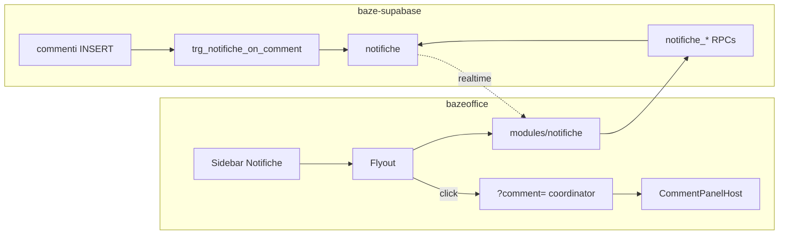
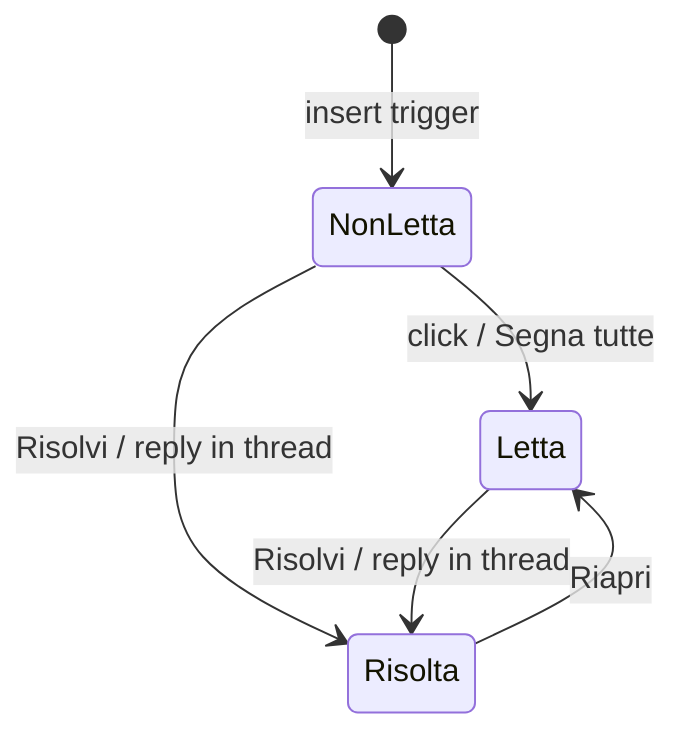
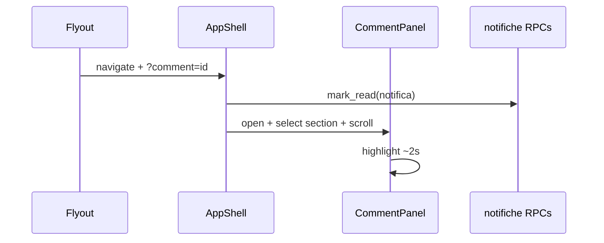

# feat: Notification center (BAZ-84)

## Goal Capsule

- **Objective:** Ship BAZ-84 so @mentions and thread replies become actionable to-dos in a sidebar notification center — with Non letta → Letta → Risolta lifecycle, deep-link into the comment panel, and realtime badge updates — closing the loop that keeps operators on Google Chat.
- **Product authority:** [PRD — Notifiche e menzioni (BAZ-84)](https://linear.app/bazeapp/document/prd-notifiche-e-menzioni-baz-84-00073afbece9).
- **UI authority:** `docs/references/centro-notifiche-spec-ui-ux.html` (layout, tabs, empty states, sidebar expanded/collapsed). Product counters follow the PRD when the mock wording differs (badge = non lette; tab counter = da risolvere).
- **Backend authority:** sibling repo `baze-supabase` — `notifiche` schema, generation trigger, RLS, RPCs, realtime publication. Frontend integration blocks on those RPCs in local/staging.
- **Depends on:** BAZ-83 commenti (shipped on `feature/notifications`) — mention markup `@[Nome](operator_uuid)`, `commenti` / `commenti_scope` / `commenti_letti`, panel host.
- **Stop conditions:** Do not build email/push/digest/aggregation/prefs/snooze/entity-status events (PRD §10). Do not re-implement the comment-panel unread-mention red pill (already shipped). Do not conflate `commenti_letti` with `notifiche` lifecycle.

---

## Product Contract

**Product Contract preservation:** Derived from the Linear PRD (v1, ready for implementation). No separate ce-brainstorm artifact. Confirmed scoping: FE + backend together; keep existing comment-panel mention indicators; PRD wins on badge vs tab counters.

### Summary

The notification center is a **to-do list, not a feed**. Only events that require action land there: @mentions and replies in threads you author or participate in. Opening a notification marks it read and deep-links to the exact comment; resolving is explicit (`✓ Risolvi`) or automatic when you reply in that thread. Success metric (PRD): median time from @mention to resolution under 4 working hours.

### Problem Frame

Comments without notifications leave operators opening Google Chat to ping colleagues. A noisy feed would be ignored within weeks. BAZ-84 closes the loop with a small, action-oriented list anchored in the sidebar (where backoffice attention lives), not a consumer-style header bell.

### Key Decisions

- **To-do list, not feed** — only `menzione` and `risposta_thread`; no entity “follow”, no auto-notify on generic comments, no self-notifications, no notifications on comment edits.
- **Click ≠ resolve** — click / deep-link marks **letta** only; **risolta** requires `✓ Risolvi` or a reply in that thread (reply resolves **all** open notifiche for that user on that thread).
- **Badge = non lette**; tab `Da risolvere (N)` = unresolved (letta + non letta). Collapsed sidebar shows a red dot without a number.
- **Access in sidebar footer**, above theme/account — never header top-right.
- **Preview text is live-joined** from `commenti` (not denormalized); `entity_type` / `entity_id` are denormalized for chip + deep link.
- **Recipient id = `operatori.id`**, not auth uid (matches mention markup and `commenti_current_operator_id()`).
- **Comment-panel mention pill stays** `commenti_letti` + mention parse — independent of `notifiche` badge (already on branch; out of re-scope).

### Requirements

**Generation**

- R1. On `commenti` insert, parse `@[label](operator_uuid)` → one `menzione` row per mentioned active operator (exclude author; exclude deactivated).
- R2. On reply insert, emit `risposta_thread` to root author + prior reply authors on that thread (exclude author; skip if already notified for this comment).
- R3. Unique `(comment_id, user_id)`; if both mention and participant apply, keep a single row typed `menzione`.
- R4. Comment edit never creates/updates notification rows (preview updates via join). Soft-deleted comment cascades/deletes its notifiche.

**Lifecycle**

- R5. States: non letta (`read_at` null, `resolved_at` null) → letta (`read_at` set) → risolta (`resolved_at` set).
- R6. Mark letta: row click / deep-link arrival / `Segna tutte come lette` (marks unread → read only; does not resolve).
- R7. Mark risolta: `✓ Risolvi` on a row, **or** automatic when the recipient inserts a reply in that thread (bulk for all their open rows on the thread).
- R8. `Riapri` from tab Risolte clears `resolved_at` and lands as **letta** (not non letta). New activity on a resolved thread creates a **new** notifica — never reopens the old row.

**UI**

- R9. Sidebar expanded: `Notifiche` row + unread badge count. Collapsed: bell + red full dot (no number), always clickable.
- R10. Flyout ~420px, full height minus margins, anchored to sidebar; page behind remains usable; click outside closes.
- R11. Tabs: `Da risolvere (N)` default · `Tutte` · `Risolte`. Date groups with sticky headers: Oggi · Ieri · Questa settimana · Prima.
- R12. Row: avatar, actor + action copy, 2-line preview with self-mention highlight, entity chip (same grammar as comment panel), relative time, hover `✓ Risolvi` / on risolta hover `Riapri`.
- R13. Row visuals: non letta (tint + blue dot), letta (plain), risolta (muted + `✓ Risolta`). Three distinct empty states per PRD §6. Vocabulary: always **Risolvi**, never Archivia.

**Deep link**

- R14. Click → navigate to entity route with `?comment={comment_id}`; open comment panel; expand owning section; scroll to comment; highlight ~2s; mark notifica letta. Expand collapsed reply threads if needed. Missing/deleted comment: drop the notifica (or never show it) — do not land on a dead comment.

**Realtime**

- R15. Subscribe to `notifiche` for current operator; badge/list update without refresh; micro-animation on insert when flyout open. No sound, toast, or popup.

### Key Flows

- F1. Receive @mention → unread badge → open Da risolvere → click → deep-link + letta → reply → auto risolta.
- F2. Receive thread reply → same path; `✓ Risolvi` without reply also works.
- F3. Segna tutte → badge to 0; unresolved rows remain in Da risolvere as letta.
- F4. Riapri from Risolte → row returns to Da risolvere as letta.
- F5. Realtime: second browser session sees badge bump on new menzione without refresh.

### Acceptance Examples

- AE1. @mention creates exactly one notifica for the mentioned operator, none for others or the author. Covers R1.
- AE2. Reply notifies root author + prior repliers, never the reply author. Covers R2.
- AE3. Mention of a thread participant yields one `menzione` row. Covers R3.
- AE4. Click marks letta, not risolta; badge decrements; tab counter unchanged. Covers R5, R6, R9.
- AE5. Reply in thread bulk-resolves all open notifiche for that user on that thread. Covers R7.
- AE6. Deep link opens panel on correct section, scrolls, highlights ~2s. Covers R14.
- AE7. Collapsed sidebar shows red dot without number; expanded shows numeric unread. Covers R9.
- AE8. Soft-delete of comment removes its notifiche. Covers R4.

### Scope Boundaries

**In scope**

- Backend `notifiche` + trigger + RPCs + realtime in `baze-supabase`.
- FE module `notifiche`, sidebar entry, flyout, deep-link orchestration.
- Reply → auto-resolve wiring (BE + FE cache invalidation).

**Deferred for later / PRD §10**

- Email, push, daily digest, event aggregation, per-user prefs, entity status-change notifications, snooze, assign-to-other.

**Deferred to Follow-Up Work**

- Perfect deep-link restore for every board-only surface without URL detail id (Gate/CRM kanban sheets that are session-only). V1: best-effort open sheet when a page-level open handler exists; otherwise navigate to the closest list route and open the panel when context can be registered.
- Dual-tab Playwright realtime E2E (still unproven harness — same deferral as BAZ-83 E2E plan).
- Re-scoping comment-panel mention pill onto `notifiche` (keep independent).

**Outside this product's identity**

- Header bell placement.
- Treating the center as an activity feed.

### Actors

- A1. Operatore backoffice (recipient and actor).
- A2. Sistema (insert trigger / resolve-on-reply).

---

## Planning Contract

### Assumptions

- Sibling backend work lands in `baze-supabase` (local path relative to workspace siblings); plan units cite that repo explicitly.
- `user_id` / `actor_id` on `notifiche` are `operatori.id`. FE resolves current operator the same way commenti RPCs do (`commenti_current_operator_id` pattern).
- Thread participants = root author + distinct reply authors on that `thread_root_id` (not mention-only readers).
- `Riapri` → `resolved_at = null`, keep `read_at` (letta).
- `Segna tutte come lette` affects the current operator’s non-letta rows only (all tabs’ data), never resolves.
- Comment soft-delete cascade for notifiche is implemented even though FE has no delete UI yet (admin path / future).
- UI mock copied to `docs/references/centro-notifiche-spec-ui-ux.html` for durable visual authority.

### Key Technical Decisions

- **KTD1. Dedicated `notifiche` module** at `src/modules/notifiche/` mirroring current `commenti` anatomy (per-file queries/mutations, `lib/adapters.ts` + Zod schemas, barrels only — no consumer deep-imports of internals).
- **KTD2. Backend owns generation and resolve-on-reply.** `AFTER INSERT` on `commenti` creates rows; reply insert bulk-sets `resolved_at` for open notifiche of that operator on the thread. FE never invents notification rows client-side.
- **KTD3. Separate from `commenti_letti`.** Deep-link marks notifica letta immediately; comment unread / mention pill continue to use viewport mark-read. No forced sync either direction.
- **KTD4. RPC surface (names directional):** `notifiche_list` (filter: da_risolvere | tutte | risolte + cursor), `notifiche_counts` (unread + da_risolvere), `notifiche_mark_read`, `notifiche_mark_all_read`, `notifiche_resolve`, `notifiche_reopen`, plus `commenti_navigation_for_comment(comment_id)` returning page focus hints for deep link. Do not put `notifiche` on `record-crud` allow-lists.
- **KTD5. Realtime via `useRealtimeRows`** on table `notifiche`. RLS already scopes rows to the current operator; subscribe without a client-side user filter and invalidate notifiche query keys — same low-level hook as commenti, not board-sync.
- **KTD6. Sidebar host.** Insert Notifiche control in `app-sidebar.tsx` `SidebarFooter` above theme toggle; flyout as `Popover` (not modal). Unread badge + collapsed red dot live here; flyout content from `notifiche` components.
- **KTD7. Deep-link as first-class search param.** Extend app shell URL sync to preserve/consume `?comment=`; add a coordinator that: resolves navigation payload → `setRoute` / open detail when possible → waits for comment route context → expands panel → selects section → scrolls/highlights → marks notifica letta. Strip or replace param after consume to avoid re-fire loops (see `docs/solutions/best-practices/custom-slug-router-deep-link-and-browser-back.md`).
- **KTD8. Entity → route map** as pure lib (extend commenti helpers or `notifiche/lib/entity-route-map.ts`) covering URL-backed entities first; board-only entities use registered open-detail callbacks where available.
- **KTD9. Visuals** follow `docs/references/centro-notifiche-spec-ui-ux.html` with existing shadcn `Tabs` (`count` prop), `Popover`, sidebar primitives.
- **KTD10. Target repos.** Plan lives in bazeoffice; U1–U2 execute in `baze-supabase`. FE units block on RPC availability.

### High-Level Technical Design



**Lifecycle**



**Deep-link sequence (directional)**



### Output Structure

```text
src/modules/notifiche/
  types/
  lib/           # adapters, schemas, query-keys, date-groups, entity-route-map
  queries/       # list, counts
  mutations/     # mark-read, mark-all-read, resolve, reopen
  hooks/         # use-notification-center, use-unread-badge
  components/    # flyout, list, row, empty-states, sidebar-trigger
  __tests__/
docs/references/centro-notifiche-spec-ui-ux.html
# sibling:
# baze-supabase/supabase/migrations/*_notifiche.sql
```

---

## Implementation Units

### U1. Backend: `notifiche` schema, trigger, RLS, realtime

- **Goal:** Persist notifications and generate them on comment insert with PRD rules.
- **Requirements:** R1–R5, R7 (reply bulk-resolve), R15 (publication)
- **Dependencies:** None (requires existing `commenti` schema)
- **Files:**
  - Create: `baze-supabase/supabase/migrations/<ts>_notifiche.sql` (single migration: schema + RPCs)
  - Test: SQL/pgTAP or backend test harness used by that repo (follow local commenti migration test practice); document scenarios below even if executed manually in staging first
- **Approach:** Table per PRD §4 with FKs to `operatori` and `commenti` (`ON DELETE CASCADE`). Indexes `(user_id, resolved_at, created_at desc)` and unique `(comment_id, user_id)`. `AFTER INSERT` trigger: parse mention markup; for replies notify participants; skip author and deactivated; prefer `menzione` on conflict. Second path on reply insert: set `resolved_at = now()` for open rows of the reply author on that `thread_root_id`. RLS: select/update own rows only. Add table to `supabase_realtime` publication.
- **Patterns to follow:** `20260714100000_commenti_schema.sql` trigger/RLS/realtime blocks; `commenti_current_operator_id()`.
- **Execution note:** Land and verify on local/staging Supabase before FE integration units.
- **Test scenarios:**
  - Happy path: root with two @mentions → two `menzione` rows; author none.
  - Happy path: reply → `risposta_thread` to root author + prior replier; reply author none.
  - Edge: mention of participant → single `menzione` row.
  - Edge: @self → zero rows.
  - Edge: deactivated operator mention → skipped.
  - Happy path: recipient replies → all their open rows on thread get `resolved_at`.
  - Edge: new reply after prior risolta → new non_letta row; old risolta unchanged.
  - Error/edge: soft-delete comment → notifiche gone.
- **Verification:** Trigger matrix above passes on local Supabase; realtime publication includes `notifiche`.

### U2. Backend: notifiche + navigation RPCs

- **Goal:** Expose list/count/lifecycle RPCs and comment navigation payload for deep links.
- **Requirements:** R6–R8, R11, R14
- **Dependencies:** U1
- **Files:**
  - Modify: `baze-supabase/supabase/migrations/<ts>_notifiche.sql` (RPCs section)
  - Test: same backend harness / manual RPC checks as U1
- **Approach:** RPCs use `commenti_assert_operator()` / current-operator helper. List joins `commenti` + actor `operatori` for preview and display name; **exclude soft-deleted comments** (`commenti.deleted_at IS NULL`) so orphan/missing comments never appear (R14). Filter by tab; order by `created_at desc`; optional cursor pagination. Counts use the same delete filter. Mark-read / mark-all-read / resolve / reopen are SECURITY DEFINER with ownership checks. `commenti_navigation_for_comment` returns `comment_id`, `thread_root_id`, `entity_type`, `entity_id`, and enough parent ids for route building when cheap (e.g. candidatura → ricerca id); returns null/empty when the comment is deleted or invisible.
- **Patterns to follow:** `20260714100100_commenti_rpcs.sql`.
- **Test scenarios:**
  - Happy path: list da_risolvere excludes risolte; counts match filters.
  - Happy path: mark_read sets `read_at`; mark_all_read only touches non_letta.
  - Happy path: resolve / reopen transitions.
  - Edge: soft-deleted comment → absent from list/counts; navigation RPC empty.
  - Error: mark_read on another user’s row → forbidden/no-op.
  - Integration: navigation RPC returns usable entity ids for a seeded comment.
- **Verification:** RPCs callable as authenticated operator; FE can depend on stable JSON shapes.

### U3. FE module skeleton: types, adapters, queries, mutations

- **Goal:** Domain module boundary for notifiche data.
- **Requirements:** R5–R8, R11, R15
- **Dependencies:** U2
- **Files:**
  - Create: `src/modules/notifiche/types/*`, `lib/schemas.ts`, `lib/adapters.ts`, `lib/query-keys.ts`, `lib/date-groups.ts`, `queries/*`, `mutations/*`, barrels
  - Test: `src/modules/notifiche/lib/__tests__/adapters.test.ts`, `date-groups.test.ts`
- **Approach:** Zod at boundary; adapters map snake_case → domain (`status` derived from timestamps). Query keys hierarchical. Date grouping pure function matching Oggi/Ieri/Questa settimana/Prima. Mutations thin RPC wrappers; hooks wrap with invalidation (and `runTracked` only if writes need echo suppression — usually not for notifiche).
- **Patterns to follow:** `src/modules/commenti/lib/adapters.ts`, `query-keys.ts`, per-file queries/mutations.
- **Test scenarios:**
  - Happy path: adapter derives non_letta / letta / risolta from timestamps.
  - Edge: null preview / missing actor fields → safe fallbacks.
  - Happy path: date-groups buckets fixtures across day boundaries.
- **Verification:** Unit tests green; module exports only barrels.

### U4. Unread badge + realtime hook

- **Goal:** Live unread count for sidebar without opening the flyout.
- **Requirements:** R9, R15
- **Dependencies:** U3
- **Files:**
  - Create: `src/modules/notifiche/hooks/use-unread-badge.ts`, `hooks/use-notifiche-realtime.ts`
  - Test: `src/modules/notifiche/hooks/__tests__/use-unread-badge.test.ts`
- **Approach:** Query `notifiche_counts`; subscribe `useRealtimeRows` on `notifiche`; invalidate counts + list keys on change. No toast/sound.
- **Patterns to follow:** `src/modules/commenti/hooks/use-comment-panel.ts` realtime block; `src/hooks/use-realtime-rows.ts`.
- **Test scenarios:**
  - Happy path: counts query exposes unread for badge.
  - Integration: simulated realtime event invalidates keys (mock `useRealtimeRows` callback).
- **Verification:** Hook tests pass; badge can mount independently of flyout.

### U5. Sidebar entry + notification flyout UI

- **Goal:** Ship the PRD UI shell wired to real data.
- **Requirements:** R9–R13
- **Dependencies:** U3, U4
- **Files:**
  - Modify: `src/components/layout/app-sidebar.tsx`
  - Create: `src/modules/notifiche/components/*` (flyout, tabs, row, empty states, sidebar trigger)
  - Test: `src/modules/notifiche/components/__tests__/notification-flyout.test.tsx`
  - UI ref: `docs/references/centro-notifiche-spec-ui-ux.html`
- **Approach:** Footer row above theme; Popover flyout; tabs with da_risolvere count; list grouped by date; row actions call mutations; empty states per tab. `data-testid`s: `notifiche-sidebar-trigger`, `notifiche-unread-badge`, `notifiche-collapsed-dot`, `notifiche-flyout`, `notifiche-tab-da-risolvere`, `notifiche-row`, `notifiche-resolve`, `notifiche-reopen`, `notifiche-mark-all-read`.
- **Patterns to follow:** UI HTML spec; `TabsTrigger count`; comment panel testid discipline.
- **Test scenarios:**
  - Happy path: default tab Da risolvere; unread badge shows counts.unread.
  - Happy path: Segna tutte calls mark-all-read; resolve/reopen call mutations.
  - Edge: each empty state renders for empty fixtures.
  - Edge: collapsed trigger exposes red dot without numeric badge.
- **Verification:** Component tests + visual check against HTML spec.

### U6. Entity route map + deep-link coordinator

- **Goal:** Clicking a notification lands on the comment with panel orchestration.
- **Requirements:** R14, R6
- **Dependencies:** U2, U5, existing commenti panel
- **Files:**
  - Create: `src/modules/notifiche/lib/entity-route-map.ts`, `src/modules/notifiche/hooks/use-comment-deep-link.ts` (names directional)
  - Modify: `src/components/layout/app-shell.tsx` (URL search sync), `src/routes/app-routes.ts` if needed, comment panel pieces for highlight + forced section/scroll
  - Test: `src/modules/notifiche/lib/__tests__/entity-route-map.test.ts`, `src/modules/commenti/**/__tests__/*` for highlight/scroll helpers, shell deep-link test if practical
- **Approach:** Map navigation RPC → `AppRoute` / open-detail callbacks. Preserve `?comment=` through `syncBrowserUrl`. Coordinator marks notifica letta, expands panel, selects section containing comment, expands collapsed thread, scrolls, applies ~2s highlight class, then clears param. Guard against re-entrancy on route refresh (openedFocusRef pattern from deep-link learning).
- **Patterns to follow:** `comment-route-helpers.ts`, `docs/solutions/best-practices/custom-slug-router-deep-link-and-browser-back.md`.
- **Execution note:** Prefer characterization tests around URL sync before changing `syncBrowserUrl`.
- **Test scenarios:**
  - Happy path: map ricerca/rapporto/lavoratore ids to routes.
  - Happy path: consuming `?comment=` expands panel and clears/replaces param once.
  - Edge: already on target page still highlights without full remount loop.
  - Edge: unknown/unauthorized comment → no crash; optional toast.
  - Integration: resolve mutation path still works when deep-link only marked letta.
- **Verification:** Unit map coverage for URL-backed entities; manual smoke on one board-only surface documenting residual gap.

### U7. Reply auto-resolve FE invalidation + `centro_notifiche` source tag

- **Goal:** After a reply, flyout/badge reflect BE bulk-resolve; optional source_interface when navigation originated from NC.
- **Requirements:** R7, R15
- **Dependencies:** U1, U5, U6
- **Files:**
  - Modify: `src/modules/commenti/mutations/reply-comment.ts` (or hook invalidation), `src/modules/commenti/hooks/use-comment-panel.ts`
  - Test: `src/modules/commenti/hooks/__tests__/*` invalidation expectations; notifiche hook test for cross-invalidate
- **Approach:** On successful reply, invalidate notifiche list/counts in addition to comment queries. **Rule:** if the panel session was opened by a notification deep-link, tag that reply’s `source_interface` as `centro_notifiche`; otherwise keep the page’s normal `source_interface`.
- **Test scenarios:**
  - Happy path: reply success invalidates notifiche query keys.
  - Edge: reply without open notifiche still succeeds.
- **Verification:** Hook test proves cross-module invalidation; manual check badge drops after reply.

### U8. Vitest coverage gate + Playwright smoke (opt-in)

- **Goal:** Safety net for critical NC flows without waiting on dual-tab realtime E2E.
- **Requirements:** AE1–AE7 (FE-observable); AE8 backend-owned
- **Dependencies:** U5–U7
- **Files:**
  - Create/extend: unit/integration tests under `src/modules/notifiche/**/__tests__/`
  - Create: `e2e/recruiter/notifiche-center.spec.ts` (or similar) when local Supabase seed helpers exist
  - Possibly extend: `e2e/support/*` service-role helpers for notifiche seed/cleanup
- **Approach:** Unit/integration required for CI (`npm run test`). Playwright opt-in: seed mention as other operator → assert badge → open flyout → click → panel highlight; mark-all-read; resolve. Defer dual-context realtime.
- **Patterns to follow:** `e2e/recruiter/commenti-unread-mentions.spec.ts`, `docs/plans/2026-07-16-001-feat-contextual-comments-e2e-plan.md`.
- **Test scenarios:**
  - E2E happy path: mention → badge → deep link → letta.
  - E2E: Segna tutte clears badge; Da risolvere still lists letta items.
  - E2E: Risolvi removes from Da risolvere; appears under Risolte; Riapri returns it.
- **Verification:** `npm run test` / `tsc` / `lint` green; Playwright smoke documented as opt-in.

---

## Verification Contract

- **Unit/integration:** `npm run test` covering adapters, date-groups, hooks (mocked RPC boundary), flyout UI states.
- **Typecheck/lint:** `npm run build` (or `tsc -b`) and `npm run lint` — CI gate.
- **Backend:** U1–U2 trigger/RPC matrix on local Supabase before merging FE integration.
- **Manual UI:** Compare flyout/sidebar to `docs/references/centro-notifiche-spec-ui-ux.html`; confirm badge vs tab counter semantics.
- **E2E:** Opt-in Playwright smoke for F1/F3/F4; not required in GitHub Actions until harness is standard.
- **Non-goals for this plan’s gate:** dual-tab realtime E2E; email/push.

---

## Definition of Done

- [ ] PRD acceptance checklist (§11) satisfied for in-scope items.
- [ ] U1–U8 complete with their test scenarios; CI test/tsc/lint green on bazeoffice.
- [ ] Backend migrations applied on staging; FE points at RPCs successfully.
- [ ] Sidebar works expanded and collapsed; no header bell.
- [ ] Deep link works for at least one URL-backed entity type end-to-end; residual board-only gaps documented under Deferred.
- [ ] Reply auto-resolves open notifiche; badge updates via realtime or invalidation without toast/sound.
- [ ] Comment-panel mention pill behavior unchanged (still `commenti_letti`-based).
- [ ] No PRD §10 features accidentally shipped.

---

## System-Wide Impact

- **Commenti:** invalidation hooks on reply; possible highlight/scroll API on panel; deep-link competition with `CommentAppProvider` registration — coordinate carefully.
- **App shell / router:** first product use of persistent search params — high regression risk for `syncBrowserUrl`.
- **Backend load:** insert trigger on every comment; keep mention parse cheap; indexes required.
- **Operators:** new daily surface in sidebar; badge discipline must stay trustworthy (unread-only).

---

## Risk Analysis & Mitigation

| Risk | Mitigation |
| --- | --- |
| Dual unread models confuse implementers | KTD3 + DoD: pill stays on `commenti_letti`; badge on `notifiche` |
| `?comment=` stripped by pathname-only sync | Characterization before change; consume-once guard |
| Board surfaces without URL detail | Best-effort open; document gaps; don’t block v1 |
| Trigger bugs create notification spam | Exhaustive U1 matrix; never notify author; unique constraint |
| FE lands before RPCs | U3+ blocked on U2; use staging feature branch pairing |

---

## Open Questions

- **Deferred:** Exact open-detail callback registry for every board-only surface — resolve during U6 implementation against live pages.
- **Deferred:** Whether navigation RPC should embed a precomputed path string vs structured ids — prefer structured ids (FE owns `AppRoute`).

---

## Sources & Research

- [PRD BAZ-84](https://linear.app/bazeapp/document/prd-notifiche-e-menzioni-baz-84-00073afbece9) · [BAZ-84 issue](https://linear.app/bazeapp/issue/BAZ-84/implementare-sistema-notifiche-bazeoffice-menzioni)
- UI: `docs/references/centro-notifiche-spec-ui-ux.html`
- Prior plan: `docs/plans/2026-07-14-001-feat-contextual-comments-plan.md` (BAZ-84 deferrals)
- Patterns: `src/modules/commenti/`, `src/hooks/use-realtime-rows.ts`, `src/components/layout/app-sidebar.tsx`
- Learnings: `docs/solutions/best-practices/custom-slug-router-deep-link-and-browser-back.md`, `docs/realtime-board-pattern.md`, `docs/testing-strategy.md`
- Backend: `baze-supabase/supabase/migrations/20260714100000_commenti_schema.sql`, `20260714100100_commenti_rpcs.sql`
- External research: skipped — strong local commenti patterns.
