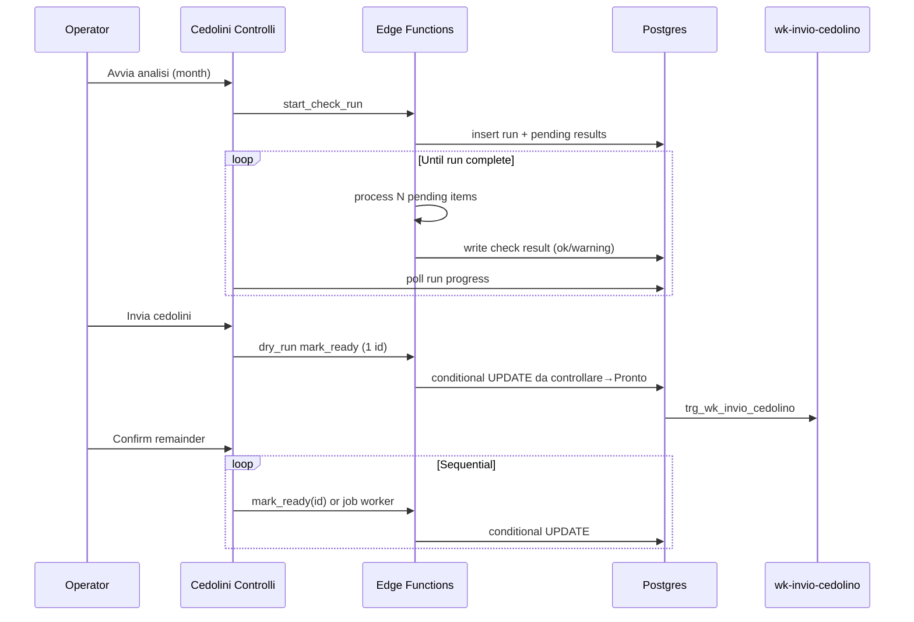
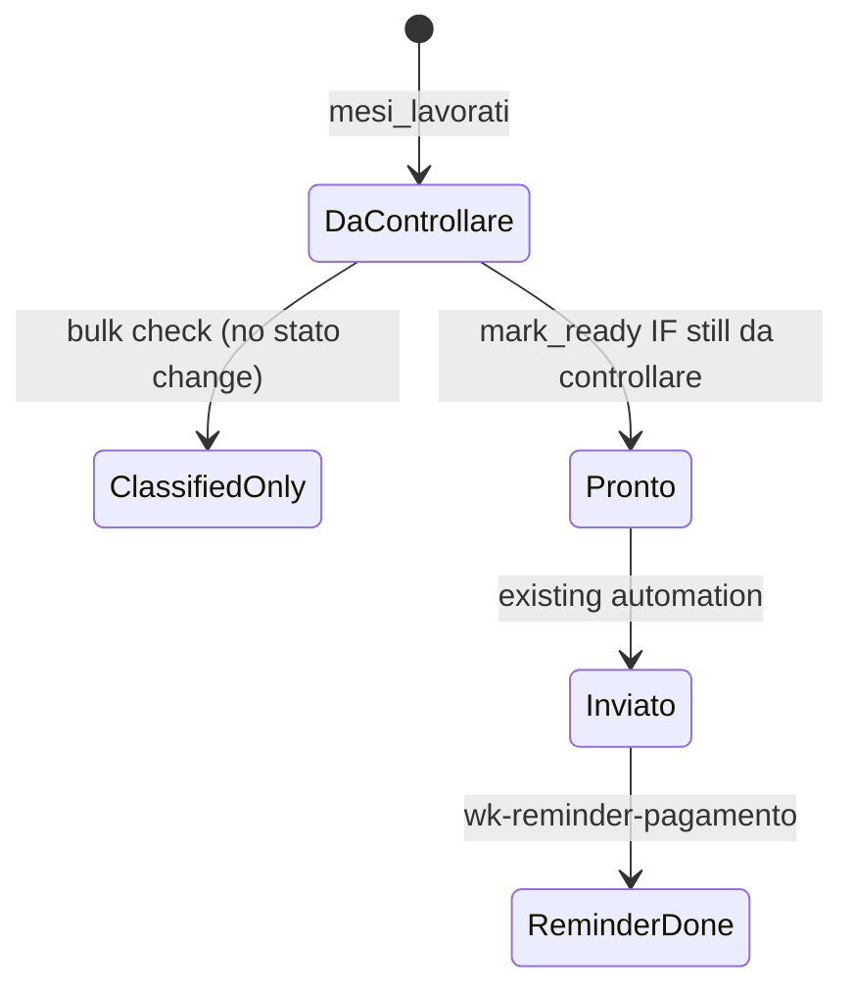

# feat: Cedolini Bulk Analyzer & Invio (BAZ-98 / BAZ-99 / BAZ-100)

## Goal Capsule

**Objective.** Put automatic cedolino controls, bulk send (after dry run), URL recovery, and payment reminders into the existing Payroll → Cedolini page as Controlli / Pagamenti modes — without moving privileged PDF/Drive/Stripe work into the browser, and without changing the existing Board or `wk-invio-cedolino` / `wk-reminder-pagamento` automations beyond invoking them.

**Authority.** Linear PRD (origin) > UI specs Option B (tabs) > this plan's KTDs > module anatomy in AGENTS.md.

**Stop when.** Controlli can run a persisted month analysis with live progress, classify Pronti/Warning, recover empty `cedolino_url`, dry-run then sequentially mark-ready with stop/idempotency; Pagamenti can dry-run then bulk-invoke reminders with the date filter binding both UI and payload; Board unchanged; no service keys / Drive / PDF parse in the client.

**Product Contract preservation:** Product Contract derived from Linear PRD + confirmed scoping (both repos, full BAZ-98/99/100, async job/batch). No separate brainstorm file to diff against.

---

## Product Contract

### Summary

Operators keep the Cedolini Board for day-to-day card work. For month-end bulk work they switch to Controlli (analyze + send + recover) or Pagamenti (remind unpaid Baze Pay). The system analyzes and classifies; it never sends without an explicit dry-run-then-confirm sequence. Check outcomes and job progress are persisted so refresh mid-run does not lose work.

### Requirements

- R1. Cedolini page exposes three modes: Board (unchanged), Controlli, Pagamenti; shared month switcher.
- R2. Bulk check analyzes only `stato_mese_lavorativo = 'Cedolino da controllare'` for the selected month, excludes `caso_particolare = 'Chiusura rapporto'`, runs five independent checks (PDF extract, paga oraria, ore vs presenze, eventi presenze, PDF/`cedolino_url`; Stripe only for Baze Pay), persists each result before the next record, shows live progress, and classifies AND-failure as Warning.
- R3. Warning UI groups by six fixed categories + Altri (collapsible, filterable); a cedolino may appear in multiple groups; cards show datore/lavoratore/tipo/ids/details.
- R4. Bulk send: dry run one real mark-ready → confirm → sequential rest → stoppable; resume/refresh must not re-send already processed records (conditional status update).
- R5. Mark-ready sets `stato_mese_lavorativo` to `Cedolino Pronto` only when still `Cedolino da controllare`, triggering existing `trg_wk_invio_cedolino` / `wk-invio-cedolino` (untouched).
- R6. Recovery `cedolino_url`: Storage PDF → Drive share link → write URL → full recheck (bulk group + single card); framework shape for future recoveries, only URL recovery in v1.
- R7. Pagamenti lists `Inviato cedolino` rows with a linked `transazioni_finanziarie` row; Reminder da fare / fatti via `check_reminder_pagamento_inviato`; date filter on `data_invio_famiglia` gates both visibility and bulk IDs.
- R8. Bulk reminder: same dry-run → confirm → sequential → stoppable sequence; invokes `wk-reminder-pagamento` with `{ record_id }` only (no logic duplication).
- R9. No privileged keys, Drive upload, or PDF reading in the browser.
- R10. Out of scope: other recoveries, admin audit UI, operator notifications, modifying `wk-reminder-pagamento`, mobile, UI Options A/C.

### Actors

- A1. Payroll operator — runs Controlli / Pagamenti on desktop.
- A2. Existing automations — `wk-invio-cedolino` (status trigger), `wk-reminder-pagamento` (explicit invoke).

### Key Flows

- F1. Bulk analysis (PRD §5–§7).
- F2. Bulk send with dry run (PRD §8).
- F3. Recovery `cedolino_url` (PRD §9).
- F4. Payment reminders (PRD §10).

### Acceptance Examples

- AE1. Mid-analysis refresh keeps already-written check results and progress.
- AE2. Dry run fails → bulk send of remainder does not start.
- AE3. Stop mid-send; resume skips rows already at `Cedolino Pronto` / later; no double `wk-invio-cedolino`.
- AE4. Two operators mark-ready the same row → only one transition fires.
- AE5. Abbonamento skips Stripe check; unpaidLeave/overtime/vacation/sickness → Eventi warning; paidLeave counts in hours only.
- AE6. Reminder date filter unset → bulk uses all visible “da fare”; with filter → only `data_invio_famiglia <= date`.
- AE7. Recovery failure leaves warning with logged error; success runs full recheck and may move to Pronti.

### Scope Boundaries

**In scope:** Full PRD Controlli + Pagamenti + persistence + job workers in `baze-supabase` + FE in `src/modules/payroll`.

**Deferred for later:** Other recoveries; admin audit of past runs; auto-notifications; mobile.

**Outside this product's identity:** Replacing Board; changing Make.com / Stripe Checkout creation; shipping service_role to the SPA; resurrecting the standalone `cedolini-checker` mini-tool as the product UI.

---

## Planning Contract

### Assumptions

- A-S1. Work spans **both** `bazeoffice` and `baze-supabase` (confirmed scoping).
- A-S2. One implementation plan covers BAZ-98 + BAZ-99 + BAZ-100 (confirmed).
- A-S3. Async job/batch processing (confirmed; aligns with PRD §11 preference).
- A-S4. Google Drive service-account credentials and any LLM API keys for hard PDF cases will be provisioned as Supabase secrets before recovery/AI fallback ship; until then recovery/AI paths stay behind env presence checks.
- A-S5. Italian payroll PDF text layout is stable enough for regex/heuristic extraction after `unpdf` text extract for the majority of rows; scanned/illegible PDFs become Warning “Cedolino o PDF” without blocking the run.
- A-S6. UI specs Option B is authoritative for IA (tabs); interactive mockup details may refine layout during implementation without changing flows.
- A-S7. Dry-run / bulk-send “success” means **conditional mark-ready returned `updated: true`** (row is `Cedolino Pronto`). Transition to `Inviato cedolino` is async via `wk-invio-cedolino` / Make and is observed on the Board, not awaited inside the Controlli job. Stuck-at-Pronto after automation failure is a visible failure needing a separate recover/re-trigger path (follow-up if not in v1).
- A-S8. Prefer dedicated Edge Functions / RPCs for Controlli/Pagamenti data — do not add new `table-query` allow-list fields for this feature (FASE 4 BIS: Anagrafiche-only). Reuse existing `_shared/openai.ts` if AI PDF fallback is enabled.

### Key Technical Decisions

- KTD1. **Dual-repo delivery.** Schema + Edge Functions in `baze-supabase`; UI/hooks/queries in `bazeoffice` `payroll` module. Plan file stays in bazeoffice; backend paths are repo-relative to `baze-supabase`. `(session-settled: user-approved — chosen over FE-only plan: PRD forbids client PDF/Drive/service keys)`
- KTD2. **Job tables as the queue (not pgmq first).** Persist `cedolino_check_runs` / `cedolino_check_results` per PRD §12, plus a small `cedolino_bulk_jobs` (+ item rows) for send/reminder/recover batches. Workers claim pending items with conditional updates (`pending → processing`), write outcomes, then self-chain or rely on a short `pg_cron` kick for stuck runs. Prefer PRD-shaped tables over introducing PGMQ unless claim races prove insufficient. External guidance ([Supabase large jobs](https://supabase.com/blog/processing-large-jobs-with-edge-functions)) informs chunking and cron wake-ups.
- KTD3. **Never use unconditional `update-record` for mark-ready.** Existing `usePayrollBoard.moveCard` → `updateRecord` would re-fire invio if a card already `Inviato cedolino` were patched back to `Cedolino Pronto`. Bulk send calls a dedicated Edge Function/RPC: `UPDATE … SET stato_mese_lavorativo = 'Cedolino Pronto' WHERE id = $1 AND stato_mese_lavorativo = 'Cedolino da controllare' RETURNING …`.
- KTD4. **PDF parsing server-side with `unpdf` (+ structured extract).** Edge-compatible text extraction ([unpdf](https://github.com/unjs/unpdf)); map fields to paga/ore; optional AI structured extract only as fallback when text parse fails — never in the browser. Prefer existing `baze-supabase/supabase/functions/_shared/openai.ts` over a new vendor if AI is needed.
- KTD5. **FE mode shell mirrors Prove/Colloqui.** `TabsList variant="segmented"` under `SectionHeader` (see `prove-colloqui-view.tsx`); Board subtree stays the current `PayrollOverviewCedoliniView` body; Controlli/Pagamenti are sibling views sharing `selectedMonth`. Do **not** add sidebar routes for Controlli/Pagamenti (would fork month state and break `gotoCedolini` e2e).
- KTD6. **Baze Pay detection.** Reuse board semantics: `richiesta_attivazione_id` present **or** linked `transazioni_finanziarie` row (as PRD §6.6); Abbonamento skips Stripe. If the two signals disagree, treat as Baze Pay (run Stripe check) and surface mismatch detail in `details` jsonb.
- KTD7. **Payment-link check (PRD “Stripe”).** Production payment CTAs are **Make hooks** built from `transazioni_finanziarie.id` (see `wk-invio-cedolino` / `wk-reminder-pagamento`), not always live `checkout.stripe.com` sessions. Worker validates the **effective payment URL** read-only (follow redirects; structured `{ ok, http_status, final_url, reason }`); accept Make→Stripe checkout finals when present; expired/paid/404 → Pagamento Stripe warning. Do not complete payment.
- KTD8. **`cedolini_checker` role stays for the external mini-tool.** Product path uses authenticated SPA → Edge Functions with service role server-side; do not force the SPA onto that JWT role.
- KTD9. **Presenze event codes match payroll UI canon.** Read `tipo_day_*` using values from `payroll-display-utils.ts`: `unpaidLeave`, `paidLeave`, `overtime`, `vacation`, `sickness` (PRD “sick leave” → `sickness`). Hours sum uses `ore_day_*` for ordinary + overtime + paidLeave days only.
- KTD10. **Send preflight before mark-ready.** Skip/fail-fast records that would not fire `trg_wk_invio_cedolino`: missing `cedolino` jsonb, missing `mese_id`, or `caso_particolare ∈ {Tredicesima, Chiusura rapporto}`. Dry-run must pick an eligible Pronto candidate, not a trigger-skip row.
- KTD11. **Job progress UX polling.** App `QueryClient` defaults have no `refetchInterval` — Controlli/Pagamenti hooks must set an explicit interval (and/or subscribe via extending `PAYROLL_REALTIME_TABLES` for new job/result tables). Prefer `invokeEdgeFunction` wrappers + `runTracked` when the FE also writes.

### System-Wide Impact

- **Operators:** month-end Controlli/Pagamenti become the bulk path; Board remains daily path — dual mental model needs clear tab labels.
- **Automations:** mark-ready only enters via conditional UPDATE so `trg_wk_invio_cedolino` and Make.com payment links are not double-fired.
- **Backend load:** ~400–500 PDF extractions/month in bursts; chunked workers + Storage downloads must stay within Edge limits.
- **Security:** Drive service account and any AI keys stay in Supabase secrets; SPA keeps using anon key + user JWT only.
- **Cross-repo:** FE must not ship until migrations/functions are deployed to the target Supabase env (staging then prod).

### High-Level Technical Design

### Alternative Approaches Considered

| Approach | Why not |
| --- | --- |
| Long single Edge Function request for whole month | Timeouts; no durable progress (PRD §13) |
| PGMQ as primary queue from day one | Heavier than needed; PRD already specifies result tables — start there |
| Port mini-tool client PDF + Drive into SPA | Explicitly forbidden (PRD §13 / R9) |
| UI Option A/C | PRD + UI specs chose Option B |

### Risks & Dependencies

| Risk | Mitigation |
| --- | --- |
| Edge Function wall-clock on PDF/AI | Chunk 1–few items per invocation; persist before next; cron/self-chain |
| Drive/LLM secrets missing | Feature-detect secrets; recovery/AI degrade to clear error Warning |
| Unconditional update re-triggers invio | KTD3 dedicated conditional path only |
| ~478 rows/month UX | Progress from DB; never block browser on full batch |
| Field naming drift (`stato` vs `stato_mese_lavorativo`) | Use DB column `stato_mese_lavorativo` everywhere in workers |
| Cross-repo deploy ordering | Land migrations + functions before FE calls them |
| Stuck at Pronto after Make/EF failure | Surface job item failure; do not pretend Inviato; document recover/re-trigger as follow-up (A-S7) |
| Tredicesima / missing cedolino silent no-send | KTD10 preflight reject before dry-run/bulk |
| Concurrent check runs same month | One active `in_corso` run per month (or per operator); UI binds to canonical `run_id` |
| Stale Pronti vs Board edits | Re-validate eligibility at enqueue and each mark-ready |
| `wk-reminder-pagamento` sets flag even if Resend/Make channel errors | Out of scope to change EF; UX copy: “Reminder fatti” = EF accepted, not delivery proof |
| Payment URL ≠ Stripe Checkout | KTD7 validate effective Make/Stripe URL, not assume Checkout Session API |

### Open Questions

- OQ1 (deferred). Exact Drive folder ID / sharing policy for recovered files — confirm with ops at implement time.
- OQ2 (deferred). Prefer existing `_shared/openai.ts` vs Anthropic for AI PDF fallback — decide at U2 if text extract coverage is insufficient.
- OQ3 (deferred). Interactive UI mockup pixel details from the Claude artifact (nav beyond Option B) — refine during FE units without changing product flows.
- OQ4 (deferred). Confirm Deno deploy compatibility of `unpdf` (or pin a known-good Deno PDF.js serverless build) during U2 spike; swap extractor if Edge bundle fails.
- OQ5 (deferred). PRD warning bucket “Note/casi particolari” has no §6 producer — map free-text `caso_particolare` / `note` into that bucket or fold into Altri during U2.
- OQ6 (deferred). Date filter + `data_invio_famiglia IS NULL` — include or exclude; default exclude from filtered bulk.

---

## Implementation Units

### U1. Persist check runs and bulk jobs (baze-supabase)

**Goal:** Durable schema for analysis runs/results and send/reminder/recover job progress.

**Requirements:** R2, R9, AE1

**Dependencies:** None

**Files:**
- `supabase/migrations/YYYYMMDDHHMMSS_cedolino_check_runs.sql` (create)
- `supabase/migrations/YYYYMMDDHHMMSS_cedolino_bulk_jobs.sql` (create)
- Tests: SQL or Deno unit coverage under `supabase/functions/.../__tests__` if the repo already uses that pattern; otherwise document verification via local `supabase db reset` + select smoke

**Approach:**
- Tables per PRD §12: `cedolino_check_runs` (`in_corso` \| `completata` \| `interrotta`), `cedolino_check_results` (`ok` \| `warning` \| `error`, `warnings` jsonb, `details` jsonb).
- Add `cedolino_bulk_jobs` / `cedolino_bulk_job_items` with `kind` in (`send`, `reminder`, `recover_url`), statuses, `stop_requested`, counters.
- RLS: authenticated SELECT on own-org scope consistent with sibling payroll tables; writes only via service role in Edge Functions.
- Indexes on `(run_id)`, `(mese_lavorativo_id)`, `(status)` for claim/poll.

**Patterns to follow:** Existing payroll migrations under `supabase/migrations/` (e.g. cedolini board RPCs); comment style of `20260629000000_create_cedolini_checker_role.sql`.

**Test scenarios:**
- Happy path: insert run + N pending results; update one to warning; run progress counts match.
- Edge: duplicate result for same `(run_id, mese_lavorativo_id)` rejected or upserted idempotently.
- Error: invalid status values rejected by check constraint.

**Verification:** Migration applies on local Supabase; tables visible; RLS denies anon write.

---

### U2. Check-run worker Edge Functions (baze-supabase)

**Goal:** Start a month analysis and process items server-side with the five checks, persisting each outcome.

**Requirements:** R2, R3 (data shape), R9, AE1, AE5

**Dependencies:** U1

**Files:**
- `supabase/functions/cedolini-check-start/index.ts` (create)
- `supabase/functions/cedolini-check-worker/index.ts` (create)
- `supabase/functions/_shared/cedolini-checks.ts` (create — pure check helpers)
- `supabase/functions/_shared/cedolini-pdf-extract.ts` (create)
- `supabase/functions/_shared/cedolini-checks.test.ts` (create) — or colocated Deno test

**Approach:**
- `cedolini-check-start`: require authenticated user JWT (reject anon/service from browser misuse); select eligible `mesi_lavorati` for month; insert run + pending results; kick worker.
- Worker claims pending rows (limit small N), loads PDF via `_shared/attachments.ts` / Storage, extracts with `unpdf`, runs checks:
  - Paga vs `rapporti_lavorativi.paga_oraria_lorda`
  - Ore: PDF totale vs presenze (ordinarie + straordinari + paidLeave)
  - Eventi: `unpaidLeave` / `overtime` / `vacation` / `sickness` → Eventi warning; `paidLeave` hours only (KTD9)
  - PDF readable + `cedolino_url` non-empty
  - Stripe only if Baze Pay (KTD6–KTD7)
- Write result row before claiming next; mark run `completata` when no pending left; support `interrotta`.
- Self-chain next worker invocation and/or `pg_cron` safety net for stuck `processing` items.

**Execution note:** Implement pure check helpers test-first before wiring Storage/PDF I/O.

**Patterns to follow:** `wk-reminder-pagamento` for service client + cors; `fetchAttachmentsFromStorage`; Zod/body validation style from newer functions (e.g. `worker-availability`).

**Test scenarios:**
- Happy path: synthetic details → all checks ok → status `ok`, empty warnings.
- Edge: Abbonamento with bad Stripe link still `ok` (Stripe skipped).
- Edge: overtime present → warning category Eventi even if ore match.
- Error: missing PDF → warning Cedolino o PDF; run continues for siblings.
- Integration: start → worker → poll shows increasing `checked` count without losing prior rows.

**Verification:** Local invoke start+worker on seed month; results rows populated; FE-unrelated.

---

### U3. Conditional mark-ready, recover URL, reminder job glue (baze-supabase)

**Goal:** Idempotent send action, Drive URL recovery + recheck hook, and bulk-job orchestration that calls existing reminder EF.

**Requirements:** R4, R5, R6, R8, AE2–AE4, AE7

**Dependencies:** U1, U2 (recheck reuses check helpers)

**Files:**
- `supabase/functions/cedolini-mark-ready/index.ts` (create)
- `supabase/functions/cedolini-recover-url/index.ts` (create)
- `supabase/functions/cedolini-bulk-job/index.ts` (create) — start/stop/process for send|reminder|recover
- `supabase/functions/_shared/cedolini-mark-ready.ts` (create)

**Approach:**
- Mark-ready: conditional UPDATE only from `Cedolino da controllare` → `Cedolino Pronto`; return `{ updated: boolean }` so dry-run/bulk can detect skip.
- Recover: download `cedolino` attachment, upload to Drive (service account), set anyone-with-link viewer, write `cedolino_url`, enqueue full recheck for that `mese_lavorativo_id`.
- Bulk job worker: sequential item processing; honor `stop_requested`; for `send` call mark-ready; for `reminder` invoke internal `wk-reminder-pagamento` logic via HTTP to same project function (or shared import if feasible without modifying that function's contract).

**Patterns to follow:** Trigger note in `cedolini_checker` migration (mark-ready → `trg_wk_invio_cedolino`); do not alter `wk-invio-cedolino` / `wk-reminder-pagamento` bodies.

**Test scenarios:**
- Happy path: da controllare → Pronto returns `updated: true`; second call `updated: false`.
- Edge: already `Inviato cedolino` → `updated: false` (no regress to Pronto).
- Covers AE3/AE4: concurrent mark-ready — exactly one `updated: true`.
- Recovery failure (empty bucket) → item error, URL unchanged.
- Reminder job item calls reminder with `{ record_id }` only.

**Verification:** Mark-ready on fixture fires invio trigger once; double call does not; recover writes URL when secrets present.

---

### U4. Cedolini mode shell + Controlli analysis UI (bazeoffice)

**Goal:** Board / Controlli / Pagamenti modes; Controlli can start analysis, show progress, and render Pronti / Warning groups from persisted results.

**Requirements:** R1, R2, R3, AE1

**Dependencies:** U1, U2

**Files:**
- `src/modules/payroll/components/payroll-overview-cedolini-view.tsx` (modify — extract board body / add tabs)
- `src/modules/payroll/components/cedolini-mode-tabs.tsx` (create)
- `src/modules/payroll/components/cedolini-controlli-view.tsx` (create)
- `src/modules/payroll/hooks/use-cedolini-check-run.ts` (create)
- `src/modules/payroll/queries/start-cedolini-check-run.ts` (create)
- `src/modules/payroll/queries/fetch-cedolini-check-run.ts` (create)
- `src/modules/payroll/lib/cedolini-check-warnings.ts` (create — pure grouping/filters)
- `src/modules/payroll/lib/cedolini-check-warnings.test.ts` (create)
- `src/modules/payroll/components/__tests__/cedolini-controlli-view.integration.test.tsx` (create)

**Approach:**
- Segmented tabs like `prove-colloqui-view.tsx`; keep month switcher shared; no new sidebar routes (KTD5).
- Controlli: Avvia analisi → invoke start → poll run/results with explicit `refetchInterval` while `in_corso` (KTD11); optional realtime on job tables.
- Enforce one active `in_corso` run per month (or surface which `run_id` is canonical if a second start is attempted).
- Two columns: Pronti / Warning; warning side uses category chips + collapsible groups; multi-group membership.
- Reuse existing detail sheet open patterns where useful; do not change Board DnD.

**Execution note:** Pure warning-grouping module first (unit tests), then hook/view integration with data layer mocked at module boundary.

**Patterns to follow:** `cedolini-filters.ts` purity; `usePayrollBoard` query-key style; payroll integration test mock boundary.

**Test scenarios:**
- Happy path: mocked completed run renders N pronti and warning cards under correct categories.
- Edge: one card with two warning categories appears in both groups.
- Edge: refresh while `in_corso` rehydrates prior results from fetch (no empty flash of “zero”).
- Covers AE1: simulated mid-run fetch returns partial results + progress X/Y.

**Verification:** Unit tests green; Controlli tab reachable in app; Board behavior unchanged in existing e2e smoke if run.

---

### U5. Controlli bulk send + URL recovery UI (bazeoffice)

**Goal:** Dry-run → confirm → sequential/stoppable send; bulk + single recovery actions.

**Requirements:** R4, R5, R6, AE2–AE4, AE7

**Dependencies:** U3, U4

**Files:**
- `src/modules/payroll/components/cedolini-controlli-send-dialog.tsx` (create)
- `src/modules/payroll/hooks/use-cedolini-bulk-send.ts` (create)
- `src/modules/payroll/hooks/use-cedolini-recover-url.ts` (create)
- `src/modules/payroll/queries/cedolini-mark-ready.ts` (create)
- `src/modules/payroll/queries/cedolini-bulk-job.ts` (create)
- `src/modules/payroll/components/__tests__/cedolini-controlli-send.integration.test.tsx` (create)
- `e2e/payroll/cedolini-controlli-send.spec.ts` (create) — if e2e harness can hit staging functions

**Approach:**
- Dialog copy matches PRD dry-run language; disable Invia when zero pronti; confirm shows **count** of remaining IDs.
- Prefer server bulk job for send (progress + stop flag) so refresh mid-send is safe; plan standard is job-backed (not FE `moveCard` loops).
- Preflight (KTD10) before dry-run pick; dry-run success = `updated: true` only (A-S7); account for the singleton already at Pronto before remainder starts.
- Re-check eligibility per item (still da controllare, still in Pronti set); Board drag away → skip safely.
- On success remove card from Pronti; Board updates via `mesi_lavorati` realtime.
- Recovery buttons on Cedolino o PDF group + per-card.
- Extend `PAYROLL_REALTIME_TABLES` if job tables should push progress without poll alone (KTD11).

**Patterns to follow:** Existing dialogs in payroll detail; `invokeEdgeFunction` + write tracking for mutations; never `updateRecord` for mark-ready.

**Test scenarios:**
- Happy path: dry run success → confirm → N sequential successes → completion dialog.
- Edge: dry run `updated: false` / error → no remainder send (AE2).
- Edge: stop mid-job → remaining stay pending; resume does not re-process completed items (AE3).
- Edge: Tredicesima / missing `cedolino` preflight-rejected before dry-run (KTD10).
- Edge: Board moves card off da controllare while queued → item skipped, no error storm.
- Recovery success moves card to Pronti after recheck; failure keeps warning (AE7).

**Verification:** Integration tests for dialog state machine; manual or e2e mark-ready on fixture once.

---

### U6. Pagamenti tab + reminder bulk (bazeoffice)

**Goal:** Reminder da fare / fatti columns, date filter bound to bulk IDs, dry-run sequential reminder send.

**Requirements:** R7, R8, AE6

**Dependencies:** U3 (job glue), U4 (tabs shell)

**Files:**
- `src/modules/payroll/components/cedolini-pagamenti-view.tsx` (create)
- `src/modules/payroll/hooks/use-cedolini-pagamenti.ts` (create)
- `src/modules/payroll/lib/cedolini-pagamenti-filters.ts` (create)
- `src/modules/payroll/lib/cedolini-pagamenti-filters.test.ts` (create)
- `src/modules/payroll/queries/fetch-cedolini-pagamenti.ts` (create)
- `src/modules/payroll/queries/invoke-reminder-pagamento.ts` (create) — thin wrap of `wk-reminder-pagamento`
- `src/modules/payroll/components/__tests__/cedolini-pagamenti-view.integration.test.tsx` (create)
- `e2e/payroll/cedolini-pagamenti-reminder.spec.ts` (create) — optional if EF callable in e2e env

**Approach:**
- Query month rows in `Inviato cedolino` with transaction; split by `check_reminder_pagamento_inviato`.
- Date filter predicate pure in `lib/`; bulk reminder passes filtered IDs only (AE6); confirm dialog shows **count + date bound**.
- NULL `data_invio_famiglia` under filter: exclude by default (OQ6).
- Reuse Controlli send dialog pattern for dry-run/confirm/stop.
- Do not modify `wk-reminder-pagamento` (known: may set flag even if Resend/Make channel errors — label “fatti” as EF-accepted).
- EF “già inviato” on resume → idempotent skip, not batch abort.

**Patterns to follow:** U5 dialog/job UX; filter purity like `cedolini-filters.ts`.

**Test scenarios:**
- Happy path: da fare card → reminder success → moves to fatti (flag true from EF).
- Edge: no transaction → row absent from tab.
- Edge: date filter excludes older-than-cutoff from both list and bulk ID list (AE6).
- Edge: NULL `data_invio_famiglia` excluded when filter set.
- Error: EF already-sent guard → item skipped as success/idempotent; others continue.

**Verification:** Filter unit tests; integration with mocked invoke; e2e if environment allows.

---

## Verification Contract

- FE: `npm run test:unit` for new pure libs; `npm run test:integration` for Controlli/Pagamenti hooks/views; targeted e2e under `e2e/payroll/` when functions available.
- Backend: local Supabase migration apply; Deno tests for check helpers; manual invoke of start/worker/mark-ready against seed.
- Gate: existing `npm run lint` / `tsc` / payroll e2e must still pass for Board regressions.
- Do not treat coverage % as a gate.

## Definition of Done

- All R1–R10 satisfied against PRD acceptance checklist.
- U1–U6 verification outcomes met; AE1–AE7 covered by automated tests or documented manual proofs where e2e cannot hit Drive/Stripe.
- Board kanban e2e still green.
- No service_role, Drive credentials, or PDF bytes handled in `bazeoffice` client code.
- Secrets documented for ops (Drive, optional AI) without committing values.

---

## Appendix

### Sources & Research

- PRD: Linear document (origin URL in frontmatter).
- UI: Claude artifact — Option B recommended (Board + Controlli + Pagamenti modes).
- Prior art: scoped role migration `baze-supabase/supabase/migrations/20260629000000_create_cedolini_checker_role.sql` for external `cedolini-checker` tool (not the product UI).
- Invio trigger: `trg_wk_invio_cedolino` on `mesi_lavorati.stato_mese_lavorativo = 'Cedolino Pronto'` (also requires `cedolino` + `mese_id`; skips Tredicesima/Chiusura).
- Reminder: `supabase/functions/wk-reminder-pagamento/index.ts` (`verify_jwt = false`; Make payment CTA).
- FE board: `src/modules/payroll/components/payroll-overview-cedolini-view.tsx`, `hooks/use-payroll-board.ts`, `queries/fetch-cedolini-board.ts`.
- Tabs precedent: `src/modules/support/components/prove-colloqui-view.tsx`.
- Learnings: board characterization (`docs/solutions/best-practices/characterization-testing-board-hook-contract-patterns.md`); realtime board pattern; FASE 4 BIS no new table-query for payroll; write-tracking/echo window.
- Backend research: job tables greenfield; Drive/PDF/Checkout validation not in-repo today; `_shared/attachments.ts` + `_shared/openai.ts` reusable; async today = pg_cron/`pg_net`/Make.
- External (load-bearing): Supabase Edge + cron/queue chunking; `unpdf` for Deno/edge PDF text extraction.
- Flow analysis: Pronto≠Inviato handoff; stuck Pronto; concurrent runs; stale Pronti; reminder flag≠delivery.

### CONCEPTS.md

No new glossary entries required beyond existing `payroll` / Cedolini route notes; domain terms match PRD Italian labels already used in board stages.
