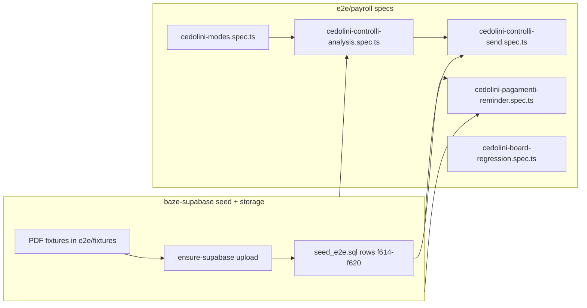

# test: Cedolini bulk Controlli + Pagamenti E2E coverage

## Goal Capsule

**Objective.** Add Playwright E2E coverage for the Cedolini bulk features shipped under BAZ-98/99/100 — mode tabs (Board / Controlli / Pagamenti), persisted bulk check + UI classification, dry-run bulk send with stop/resume idempotency, Pagamenti date-filter-bound reminders — without regressing existing Board specs.

**Authority.** Origin implementation plan + PRD acceptance examples > existing `e2e/payroll/cedolini-*` patterns > unit/integration tests already green in `src/modules/payroll/`.

**Stop when.** Payroll-project specs cover the seven PRD acceptance examples that are E2E-testable locally (AE1–AE4, AE6, plus partial AE5/AE7); Board e2e stays green; fixtures reset idempotently on `supabase db reset` + ensure-supabase; external Make/Drive/Stripe/email never hit production from local runs.

**Product Contract preservation:** Derived from origin plan scope; this artifact covers **verification only**, not feature implementation.

---

## Product Contract

### Summary

The Controlli/Pagamenti UI and Edge Functions are implemented; Vitest covers pure libs and mocked hook wiring. The gap is **full-stack Playwright** against local Supabase: real `cedolini-check-start` / worker / mark-ready / bulk-job paths, with deterministic fixtures including **real Italian cedolino PDFs** supplied by ops.

Existing `E2E_CEDOLINI` seed rows (TODO / Ricezione presenze / Inviato) stay for Board regression. New bulk fixtures add `Cedolino da controllare` rows, check-run result rows, and Pagamenti reminder candidates.

### Requirements

- R1. Extend E2E seed data in `baze-supabase` with fixed UUIDs mirrored in `e2e/constants.ts` — do not break existing Board fixtures (`f611`–`f613`).
- R2. Commit two real cedolino PDFs as binary fixtures under `e2e/fixtures/cedolini/` and upload them to local Storage on every ensure-supabase run so the check worker can parse them with `unpdf`.
- R3. Mode shell: segmented tabs Board / Controlli / Pagamenti; shared month switcher; URL `?mode=` / `?month=` persistence across reload.
- R4. Controlli: start analysis → live progress → Pronti / Warning columns; warning category chips and collapsible groups; multi-group membership; mid-run reload keeps persisted results (AE1).
- R5. Controlli bulk send: dry run → confirm → sequential processing → stoppable; failed dry run blocks remainder (AE2); stop/resume and refresh do not double mark-ready (AE3, AE4).
- R6. Pagamenti: only `Inviato cedolino` + linked `transazioni_finanziarie`; Reminder da fare / fatti split; date filter gates visible list **and** bulk IDs (AE6).
- R7. Pagamenti bulk reminder: same dry-run → confirm → sequential → stoppable pattern as Controlli send.
- R8. Board specs (`cedolini-filters`, `cedolini-moves`, `cedolini-sheet`) remain green without modification unless selectors intentionally shared.
- R9. External side effects (Make webhooks, Resend email, Drive upload, live Stripe redirect checks) are stubbed or bypassed in local E2E — assert DB + UI state only.
- R10. E2E stays opt-in local (`npm run e2e`); not added to lefthook or CI in this work.

### Actors

- A1. Payroll operator (`e2e-payroll@local.test`) — sole Playwright project for these specs.
- A2. Local Edge Functions — `cedolini-check-start`, `cedolini-check-worker`, `cedolini-mark-ready`, `cedolini-bulk-job`, optionally stubbed `wk-reminder-pagamento`.

### Key Flows

- F1. Tab navigation and URL state (origin R1 / KTD5).
- F2. Bulk analysis with persisted progress (PRD §5–§7, AE1).
- F3. Bulk send dry-run gate + idempotent mark-ready (PRD §8, AE2–AE4).
- F4. Pagamenti filter + reminder bulk (PRD §10, AE6).
- F5. Board regression smoke after mode changes.

### Acceptance Examples

| ID | E2E coverage |
| --- | --- |
| AE1 | Controlli spec: start analysis, reload mid-run or after partial completion — prior `cedolino_check_results` still visible, progress X/Y restored. |
| AE2 | Send spec: force dry-run failure (preflight reject or `updated: false`) — confirm step never enables remainder. |
| AE3 | Send spec: stop mid bulk job — resume/refresh skips terminal items; DB stato unchanged for already-processed rows. |
| AE4 | Send spec: service-role pre-mark one row Pronto — operator bulk send on same id yields skip, not double transition. |
| AE5 | Analysis spec (unit seed + one live worker spec): Abbonamento row skips Stripe warning; presenze with `overtime` → Eventi warning group even if ore match. |
| AE6 | Pagamenti spec: set date filter — cards and bulk reminder count both shrink; unset restores full da-fare set. |
| AE7 | Recovery deferred — Drive secrets absent locally; covered by integration tests + manual staging note, not Playwright. |

### Scope Boundaries

**In scope:** Seed + Storage fixtures; `e2e/support/cedolini-bulk.ts` helpers; five spec files under `e2e/payroll/`; `e2e/constants.ts` expansion; `e2e/README.md` + `docs/testing-strategy.md` E2E section update; ensure-supabase storage upload step.

**Deferred for later:** AE7 URL recovery E2E (needs Drive service account in local env); live Stripe payment-link validation; CI/lefthook gate; admin audit UI.

**Outside this product's identity:** Re-implementing Controlli/Pagamenti features; changing `wk-reminder-pagamento` / `wk-invio-cedolino` bodies; mobile viewport tests.

---

## Planning Contract

### Assumptions

- A-S1. Sibling repo `baze-supabase` is available at `../baze-supabase` (same as existing E2E harness).
- A-S2. User-supplied PDFs are representative BAZE Giugno 2026 cedolini and parse cleanly with current `cedolini-pdf-extract` heuristics.
- A-S3. Hybrid analysis coverage: pre-seeded `cedolino_check_results` for fast UI specs + one spec invoking real start/worker against the 24h PDF fixture.
- A-S4. Stub external deps at Playwright layer (`mockEdgeFunctionSuccess`, selective `page.route`) rather than production webhooks.

### Key Technical Decisions

- KTD1. **PDF fixture layout.** Copy user PDFs into the repo with stable, descriptive names (no UUIDs in paths):

  | Source file (user) | Repo path | Role in E2E |
  | --- | --- | --- |
  | `c5f8d5a7-…-1782566248.pdf` | `e2e/fixtures/cedolini/cedpag-giugno-2026-24h-busnelli-ochoa.pdf` | Happy-path analysis: extracts `paga_oraria=9.5`, `ore_ordinarie=24`, `totale_ore=24` (Giugno 2026). Pair with presenze summing to 24h and matching `rapporti_lavorativi.paga_oraria_lorda=9.5` → **Pronti**. |
  | `1783259804707-CedPag-2026_06-CHIUSURA-CANDELA-V.pdf` | `e2e/fixtures/cedolini/cedpag-giugno-2026-chiusura-candela-5h.pdf` | **Exclusion** fixture: attach PDF but set `caso_particolare='Chiusura rapporto'` — must never appear in bulk check eligibility (PRD §4 / §15). Parses `totale_ore=5` if ever run in isolation. |

  Add a one-line `e2e/fixtures/cedolini/README.md` documenting provenance (anonymized production samples, Giugno 2026) — no PII in prose beyond what's already on the PDF faces.

- KTD2. **Storage upload in ensure-supabase.** SQL seed alone cannot populate Storage bytes. Extend `e2e/ensure-supabase.mjs` (or call a new `e2e/seed-cedolini-storage.mjs` from it) to upload both PDFs to `baze-bucket/mesi_lavorati/e2e/` after `supabase db reset`, using service role + `@supabase/supabase-js` or `curl` Storage API. Seed rows reference paths like `baze-bucket/mesi_lavorati/e2e/cedpag-giugno-2026-24h-busnelli-ochoa.pdf`.

- KTD3. **Seed block in existing `seed_e2e.sql`.** Add a `cedolini bulk controlli/pagamenti` section (new UUIDs `f621+`) rather than a separate seed file — matches pipeline/contributi pattern. Rows include:

  - `f614` — `Cedolino da controllare`, 24h PDF, presenze match, `cedolino_url` set, Baze Pay transazione → **pronto candidate** after live check.
  - `f615` — `Cedolino da controllare`, same PDF, presenze **20h** (mismatch) → **Ore non coerenti** warning when worker runs.
  - `f616` — `Cedolino da controllare`, presenze with `evento_day_1='overtime'` → **Eventi presenze** warning.
  - `f617` — `Cedolino da controllare`, `cedolino_url` null, PDF present → **Cedolino o PDF** warning (recovery UI visible; action stubbed in E2E).
  - `f618` — `caso_particolare='Chiusura rapporto'`, chiusura PDF attached → excluded from analysis count.
  - `f619` / `f620` — `Inviato cedolino` + `transazioni_finanziarie`, `check_reminder_pagamento_inviato` false/true, distinct `data_invio_famiglia` for AE6 date filter.

  Pre-seed one completed `cedolino_check_runs` + mixed `cedolino_check_results` for `2026-06` so UI specs can run **without** waiting for worker (fast path).

- KTD4. **Support module split.** Extend `e2e/support/cedolini.ts` with `switchToControlliTab`, `switchToPagamentiTab`, `gotoCedoliniControlli`, `gotoCedoliniPagamenti` (tab click + wait for panel test ids). New `e2e/support/cedolini-bulk-mutations.ts` for service-role reset: delete bulk jobs/check runs for fixture month, restore `mesi_lavorati` stati, reset reminder flags — analogous to `cedolini-mutations.ts`.

- KTD5. **Stub strategy for send/reminder.** For bulk-send specs that must not fire Make invio: either (a) run mark-ready against rows whose rapporti lack invio trigger prerequisites tested separately, or (b) stub `cedolini-bulk-job` process responses after dry-run while still testing real dry-run + confirm UI. For reminders: stub `wk-reminder-pagamento` via `mockEdgeFunctionSuccess` returning `{ success: true }` and assert `check_reminder_pagamento_inviato` via service-role read after bulk job completes (or service-role PATCH in stub callback).

- KTD6. **Serial spec groups.** Bulk flows mutate shared DB state — use `test.describe.configure({ mode: 'serial' })` per file and `afterEach`/`afterAll` fixture reset, matching `cedolini-moves.spec.ts`.

### High-Level Technical Design

### Risks & Dependencies

| Risk | Mitigation |
| --- | --- |
| PDF parse drift if layout changes | Pin extract expectations in seed metadata comments; optional smoke in `cedolini-pdf-extract.test.ts` using committed fixture text sample |
| Worker slow/flaky in E2E | One live-worker spec with generous timeout; other specs use pre-seeded results |
| `wk-invio-cedolino` fires on mark-ready | Use conditional mark-ready assertions only; do not assert `Inviato cedolino` in send spec — assert `Cedolino Pronto` + job item terminal state (origin A-S7) |
| Storage upload fails on fresh clone | ensure-supabase fails fast with clear message if fixture files missing |
| PII in committed PDFs | Files are test fixtures only; README notes local-only use; filenames avoid real surnames |

### Open Questions

- OQ1 (deferred). Whether to add a third PDF for “unreadable/scanned” warning — not needed for v1 if `f617` uses null URL instead.
- OQ2 (deferred). Promote one bulk spec to CI when staging Supabase becomes available in GitHub Actions.

---

## Implementation Units

### U1. PDF fixtures + Storage upload hook

**Goal.** Make real cedolino PDF bytes available to the local check worker on every E2E run.

**Requirements:** R2

**Dependencies:** None

**Files:**
- `e2e/fixtures/cedolini/cedpag-giugno-2026-24h-busnelli-ochoa.pdf` (create — copy from user sample)
- `e2e/fixtures/cedolini/cedpag-giugno-2026-chiusura-candela-5h.pdf` (create — copy from user sample)
- `e2e/fixtures/cedolini/README.md` (create — provenance + expected extract fields)
- `e2e/seed-cedolini-storage.mjs` (create — upload both files to Storage)
- `e2e/ensure-supabase.mjs` (modify — invoke storage seed after db reset)
- `src/modules/payroll/lib/cedolini-pdf-extract.test.ts` (modify — optional table row with snippet from 24h PDF text)

**Approach:**
- Copy the two user-provided PDFs into `e2e/fixtures/cedolini/` with stable names (KTD1).
- Upload script targets bucket `baze-bucket`, prefix `mesi_lavorati/e2e/`, idempotent overwrite.
- Document expected extraction: 24h → `{ paga_oraria: 9.5, ore_ordinarie: 24, totale_ore: 24 }`; chiusura 5h → `{ paga_oraria: 9.5, ore_ordinarie: 5, totale_ore: 5 }`.

**Test scenarios:**
- Happy path: after ensure-supabase, Storage object exists and worker can download bytes (smoke via one analysis spec in U3).
- Edge: missing fixture file → ensure-supabase exits non-zero with actionable error.

**Verification:** Manual `node e2e/seed-cedolini-storage.mjs` after reset; Storage browser or REST HEAD returns 200.

---

### U2. E2E seed expansion + constants mirror

**Goal.** Deterministic DB rows for Controlli eligibility, pre-baked check results, Pagamenti reminder candidates, and Chiusura exclusion.

**Requirements:** R1, AE5, AE6

**Dependencies:** U1 (Storage paths)

**Files:**
- `baze-supabase/supabase/seed_e2e.sql` (modify — new cedolini bulk section)
- `e2e/constants.ts` (modify — `E2E_CEDOLINI_BULK` export with ids, search labels, expected warning categories)
- `e2e/support/cedolini-bulk-mutations.ts` (create — reset check runs, bulk jobs, fixture stati/reminder flags)

**Approach:**
- Insert new `mesi_lavorati` rows on existing Giugno 2026 `mesi_calendario` (`f601`).
- Wire `cedolino` jsonb to uploaded Storage paths; set `rapporti_lavorativi.paga_oraria_lorda`, presenze hour grids, `transazioni_finanziarie` links per KTD3 matrix.
- Insert completed `cedolino_check_run` for `2026-06` with results for f614–f617 (ok / ore mismatch / eventi / pdf-url).
- f618 chiusura row: attach chiusura PDF but exclude from run eligibility.
- f619/f620: Pagamenti tab with transazione + reminder flag false/true + different `data_invio_famiglia`.

**Patterns to follow:** UUID comment map at top of cedolini section in `seed_e2e.sql` (existing f611–f613 style); `E2E_PIPELINE` in `e2e/constants.ts`.

**Test scenarios:**
- Happy path: after db reset, service-role query returns expected row counts for eligible `Cedolino da controllare` (4 not 5 — f618 excluded).
- Edge: f618 absent from `cedolino_check_results` when start run enqueued.
- Edge: f619 visible in Pagamenti da fare; f620 in fatti only.

**Verification:** `supabase db reset` + SQL spot-check; constants ids match seed comments.

---

### U3. Mode shell + Controlli analysis specs

**Goal.** Playwright coverage for tabs, URL state, and Controlli results panel including AE1 persistence.

**Requirements:** R3, R4, AE1, AE5 (partial)

**Dependencies:** U2

**Files:**
- `e2e/support/cedolini.ts` (modify — tab helpers, controlli panel waits)
- `e2e/support/selectors.ts` (modify — optional controlli/pagamenti selector entries)
- `e2e/payroll/cedolini-modes.spec.ts` (create)
- `e2e/payroll/cedolini-controlli-analysis.spec.ts` (create)

**Approach:**
- Modes spec: from Board, click Controlli/Pagamenti tabs (`data-testid="cedolini-mode-tab-*"`); assert panel test ids; change month → Controlli still scoped; reload preserves `?mode=controlli&month=2026-06`.
- Analysis spec (pre-seeded): open Controlli → assert Pronti card for f614, warning groups for f615/f616/f617, category chip toggles hide/show groups, f615 appears under Ore non coerenti.
- Analysis spec (live worker, single test, 120s timeout): reset check results for month → click Avvia analisi → poll `cedolini-controlli-progress` until completata → assert f614 lands Pronti (validates PDF + worker + Storage end-to-end).
- AE1: during live run or via service-role insert partial results then reload — progress and prior cards remain.

**Execution note:** Live worker test runs last in serial file so pre-seeded tests stay deterministic.

**Test scenarios:**
- Happy path: tabs switch without losing month; URL reflects mode.
- Happy path: pre-seeded run shows correct Pronti/Warning counts.
- Covers AE1: reload with `in_corso` or partial results does not wipe written results.
- Covers AE5: f616 shows Eventi presenze group; Abbonamento fixture (if seeded without transazione) has no Pagamento Stripe group.
- Edge: f618 never appears in Controlli columns.
- Edge: Avvia analisi disabled when zero eligible rows (navigate to empty month or reset all da controllare).

**Verification:** `npx playwright test --project=payroll e2e/payroll/cedolini-modes.spec.ts e2e/payroll/cedolini-controlli-analysis.spec.ts`

---

### U4. Controlli bulk send spec

**Goal.** E2E dry-run gate, confirm, sequential send, stop, and idempotency (AE2–AE4).

**Requirements:** R5, AE2, AE3, AE4

**Dependencies:** U2, U3

**Files:**
- `e2e/payroll/cedolini-controlli-send.spec.ts` (create)
- `e2e/support/cedolini-bulk-mutations.ts` (extend — read bulk job state, force stati)

**Approach:**
- Serial describe; start from Controlli with pre-seeded Pronti (f614 only or f614+f615 if f615 manually cleared warnings — prefer single pronto for send count clarity).
- Click Invia → confirmer “Invio di prova” → dry-run dialog → assert confirm copy shows count.
- AE2: seed row failing KTD10 preflight (missing `cedolino` jsonb on pronto candidate) → dry-run failed banner → confirm button absent.
- AE3: start bulk send on 2+ pronti (temporarily mark f615 ok in results + stato), stop mid-job, reload, resume — assert second row not processed twice via `readCedolinoStato`.
- AE4: service-role mark f614 Pronto before send → dry run returns skip → no duplicate transition.

**Patterns to follow:** `cedolini-controlli-send-dialog` test ids; confirmer flow from integration test `cedolini-controlli-send.integration.test.tsx`.

**Test scenarios:**
- Happy path: dry run success → confirm → progress → summary; f614 stato becomes `Cedolino Pronto`.
- Covers AE2: dry run failure blocks remainder.
- Covers AE3: stop + resume idempotency.
- Covers AE4: concurrent/already-processed skip.

**Verification:** Playwright payroll project; reset mutations in afterEach.

---

### U5. Pagamenti tab + reminder bulk spec

**Goal.** E2E for date filter binding and reminder dry-run flow (AE6, R6, R7).

**Requirements:** R6, R7, AE6

**Dependencies:** U2

**Files:**
- `e2e/payroll/cedolini-pagamenti-reminder.spec.ts` (create)
- `e2e/support/cedolini.ts` (extend — pagamenti panel helpers)

**Approach:**
- Open Pagamenti tab on Giugno 2026; assert f619 in da fare, f620 in fatti, f613 (existing inviato without transazione) absent.
- Set date filter to cutoff excluding f619 → card hidden; assert Invia reminder button disabled or bulk count 0.
- Set filter inclusive → stub `wk-reminder-pagamento` success → dry run → confirm → assert f619 moves to fatti (refetch or poll).
- AE6: capture bulk ids indirectly via confirm dialog copy (“N reminder”) matching visible da-fare count.

**Test scenarios:**
- Happy path: reminder dry run → confirm → f619 flag flipped (service-role read).
- Covers AE6: filter reduces both visible cards and bulk N.
- Edge: no transazione row never listed.
- Edge: stub EF “già inviato” → item skipped, spec continues (idempotent).

**Verification:** Playwright payroll project with route stub registered in beforeEach.

---

### U6. Board regression + docs

**Goal.** Guard existing Board behavior after mode shell; document new specs.

**Requirements:** R8, R10

**Dependencies:** U3 (tabs shipped)

**Files:**
- `e2e/payroll/cedolini-board-regression.spec.ts` (create — thin: goto Board tab, run one filter + one move reset)
- `e2e/README.md` (modify — list new specs, PDF fixtures, storage upload)
- `docs/testing-strategy.md` (modify — Cedolini bulk E2E paragraph under Playwright section)

**Approach:**
- Regression spec: switch Controlli → Board → assert existing fixture cards visible; optional single `cedolini-moves` smoke or import shared helper call.
- README: document `E2E_CEDOLINI_BULK`, fixture PDF meanings, reset mutations.

**Test scenarios:**
- Happy path: Board columns and search unchanged after visiting other tabs.
- Test expectation: none for new unit tests — docs-only unit.

**Verification:** Full `npm run e2e -- --project=payroll` green including legacy cedolini specs.

---

## Verification Contract

- **Local gate:** `npm run e2e -- --project=payroll` after `npm run e2e` (ensure-supabase + preview).
- **Unit sanity:** `npm run test:unit -- src/modules/payroll/lib/cedolini-pdf-extract.test.ts` if fixture text case added.
- **Existing CI gate unchanged:** `npm run test`, `tsc`, `lint` — no new e2e in lefthook.
- **Manual staging (out of scope for automation):** AE7 recovery with Drive secrets; live Stripe link check.

## Definition of Done

- U1–U6 complete; both PDF fixtures committed and uploaded locally.
- AE1–AE4 and AE6 have passing Playwright specs; AE5 partially covered; AE7 documented as deferred.
- `cedolini-filters`, `cedolini-moves`, `cedolini-sheet` still pass.
- `e2e/constants.ts` UUID map matches `seed_e2e.sql` comments.
- No production webhook/email calls from local e2e runs.

---

## Appendix

### Sources & Research

- Origin: `docs/plans/2026-07-21-001-feat-cedolini-bulk-analyzer-invio-plan.md` (U5/U6 already named target e2e files).
- PRD acceptance checklist (user-provided in planning prompt).
- Existing E2E patterns: `docs/plans/2026-06-29-002-test-pipeline-e2e-coverage-plan.md`, `e2e/payroll/cedolini-*.spec.ts`, `e2e/customer/prove-colloqui-filters.spec.ts` (tab switcher).
- Implementation: `src/modules/payroll/components/cedolini-*-view.tsx` (test ids already present).
- Backend: `baze-supabase/supabase/functions/cedolini-check-*`, `cedolini-mark-ready`, `cedolini-bulk-job`.
- PDF samples (user, 2026-07-28): 24h standard cedolino; 5h chiusura cedolino — mapped in KTD1.
- Vitest already covers: `cedolini-check-warnings.test.ts`, `cedolini-bulk-send.test.ts`, `cedolini-pagamenti-filters.test.ts`, integration views with mocked hooks.

### PDF fixture extraction reference

From text extract of committed PDFs (for seed alignment):

**24h (Busnelli/Ochoa):** `Ore ordinarie 24,00`, `Base Oraria 9,50`, `H. Lavorate 24,00` → worker should classify **ok** when presenze sum to 24 and rapporto paga is 9.5.

**5h chiusura (Candela/Herrera):** `Ore ordinarie 5,00`, `Data Cessazione 29/06/2026` → use only on f618 with `caso_particolare='Chiusura rapporto'` to prove exclusion, not pronto path.
